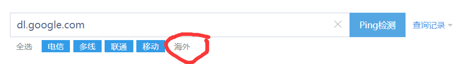
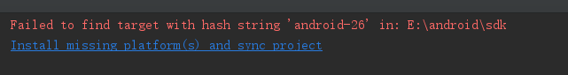

# Android Studio解决Gradle同步失败的相关问题

已经被卡住好几天了。。。我只是想写个HelloWorld啊。。。

## 背景

刚安装的Android Studio 3.1.0.0，没有内置SDK。手动安装SDK后新建项目却一直显示Gradle同步失败

## 解决connection time out错误

AS自动生成的`gradle-wrapper.properties`文件中有一项`distributionUrl`，原本的值为`https\://services.gradle.org/distributions/gradle-4.4-all.zip`（也就是说我的gradle版本为4.4），但是登录gradle的官方网站可以发现gradle的产品下载链接更新了，把原网址中的`services`改为`downloads`即可

也就是说我的文件内容更改之后应该是

```
distributionUrl=https\://downloads.gradle.org/distributions/gradle-4.4-all.zip
```

一定要注意此处`https`后面的冒号前面**有一个反斜杠**

## 解决connection refused错误

展开错误信息可以发现错误详情是

```
Connect to 127.0.0.1:1080 [/127.0.0.1] failed: Connection refused: connect
```

原因是`gradle.properties`文件中使用了代理。我的`gradle.properties`文件含有以下内容

```
systemProp.http.proxyHost=127.0.0.1
systemProp.https.proxyPort=8787
systemProp.https.proxyHost=127.0.0.1
systemProp.http.proxyPort=8787
```

把它们全部注释掉，即在每一行前面加上井号`#`

```
#systemProp.http.proxyHost=127.0.0.1
#systemProp.https.proxyPort=8787
#systemProp.https.proxyHost=127.0.0.1
#systemProp.http.proxyPort=8787
```

## 更改Hosts以访问dl.google.com

如果没有魔法上网，上面的问题解决后会发现`dl.google.com`一直访问不上

通过更改Hosts，把`dl.google.com`的IP地址解析到国内的谷歌代理服务器即可

使用站长工具的[超级ping](http://ping.chinaz.com/)，选择海外，ping一下`dl.google.com`



我得到了如下结果


北京谷翔信息技术有限公司的BGP结点。没毛病

我选择了第一个IP地址，用本机的cmd来ping一下试试


能ping通，妙啊。接下来只要把这个IP地址写入Hosts文件就行了

**管理员身份**启动记事本，打开Hosts，添加如下行。这里的IP地址不一定是我这个IP地址，读者可以自行选择一个自己能ping通的IP地址

```
203.208.41.169 dl.google.com
```

这样就可以访问`dl.google.com`了

## 最后

再次同步Gradle，可能还会出现如下错误（因为我的AS是刚装的，很多组件都没有下载）



因为我们已经可以访问`dl.google.com`了，直接点击错误中的蓝色链接进行下载安装即可。可能会多次出现类似的组件缺失的错误，都点击蓝色链接全部下载安装即可

最后，Gradle终于同步成功


参考：
- [Android Studio错误：Connect to 127.0.0.1:1080 [/127.0.0.1] failed: Connection refused: connect](https://blog.csdn.net/Rainminism/article/details/79713788)
- [解决连不上dl.google.com和dl-ssl.google.com](https://blog.csdn.net/huweijian5/article/details/45867917)

觉得有用？欢迎[打赏](donate.md)

:)

[返回主页](index.md)