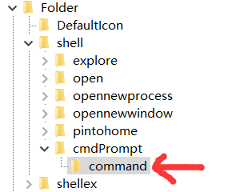
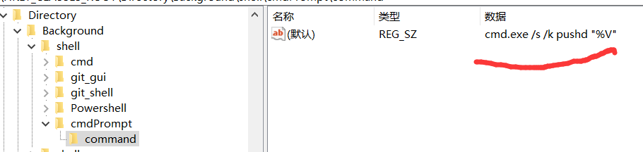
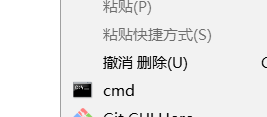

# 如何在右键菜单里面添加cmd

> 目录
> - 为什么要在右键菜单里面添加cmd
> - 在文件夹上单击右键的菜单里添加cmd
> - 在文件夹内空白处单击右键的菜单里添加cmd
> - 添加图标
> - 最后

## 为什么要在右键菜单里面添加cmd？

因为**cmd很重要**

以前的打开方法通常是Win+R打开运行窗口之后启动cmd

也有过在经常用到cmd的文件夹里面新建一个cmd.bat的文件

**麻烦！**

在右键菜单里面添加cmd的想法来源于安装**git**之后右键菜单出现的**git bash here**，如果能做出这样的效果，在任何目录单击右键就能在当前目录启动cmd，那可真是爽死了:)

## 在文件夹上单击右键的菜单里添加cmd

个性化右键菜单需要修改**注册表文件(registry file)**

使用我们熟悉的**Win+R**打开运行窗口，运行"**regedit**"，即**注册表编辑器(registry editor)**

为了防止搞砸，先**备份**一下目前的注册表文件

菜单栏-文件-导出

右键点击**HKEY_CLASSES_ROOT/Folder/shell**选择**新建-项**新建一个键值，此处命名为cmdPrompt。这个名字不重要，只要起一个好辨识且不冲突的即可

将其数据改为**cmd**，这个数据的值为右键菜单中显示的名称

在cmdPrompt上右击，选择**新建-项**新建一个键值，命名为**command**，代表cmdPrompt的command命令，所以此键值的名称不能更改

将其数据改为

	cmd.exe /k cd %1

效果

## 在文件夹内空白处单击右键的菜单里添加cmd

这次定位到

	HKEY_CLASSES_ROOT\Directory\Background\shell\cmdPrompt

重复上一小节的内容

但是这次command里面的指令不是cmd.exe /k cd %1了，否则会提示错误

改成

	cmd.exe /s /k pushd "%V"

效果

## 添加图标

在刚才的cmdPrompt里面**新建-字符串值**，命名为**Icon**(显然这个名称不可自定义)并赋值为**cmd.exe**

效果

## 最后

其实在文件夹内**shift+右键**的菜单里面有**在此处打开PowerShell窗口**选项

但是经过了我们这番折腾，我们不用按shift了，省下了一只手呢:)

参考:
- [给右键菜单加入CMD命令行快速通道(适合win7)](http://dongwei.iteye.com/blog/816350)
- [右键打开命令行窗口CMD](http://blog.csdn.net/zyw_anquan/article/details/77712943)

[返回主页](index.md)