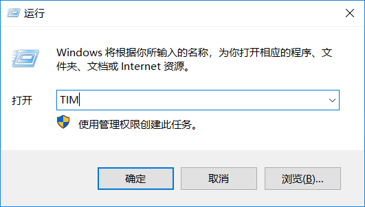
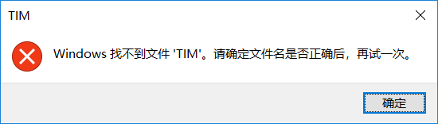

# Windows下使用快捷键启动应用程序

> 目录
> - 前言
> - 方案1: Win + 数字
> - 方案2: 设置快捷方式快捷键
> - 方案3: Win + R + 修改Path

## 前言

常年隐藏桌面图标 从桌面打开程序比较复杂

而且没有鼠标的时候笔记本的触摸板真是定位无力

以下提供三个方案以快速通过键盘启动应用程序

方案1和方案2快速便捷但是数量限制严重

方案3没有这些问题

## 方案1: Win + 数字

Win + 数字 是Windows自带的热键 可以启动任务栏对应位置的应用

只要把常用应用固定在任务栏即可使用此快捷键实现快速启动

举个例子 我的任务栏

虽然是竖向的但是不影响效果:)

常年固定应用

1. 资源管理器
2. 记事本
3. chrome
4. VScode

那么使用Win+1便可以启动资源管理器 使用Win+2便可以启动记事本 以此类推

此方案的缺点也很明显 就是任务栏的容量和美观性

ps:

1. Windows自带资源管理器热键Win+E
2. 小键盘的数字无效

## 方案2: 设置快捷方式快捷键

打开快捷方式的属性如图

其中有一栏快捷方式 可以设置为

	Ctrl + Alt + Key

比如我可以把TIM的快捷键设置为Ctrl + Alt + T

相比于方案1 此方案不需要考虑美观性了

但是此方案仍然有容量有限的缺陷

## 方案3: Win + R + 修改Path

使用Win+R可以打开运行窗口

但是直接在这里输入应用程序名是没用的

因为系统不知道要到哪里去找

比如上图中如果我们试图直接启动TIM

结果如下

所以要告诉系统你的应用程序的路径

最简单的方案是把所有需要的应用程序的快捷方式扔到一个文件夹里面

比如我在任意位置Ctrl+Shift+N新建一个文件夹 命名为appPrompt

打开 此电脑-属性-高级系统设置-环境变量

修改环境变量Path

新建条目 内容为刚才的文件夹路径

保存

现在再使用Win + R就可以通过文件名启动程序:)

个人感觉此方案最好的地方就是不用返回桌面 在任何应用中都可以打开目标应用

ps:

英文文件名不需要区分大小写

参考:

- [在Windows上快速启动程序的5种方法
](http://www.howtoip.com/5-ways-to-quickly-launch-programs-on-windows/)
- [如何使用WIN+R快速启动程序](https://blog.csdn.net/bat67/article/details/76396321)

[返回主页](index.md)