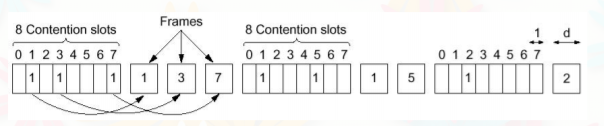
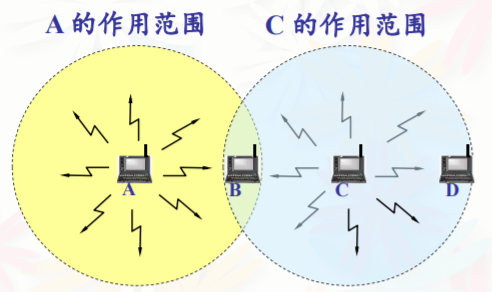

# 计算机网络 目录

- [第一章 概述](Chapter1.md)
- [第二章 物理层](Chapter2.md)
- [第三章 数据链路层](Chapter3.md)
- [第四章 MAC子层](Chapter4.md)
- [第五章 网络层](Chapter5.md)
- [第六章 传输层](Chapter6.md)
- [第七章 应用层](Chapter7.md)

# 第四章 媒体访问控制MAC(The Mediun Access Control Sublayer)子层

也叫 介质接入控制子层

## 解决问题

- 信道分配问题
- 多路访问协议
- 以太网
- 无线局域网
- 数据链路层交换

## 数据链路类型

- Point to point links点-点链路
	- 一个发送方一个接收方
	- 链接建立后地址不必传输
	- 可靠的通信
	- 协议
		- HDLC
		- PPP
- Broadcast links广播链路
	- 很多发送方和可接受到信息的接收方
	- 争夺共有的信道
	- 必须传输地址
	- 协议
		- ALOHA
		- CSMA/CD
		- MACA

## 信道分配问题

多重接入/信道分配策略
- 静态分配
	- 频分复用
	- 时分复用
	- 波分复用
	- 同步时分复用
- 动态分配
	- 异步时分复用/统计时分复用
	- 随机接入协议
		- ALOHA
		- CSMA
		- CSMA/CD
	- 接入控制协议
		- Polling
		- Token Ring

### 共享信道评价一个协议优劣的指标

- 低负载时的时延
- 高负载时的吞吐量

### Static Channel Allocation静态信道分配

时分复用接入TDMA(Time division multiple access)

把信道分配为若干个固定的时槽 空闲时槽被浪费

## Multiple Access Protocols多点接入协议

注意这些协议是局域网内的主机（网卡）的协议，而不是链路层设备交换机使用的协议。交换机只是存储转发罢了

### Pure ALOHA

- 有帧就发送 不考虑其他站（即使信道忙）
- 如果ACK没收到就重发
- 重发前等待随机时长
- 一直重发至发送成功

简单但低效 最大利用率约18.4%

脆弱期/易冲突期为**2T**，T为**单程端到端传播时延**

### Slotted ALOHA 分槽/时隙ALOHA

- 每个槽的时长为T
- 需要中心时钟或其他同步措施
- 错帧的产生：要么丢失要么完全重叠
- 最大利用率36.8%

### 载波监听多路访问协议Carrier Sense Multiple Access Protocols

- 发送前监听信道(Carrier Sense载波监听)
- 试图将脆弱期降低至T
	- 因为传播时延T通常小于发送时延

CSMA策略
- 如果信道空闲 有几率发送帧
- 如果信道忙 等待至空闲
- ACK超时未收则重发
- 脆弱期为1t 但是只能通过ACK判断是否出错

CSMA分类：
- Nonpersistent CSMA 非坚持CSMA
	- 如果信道忙 等到随机时间后再次监听（不坚持监听）
- p-persistent CSMA p-坚持CSMA
	- 有信息需要发送时，坚持监听信道
	- 信道空闲时以概率p发送帧
	- p越小 越不容易冲突 效率越高
- 1-Persistent CSMA 1-坚持CSMA
	- 有信息需要发送时，坚持监听信道
	- 信道空闲时立即发送，也就是信道空闲时以概率1发送帧

效率对比：
- 1坚持CSMA
	- 低负载（轻载）高吞吐量低时延
	- 高负载（重载）低吞吐量
- 非坚持CSMA
	- 高负载（重载）高吞吐量

### 随机接入协议总结

- Pure ALOHA
	- 时间连续
	- 无载波监听
	- 脆弱期2T
- 分槽ALOHA
	- 时间分槽
	- 无载波监听
	- 脆弱期T
- CSMA
	- 载波监听
	- 脆弱期为传播时延T
- 三者共同点
	- **只有计时器到期了 发送方才知道出错**

### CSMA/CD带冲突检测的载波监听多点接入(CSMA with Collision Detection)

- 发送时也监听信道
- 发送时发现冲突则停止发送并发送jam信号（冲突强化信号）
- 发送jam信号之后随机等待一段时间重发
- 半双工
- 节省时间和带宽
- 常用于以太局域网

三个状态
- 争用期Contention period
- 传输期Transmission period
- 空闲期Idle period

争用槽Contention slots 时长为2T
一个站点最多需要2T发现冲突

#### 1-persistant CSMA/CD

1-坚持CSMA/CD的重传等待时间：

退避时在0-d中随机选择一个数k，等待k时间后检测信道
- 如果信道空闲 发送
- 如果信道忙 等待至空闲后直接发送
- 如果再次冲突 重复以上过程
- 如果冲突次数达到一个最大值（通常16）停止发送 上报网络层
- 二进制指数退避算法(Binary Exponential Backoff Algorithm)
	- 从0到2^k-1中挑选一个数r
	- 重传等待时间=r*某个重传时间常量
	- 冲突次数达到最大值时上报网络层

## 无冲突协议Collision-Free Protocols

### Basic Bit-map Protocol基本位图协议

预留协议：实际发送信息之前先广播发送请求

- 共享信道上有N个站，竞争周期分为N个时槽，如果有站要发送帧，就在对应的时槽内发送1
- N个时槽之后，每个站都知道哪些站要发送，则按照站的序号发送数据
- 每个站每次发送的数据量是相同的，这样所有站就能够知道下一次发送竞争时槽信号的时间

### Binary Countdown二进制下数法

- 所有站点地址用等长二进制串表示
- 如果需要占用信道，则广播串
- 各个地址做与操作
- 如果存在某个站点的串大于当前串，则放弃发送请求

举例：

## 无线局域网中的隐蔽站与暴露站问题

### 隐蔽站

A和C无法感知对方，都以为B是空闲的，都给B发送数据，导致冲突

因为A和C相互隐蔽，故称为隐蔽站问题

### 暴露站

B给A发送数据，C想给D发送数据，但是C检测到了信道被占用而不发送

因为C暴露在B的传输范围内，故称为暴露站问题

### 结论

传统CSMA协议不适用于无线局域网

解决方案：MACA

## MACA(Multiple Access with Collision Avoidance)带冲突避免的多点接入

- 发送方发送请求帧RTS(Request To Send)，包括源地址、目的地址与此次会话持续时间
- 若接收方空闲，回复一个响应帧CTS(Clear To Send)，包括RTS中的会话持续时间（防止没有收到RTS的站不知道会话持续时间）
- 周围站点在此会话时间内避免发送数据

## 以太网拓扑结构

- 总线型 - 传统以太网
- 星型 - 交换以太网
- 环形 - 令牌环

## 传统以太网中的物理层

传统以太网的传输介质：
- 粗缆10BASE5
- 细缆10BASE2
- 双绞线10BASE-T
- 光缆10BASE-F

## MAC与LLC的划分

数据链路层包括了LLC（逻辑链路控制子层）和MAC（媒体访问控制子层），从功能上看显然LLC的层级要比MAC高一些。MAC负责管理与物理层的接入，LLC负责控制逻辑链路

对于同一个LLC，下面可能有多个MAC，LLC隐藏了不同MAC子层的差异，为网络层提供单一格式的接口

- 物理层功能
	- 信号的编码与译码
	- 比特的传输与接收
- MAC子层的功能
	- 成帧与拆帧
	- 比特差错检测
	- 寻址
	- 竞争处理
- LLC子层的功能
	- 建立和释放逻辑连接
	- 提供与高层的接口
	- 差错控制
	- 给帧加序号

## 硬件地址/MAC地址

### 格式

12个十六进制数，每两个十六进制数用`-`分隔，如`1A-24-F6-54-1B-0E`

### 链路层转发

路由器由于连接了两个网络，所以有两个网卡和两个MAC地址

网卡接收到MAC帧（即链路层帧）就首先检查帧中的MAC地址，如果是发往本站的就接收，否则丢弃

### MAC帧长限制

**以太网规定最小有效帧长为64字节，最大为1518字节，其中18字节为非数据字段**

MAC最小帧长的限制是由于CSMA/CD协议要求帧的发送时间应该大于2T。小于最小帧长的帧被视为**无效帧**

例题：两台计算机使用1500米的同轴电缆连接，使用CSMA/CD协议，电缆时延4.33μs/km，其他往返延时因素为38.5μs，网络数据传输速率为10Mbps，发送的帧的最短长度是？

从题中可以看出`2T = 2 * 1500 / 1000 * 4.33 + 38.5`μs，在这时间内要已知发送数据，所以最短帧长度应为上述时间称网络数据传输速率。结果为65字节

帧间最小间隔为9.6μs，相当于96比特的发送时间。一个站检测到总线空闲时要等待9.6μs才能开始发送。这是为了给之前的接收方留出处理缓存的时间

## 网桥

### 网桥的转发与学习算法

网桥的学习算法 - 逆向学习：
- 从端口x收到无差错的帧，在表中查找地址
- 如果有地址且目标地址不通过源端口，则转发。如果目标地址通过源端口则丢弃
- 如果没有地址，向x以外的端口洪泛
- 如果源站不在转发表，则把源站的MAC地址与端口x的映射加入转发表并设置计时器

网桥维护的转发表含有
- 站地址 - 各站的MAC地址
- 接口 - 各站对应的接口号
- 时间 - 帧进入网桥的时间

## 虚拟局域网

是一种局域网给用户提供的**服务**而不是一种新型局域网

在一个大的局域网内把一些**物理位置不相邻**的主机划分为小局域网的技术

组网方式：
- 使用交换机端口号定义虚拟局域网
	- 即某个交换机的哪些端口属于同一个虚拟局域网
- 使用MAC地址定义虚拟局域网
- 使用IP地址定义虚拟局域网

功能：实现信息隔离，即使是广播也无法在两个逻辑网络之间穿透（当然这里的广播指的是虚拟局域网发起的在虚拟局域网内的广播）。而且不需要改造主机的以太网卡和相关软件

觉得有用？欢迎[打赏](../../../donate.md)

:)

[返回主页](../../../index.md)