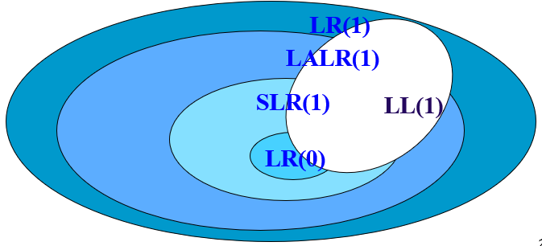

# 编译原理 目录

- [编译概述](1.md)
- [词法分析](2.md)
- [语法分析-自顶向下](3.md)
- [语法分析-自底向上](4.md)
- [语法制导翻译](5.md)
- [语义分析](6.md)
- [运行环境](7.md)
- [中间代码生成](8.md)
- [目标代码生成](9.md)
- [代码优化](10.md)

# 语法分析 - 自底向上分析

## 概述

**自底向上分析**也叫**移进-归约分析法**

- 从左向右对输入串扫描
- 自底向上构造分析树

分析过程是把输入符号串归约为非终结符，最后归约成起始符号

需要精确定义**可归约串**（即某个生成式的候选式）。定义可归约串的方式不同，得到的算法就不同。常用算法：
- LR分析法
	- 可归约串为**句柄**
- 优先分析法
  - 简单优先分析法
  - 算符优先分析法
    - 可归约串为**最左素短语**

归约过程中要保证可规约串的**唯一性**，否则就会产生冲突

## LR分析法概述

### 预备知识

- 短语 - 分析树的**一棵子树**的**所有叶子**（不一定是终结符）从左到右排列起来得到的符号串就是**相对于此子树**的短语
- 直接短语 - 仅有父子两代的子树，其短语为直接短语
- 句柄 - 一个分析树的**最左直接短语**。任何句型的句柄总是**存在且唯一**
- 以上三个概念都是针对某一个句型而言的，即某句型的句柄，某句型的短语，某句型的直接短语。离开句型就无法讨论上述三个概念


可以看出，如果要求所有短语，只要遍历所有子树即可

- 最左推导与最右归约对应（互为逆过程
- 最右推导和最左归约对应（互为逆过程
	- 最右推导为规范推导，所以**最左归约为规范归约**

### LR分析法的定义

LR分析法是一种自底向上进行规范归约的分析方法

LR(k)的含义：
- L - 表示从左到右输入串
- R - 表示最右推导的逆过程（即最左归约
- k - 表示向前看的符号个数

**优点** - 大多数**无二义性**的上下文无关文法都可以用LR分析法分析（即**不需要消左递归和左公因子**），且速度快，能够准确及时指出语法错误及错误位置

**缺点** - 手工构造工作量大（但是可以使用程序生成

本课程涉及的LR分析法：
- LR(0)
  - 0表示不向前看。最简单
  - 也最容易产生冲突
- SLR(1)
  - 低级LR(1)分析法
  - **仅在试图解决LR(0)中产生的冲突时向前看一个符号**
  - 所以并不能解决所有冲突
- LR(1)
  - 始终向前看一个符号
  - 解决冲突的能力是此处提及的四者中的最强
  - 缺点是自动机状态太多
- LALR(1)
  - lookahead-LR
  - 合并了LR(1)中的某些状态来简化程序
  - 这样的合并是有要求的，并不是所有LR(1)都能变成LALR(1)
  - **LALR(1)在分析正确串时和LR(1)需要的步骤一样多，在分析错误串时步骤多一些**

不同的分析法使用了不同的方法构造分析表

### 使用的工具

- 分析栈
	- 符号栈 - 保存已分析的符号（包括非终结符和终结符）（非必需）
	- 状态栈（必需）
- LR分析表，由action和goto两个子表构成：


解释：
- LR分析时有若干个状态（即左侧的0-11
- 在某个状态接收到不同的输入会有不同的操作（包括终结符和非终结符
	- 如果接受到终结符，则调用action中的动作
		- **s(shift)**表示把输入移进符号栈，后面的数字表示状态转移（把此状态压入状态栈
		- **r(reduce)**表示归约，后面数字表示使用哪一个生成式。所以构造表之前必须把**生成式编号**，且**每个生成式只有一个候选式**
		- **ACC**表示接受输入串，即分析成功停止分析
		- **空白项**表示程序不应该运行到这里，需要报错
	- 如果接受到非终结符，则调用goto里面的动作，跳转到指定状态（把对应状态压栈

### 举例

假设文法G(L)（已编号）:

1. `E -> E+T`
2. `E -> T`
3. `T -> T*F`
4. `T -> F`
5. `F -> (E)`
6. `F -> id`

我们使用某种方案构造了一个分析表：


分析过程：


解释：
- 栈有两行，第一行是状态栈（必需），第二行是符号栈（非必需）
- 状态栈的栈底为初始状态0
- 符号栈因为是非必需的，可以没有栈底，也可以写输入串尾符号`$`
- **根据状态栈顶的状态和输入串最左侧符号在分析表中查询动作**
  - 移进 - 把输入串最左侧符号移进符号栈，把分析表中的状态移进状态栈
  - 规约 - 从状态栈和符号栈中弹出对应生成式的长度，然后把规约得到的符号压入符号栈，根据此符号查询goto子表得到一个状态并压入状态栈
    - 如第二行使用`F -> id`规约的过程
    - 先弹出符号栈的`id`和状态栈的`5`
    - 因为生成式`F -> id`生成了符号`F`，所以相当于当前输入串为`F+id*id$`
    - 弹出`5`后状态栈顶为`0`，接收符号`F`应该`goto 3`
    - 所以把`F`压入符号栈，把`3`压入状态栈
  - 接收 - 即状态`1`遇到输入符号`$`时结束分析
- **建议分析过程左侧加上分析步骤的序号**

### 冲突

冲突类型：
- 移进-归约冲突
  - 不知道该移进还是该归约
- 归约-归约冲突
  - 同时存在超过一个生成式可被调用归约，不知道使用哪个生成式

**两种冲突可同时存在**

冲突表现为分析表中的同一个表项包含超过一个动作而导致歧义

具体冲突的情况要和具体的分析法结合判断

## LR(0)分析法与SLR(1)分析法

### 活前缀

**如果一个规范句型的一个前缀不包含句柄之后的任何符号，则称之为此句型的一个活前缀**

已知文法：

```
S -> aAcBe
A -> b | Ab
B -> d
```

- 句型abbcde的句柄是b，活前缀有ε, a, ab
- 句型aAbcde的句柄是Ab，活前缀有ε, a, aA, aAb
- 句型aAcde的句柄是d，活前缀有ε, a, aA, aAc, aAcd

**当活前缀包含句柄的时候就是规约的时候**

### 项目集规范族及其DFA

**LR(0)有效项目**：在生成式的右侧任意位置加一个圆点，它就变成了一个LR(0)有效项目。如生成式`A -> aBcD`，它可以得到如下5个项目：
- `A -> .aBcD`
- `A -> a.BcD`
- `A -> aB.cD`
- `A -> aBc.D`
- `A -> aBcD.`

这个点表示**当前分析过程分析到了当前生成式的什么位置**。所以显然：
- `A -> .aBcD`表示分析过程还没有进入此生成式
- `A -> aBcD.`表示已经分析完了这个生成式，应该使用它规约了

项目可以分为以下几类：
- 规约项目 - 圆点在生成式最右端，需要规约
- 接收项目 - 特殊的规约项目，是文法开始符号的归约项目
- 待约项目 - 圆点后面的第一个符号为非终结符
- 移进项目 - 圆点后面的第一个符号为终结符

**项目集**为项目的集合，通常使用方框括起来，并起个名字（编号），如项目集`I0`：


**每个项目集表示了一个分析状态**，如`I0`中的`S' -> .E`表示`S' -> E`还没开始分析，而存在生成式`E -> aA`和`E -> bB`，他们也没有开始分析，所以就根据项目`S' -> .E`得到了项目`E -> .aA`和`E -> .bB`，他们属于同一个分析状态。

如果状态`I0`接收输入字符为a，则可以确定此时调用了生成式`S' -> E`和`E -> aA`，那么就得到了一个项目`E -> a.A`，因为存在生成式`A -> cA`和`A -> d`，所以`E -> a.A`和`A -> .cA`和`A -> .d`应该是同一个状态（都没有开始分析A）。

重复上述过程，可以得到一个DFA，它的状态集就是**LR(0)项目集规范族**


### 构造LR(0)分析表

根据DFA之间的状态转移来构造LR(0)分析表。

规则：
1. 分析表左侧的状态即为DFA上的状态序号
2. 分析表的goto子表为状态接受非终结符产生的状态转移
3. 分析表项为shift的表项为DFA中状态接收终结符产生的状态转移
4. 如果某个状态包含规约项目，则此状态在action子表中的所有表项均为此规约动作（因为LR(0)不向前看

LR(0)容易产生冲突：假设某个状态包含项目`A -> a.`和项目`A -> .c`，那么根据规则3，`A -> .c`应该在`action-c`那一项填入`shift-c`操作移进c。但是根据规则4，存在规约项目`A -> a.`，所以所有action表项应该填入`reduce-x`，二者产生移进-归约冲突。同样也可能产生归约-归约冲突。

### 构造SLR(1)分析表

修改LR(0)构造规则4为：
4. 如果某个状态包含规约项目，则action子表中此项目**左侧非终结符的follow集**的所有表项设置为规约动作

思想：判断是规约还是移进时，向前看一位来试图确定操作

仍然可能存在**冲突**：如果规约项目左侧非终结符的follow集和移进项目的终结符有交集，则仍然无法通过向前看一位来解决冲突

### 答题流程

1. **拓广文法**（**切记勿忘**

对任意已知文法，假设它的起始符号为S，则添加一个生成式`S' -> S`（用来产生接受项目

2. 把文法转换成**每个生成式只有一个候选式**的形式并标号（以便分析表中使用标号引用
3. 构造LR(0)项目集规范族及其DFA（**切记不存在SLR(1)项目集规范族**
4. 判断**LR(0)项目集规范族**中是否有冲突（也就是不向前看无法解决的冲突），如果有要写出冲突类型，没有冲突就能构造LR(0)分析表
5. 如果存在冲突，冲突是否能通过向前看一位解决。如果能，就可以构造SLR(1)分析表。如果不能，尝试使用后文的LR(1)分析法

### 其他结论

SLR(1)文法 - SLR(1)分析表无冲突的上下文无关文法

每个SLR(1)文法都是无二义性文法（但是无二义性文法不一定是SLR(1)文法，因为SLR(1)预测分析表并没有包含足够多的信息，所以还是会有冲突

## LR(1)分析法

基本思想：始终向前看一个符号

LR(k)项目：`[A -> α.β, a1a2...ak]`，相比LR(0)项目集，后面多了k个符号，表示**能出现在A后面的符号（或A后面的符号串的first集）（是A的follow集的子集）**。称`a1a2..ak`为**项目的向前搜索符号串**。对于LR(1)有效项目，向前搜索符号串的长度为1

**向前搜索符号仅对规约项目有意义**。意为：后续的k个输入符号为`a1a2...ak`时才允许此规约的发生

如果向前搜索符号串有多个，则使用`/`隔开。

包含拓广符号`S'`的状态为`[S' -> .S, $]`

## LALR(1)分析法

构造LR(1)DFA的时候因为向前搜索符号串的不同导致其状态远多于LR(0)DFA

LALR意为lookahead-LR，是一种介于SLR(1)和LR(1)的方法

定义**同心集**：如果两个LR(1)项目去掉向前搜索符号后是相同的，则称这两个项目集是同心集

LALR(1)思想：**合并同心集**（和其中的向前搜索符号串）以减少状态数。

可能出现的问题：合并同心集操作**可能会产生归约-归约冲突（但是不会产生移进-归约冲突，因为向前搜索符号串只跟归约项目有关**

例：存在如下项目集规范族：

```
I1: {
	[A -> c., d]
	[B -> c., e]
}
I2: {
	[A -> c., e]
	[B -> c., d]
}
```

合并之后得到：

```
I12: {
	[A -> c., d/e]
	[B -> c., d/e]
}
```

那么输入d或e的时候就无法确定分析动作了

**实际分析时和LR(1)的区别**：
- 如果是**正确的输入串**，**过程一样**，只是状态名不同
- 如果是**错误的输入串**，则**LALR(1)的分析速度慢于LR(1)**，因为合并同心集后做了不必要的规约，导致延迟发现错误

## LR(0)-SLR(1)-LR(1)-LALR(1)解题顺序

通常问题：能够构造LR(0)分析表？如果不能，能否构造SLR(1)分析表？如果不能，能否构造LALR(1)分析表（此处要先构造LR(1)分析表）？

1. 建立LR(0)有效项目集规范族
2. 判断是否存在冲突，如果不存在就可以构造LR(0)分析表，结束
3. 冲突是否能通过向前看一个符号解决？如果能，构造SLR(1)分析表，结束
4. 构造LR(1)分析表
5. 判断合并同心集是否会出现冲突

## LL(1)和四种LR文法的关系



一个文法是LL(1)文法（无二义性、左递归和回溯），它一定是LR(1)文法

## 二义性

**任何二义性文法都不是LR类文法**。可以添加优先级或结合规则来解决二义性

## 优先分析法（略

觉得有用？欢迎[打赏](../../../donate.md)

:)

[返回主页](../../../index.md)