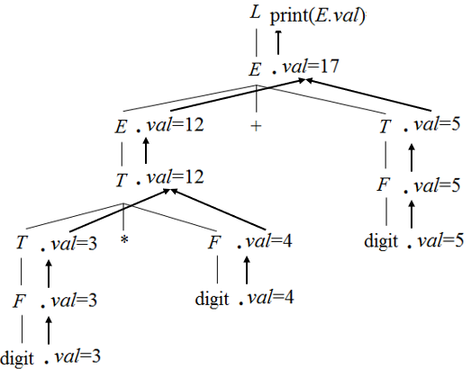
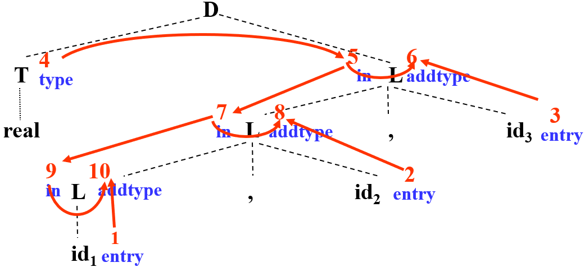
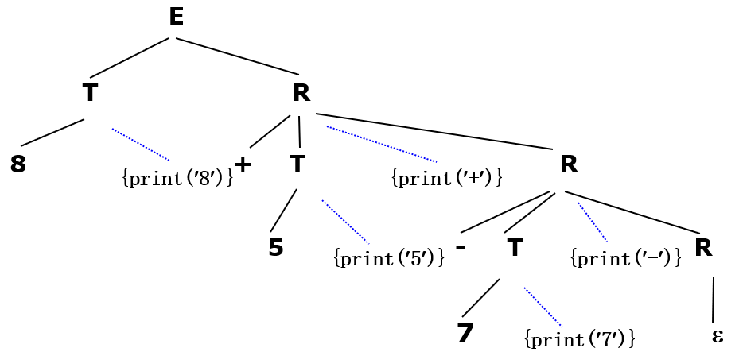
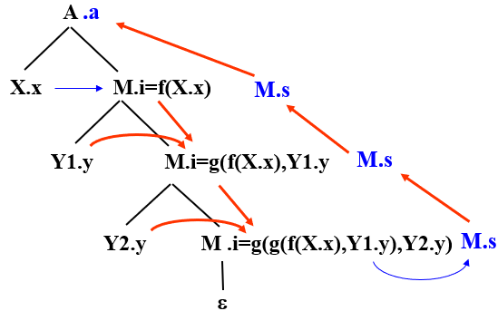
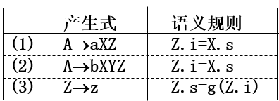
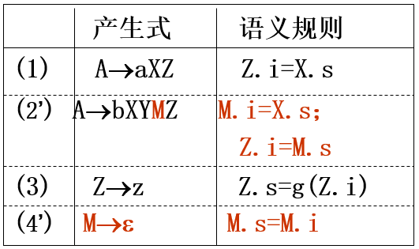

# 编译原理 目录

- [编译概述](1.md)
- [词法分析](2.md)
- [语法分析-自顶向下](3.md)
- [语法分析-自底向上](4.md)
- [语法制导翻译](5.md)
- [语义分析](6.md)
- [运行环境](7.md)
- [中间代码生成](8.md)
- [目标代码生成](9.md)
- [代码优化](10.md)

# 语法制导翻译技术

## 概述

静态语义处理的目的 - 验证语法结构合法的程序是否有意义，如：
- 类型检查
- 控制流检查
- 一致性检查
- 名字作用域分析

如果静态语义正确，语义处理程序才会开始把源码翻译成中间或目标代码

语义分析比较复杂，目前多数编译程序进行语义分析使用的方法是**语法制导翻译**，是一种搭建在语法分析基础上的翻译技术。

思路：**给每个符号（特别是非终结符）设置一系列属性，在语法翻译的时候对属性进行求值**

例如，翻译目标是计算表达式的值，则可以这样设置语义规则：


为了输出表达式的值，可以拓广文法：


实际应用时，对应的**注释分析树**（结点带有属性值的分析树）：



可见，**翻译目标决定了语义规则**，不同的目标需要不同的语义规则，同样的目标也可以有不同的语义规则

**语法翻译制导的一般步骤**：
1. 输入符号串
2. 分析树
3. 依赖图
4. 语义规则的计算顺序
5. 计算结果

## 语法制导定义SDD

### 概述

**仅定义操作，忽略顺序**

SDD是对上下文无关文法的推广，为每个生成式关联一个或多个语义规则。

SDD的格式为一个表，如下图：


### 综合属性和继承属性

定义SDD时需要说明每个属性或函数的意义，以及它们的类型（综合属性还是继承属性）

- 综合属性Synthesized Attribute
  - 生成式左侧非终结符的、值由子节点计算得到的属性为综合属性
  - 也就是自底向上进行计算的属性
  - 分析树中从树叶到树根计算
  - 常被命名为val(value)
- 继承属性Inherited Attribute
  - 生成式右侧符号的、值由生成式左部非终结符的继承属性或/和生成式右部任何文法符号的属性值决定的属性为继承属性
  - 分析树中由父节点或兄弟节点的属性值计算
  - 可以用来向后传递信息
  - 常被命名为in(interited)

一个属性不可能既是综合属性又是继承属性，否则它就有两个计算公式（一个自底向上，一个非自底向上）从而自相矛盾

SDD的一些限制：
- 终结符号只有综合属性
  - 因为终结符号为分析树的叶，不可能再向下计算继承属性
  - 这个综合属性由词法分析程序提供
- 开始符号没有继承属性
  - 没有任何别的符号的属性依赖于开始符号

如果一条语义规则的作用和求值无关，如打印一个值或向符号表中添加记录，则成为生成式左侧非终结符的**虚拟综合属性**

**常见的虚拟综合属性**：
- print(any)
  - 打印any
- addtype(id.entry, type)
  - 在符号表中为符号id添加符号类型（变量类型）type
  - id.entry指明符号id在符号表中的入口

没有虚拟综合属性的文法称为**属性文法**（即只需要计算属性的文法

### 依赖图

属性之间有依赖关系，即属性a的值由属性b决定，那么在计算a之前要先算出b。这样的依赖关系在分析树中可以用依赖图表示：


注释分析树显示了各属性的值，依赖图定义如何计算这些值。

例：如下分析树：


为这些属性建立节点，**符号左侧为继承属性，右侧为综合属性（包括虚拟综合属性**


构造依赖图，**如果依赖图无环，则存在一个拓扑排序，即为这些属性值的计算顺序**



## 语法树

也称为抽象语法树、语法结构树、结构树

是**仅由终结符构成的分析树**，例：


特殊语句，如if-then-else语句：


## 表达式的dag图

dag图 - 有向非循环图，即对语法树进行提取公共表达式的操作

例：原语法树：


提取公共表达式后的dag图：


## 翻译方案概述

**把语义规则插入到产生式右侧适当的位置**，形成翻译方案。即**翻译方案在SDD的基础上添加了语句执行的时机**

例如，存在如下SDD：

| 生成式 | 语义规则 |
| --- | --- |
| `R -> +TS` | `print('+')` |
| `T -> num` | `print(num.val)` |

可能的翻译方案：

```
R -> +T{print('+')}S
T -> num{print(num.val)}
```

**翻译方案的语法分析树**（**带有动作的分析树**），**为每个语义动作构造节点**，使用**虚线**与生成式头部相连：



具体翻译方案在下文S属性定义和L属性定义中讨论

## S属性定义

### 概述

如果一个SDD仅使用了综合属性(Synthesized Attribute)则称其为S-属性定义。因为属性自底向上计算，所以**通常使用自底向上的方法求值**

S属性定义可以和LR语法分析器一起实现，只要在分析栈中添加对应的属性值即可，在规约时按照语义规则计算符号的属性值

例：3*5+4的**注释分析树**：


### S属性定义的翻译方案

因为S属性定义全是综合属性，即调用一个生成式的时候，生成式右侧的所有符号的属性都已经计算完毕，所以**所有生成式对应的语义规则都无脑添加到生成式末尾**即可

## S属性定义的自底向上翻译

### 改造分析栈

使分析栈能够保存**综合属性**（**不需要保存继承属性**，因为继承属性可以使用综合属性栈中的内容计算出来


定义如下变量：
- top - 规约前栈顶索引
- r - 句柄长度
- newTop - 规约后栈顶索引 = top - r + 1
- val[] - 属性栈

则可以通过形如`val[top - ?]`来访问属性栈的内容，如`val[newTop] = val[top - 1] * val[top]`

### 改造分析程序

在LR分析程序的基础上改造。所以仍然需要**拓广文法**切记勿忘

读入终结符号，需要移进操作时，把此终结符号的综合属性放入属性栈

### 为语义规则设置代码段

代码段为使用此生成式规约时调用的代码


## L属性定义

### 概述

如果一个SDD仅使用了综合属性，或所有继承属性只需要其左边的符号的属性，则此SDD为L属性定义

L的含义：left，即从左向右计算

**所有S属性定义都是L属性定义**

**L属性定义的属性计算顺序**：**深度优先遍历分析树**，这样如果所有继承属性都只用到左兄弟的属性，则继承属性可计算

### L属性定义的翻译方案

限制：
- **产生式右侧的符号的继承属性必须在这个符号以前的语义规则中被算出来**
- 语义规则不能（直接或间接地）引用它右边的符号的属性
- 计算产生式左边的符号的综合属性的语义规则放在产生式末尾

## L属性定义的自顶向下翻译

是对**递归调用预测分析**的魔改

仍然要求：
- 没有左递归
- 没有回溯

### 消除左递归的问题

消除左递归会产生新的符号，如何计算它们的属性

例：已知翻译方案（A1是A的第二次出现）：

```
A -> A1Y {A.a = g(A1.a, Y.y)}
A -> X {A.a = f(X.x)}
```

消除左递归后得到的生成式：

```
A -> XM
M -> YM
M -> ε
```

没了A1，多了M，A1的属性如何传递？

为M设置
- 继承属性`M.i`
  - 表示在M之前已经扫描过的符号串的属性值
- 综合属性`M.s`
  - 表示在M完全展开为终结符号之后得到的符号串的属性值

转换后的翻译方案：

```
A -> X {M.i = f(X.x)} M {A.a = M.s}
M -> Y {M1.i = g(M.i, Y.y)} M1 {M.s = M1.s}
M -> ε {M.s = M.i}
```

分析树等价：




### 翻译程序的设计

仍然为每个终结符号建立一个函数
- 函数参数为此非终结符的继承属性（即需要根据前面符号的属性计算得到的属性
- 综合属性作为函数的返回值
- 文法符号每个属性对应一个局部变量（包括综合属性
- 函数体结构和递归调用预测分析类似，向前看符号来判断程序走向哪个分支
- 在调用其他函数之间插入代码段

例：假设翻译方案为：`E -> T {M.i = T.val} M {E.val = M.s}`，则函数代码为

```c++
int E(){
	int eval, tval, mi, ms;//E.val, T.val, M.i, M.s
	tval = T();
	mi = tval;
	ms = M(mi);
	eval = ms;
	return eval;
}
```

## L属性定义的自底向上翻译

**自底向上就不用考虑左递归和回溯了**

### 概述

主要思想：**移走翻译方案中嵌入的语义规则**，**改写SDD为S属性定义**

### 改写SDD为S属性定义

如果SDD中**没有继承属性**：**引入空生成式取走翻译方案中的动作**

例：已知如下L属性定义：

```
E -> +TR
R -> +T {print('+')} R | -T {print('-')} R | ε
T -> num {print(num.val)}
```

其中动作`{print('+')}`和动作`{print('-')}`阻碍了此文法成为S属性定义。

新建非终结符M和N，产生式为`M -> ε`和`N -> ε`，得到新的翻译方案：

```
E -> TR
R -> +TMR | -TMR | ε
T -> num {print(num.val)}
M -> ε {print('+')}
N -> ε {print('-')}
```

如果SDD中**有继承属性**的方案：**通过复写规则，直接使用val[]、top和newTop访问分析栈**

1. 继承属性位置可确定的情况：

假设翻译方案为：


继承属性`L.in`被赋值为`T.type`。尝试使用`T.type`代替`L.in`。`L.in`被用到2次，分别是`L -> id`和`L -> L,id`。由于调用`L -> id`的时候`T`一定在`L`的下方（状态栈中），所以可以使用属性栈中`T.type`的值代替`L.in`，所以翻译方案的代码为`L -> id {addtype(val[top], val[top - 1])}`。同理调用`L -> L,id`时的翻译方案代码为`L -> L,id {addtype(val[top], val[top - 3])}`

2. 继承属性位置不可确定的情况：

假设SDD为：



继承属性`Z.i`被赋值为`X.s`。尝试使用`X.s`代替`Z.i`。`Z.i`被用到1次，为`Z -> z {Z.s = g(Z.i)}`。试图直接把`X.s`赋值为`Z,s`，但是二者的位置关系无法确定，因为X和Z之间可能存在一个Y。

解决方案：新建符号M作为跳板:



使M作为桥梁衔接X和Z，M访问`val[top - 2]`来访问`X.s`，这样Z只要访问`val[top - 1]`就必然能够访问到`X.s`

3. 继承属性使用函数赋值：

考虑如下SDD：


属性栈中只保存了`A.s`，并没有保存`C.i`

解决方案：新建符号N作为桥梁：


添加一个符号保存运算结果为`N.s`这样`C.i`就可以通过`val[top - 1]`来访问

觉得有用？欢迎[打赏](../../../donate.md)

:)

[返回主页](../../../index.md)