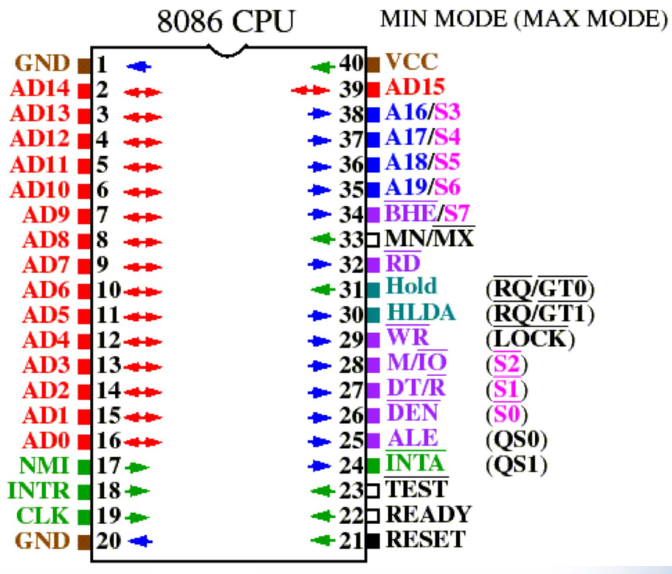

# 微处理器外部特性与输入输出

## 8086管脚

### 主要管脚

主要管脚：
- AD15-AD0
  - 时分复用地址数据线（为了减少对外引脚个数
  - ALE为1时为地址线，为0时为数据线
- A19/S6-A16-S3
  - 20位地址线的高四位
  - 或状态线S6-S3
- M/~IO
  - 表示当前地址是存储器地址还是IO地址
- ~RD
  - 表示是否读
- ~WR
  - 表示是否写
- ALE
  - 地址锁存允许信号，高电平表示AD线传输的是地址
- DT/~R
  - 数据发送(transmit)或接受(receive)信号
- ~DEN
  - data enable数据允许信号
- INTR
  - interupt request中断请求
  - INTR为1且IF(S5)为1时CPU准备进行中断服务。当前指令执行完后~INTA变为低电平以响应中断
- ~INTA
  - 中断响应信号
- CLK
  - 时钟，8086时钟为5MHz
- VCC
  - 电源5V
- GND
  - 地线0V
- MN/~MX
  - 工作模式，MN表示最小模式，MX表示最大模式

### 工作状态S7-S0

S7恒为1，S6恒为0，S5为IF

S4和S3表示当前总线周期哪一个段正在被存取：

S2-S0表示当前总线周期的功能：

## 总线周期与时序

### 概述

**总线周期**是**CPU完成一次访存（或IO端口）操作所需要的时间**，8086CPU的基本总线周期包括**4个时钟周期**，命名为T1-T4

**Ti**表示在两个**总线周期**之间插入的**空闲时钟周期**

如果一次IO或存储器存取时间较长，则根据需要在T3和T4之间插入若干个**等待周期Tw**以保证访存正常进行

### 读周期时序

- T1
  - 送出20位地址
  - 按需设置M/~IO
  - ALE使地址生效（锁存地址
  - DT/~R设置为接收态
- T2
  - 此时地址已经被锁存，AD线可以不再表示地址，A19-A16表示S7-S3
  - 按需启动~RD信号
  - 启动~DEN信号
- T3
  - T3的前沿（下降沿）采样READY信号，如果为1则表示结束，否则表示没有结束，在T3后面插入Tw
  - 数据被放入数据总线
- T4
  - T4的前沿采样数据总线，获得数据
  - 然后所有信号变为无效

## 8086工作模式

8086工作模式有最大模式和最小模式

- 最小模式 - 系统中只有一个8086处理器，所有总线控制信号都由此8086产生，系统的总线控制逻辑电路被减到最少
- 最大模式 - 可以包含一个主处理器和很多协处理器（如数值运算协处理器8087、输入输出协处理器8089），需要使用8288总线控制器来产生不同的控制信号

通电后设置8086的MN/~MX电平以控制CPU的工作模式

## 8086存储器

数据总线16位，地址总线20位，可寻址1M字节

利用BHE信号线，可以按不同方式寻址：

**如果一个字放在奇地址开始的边界上，则需要两个总线周期才能完成读写操作**（因为要发出两次字节读取信号

## IO接口概述

**IO接口指微处理器与外部世界的连接电路或部件**，外设包括存储器、IO设备、A/D或D/A转换器、控制设备等

大致结构：

接口的功能：
- 执行CPU发来的控制命令
- 联络功能
  - 告诉CPU是否准备好、缓冲区是否空或满
- 数据缓冲与锁存
  - 隔离信号，增强总线驱动能力
  - 缓冲与锁存解决CPU与外设速度不匹配的问题
    - 如CPU速度快，只在一瞬间送来地址，那么地址就要被锁存起来使用
- 寻址功能（也称为设备选择功能，即根据CPU发出的外设地址进行译码变为设备选择信号
- 信号转换功能
- 中断管理
  - CPU与中低速外设传递信息使用中断方式
- 数据转换
  - 串并转换、数模转换
- 可编程功能
  - 有些接口芯片可以使用CPU编程来获得不同的效果