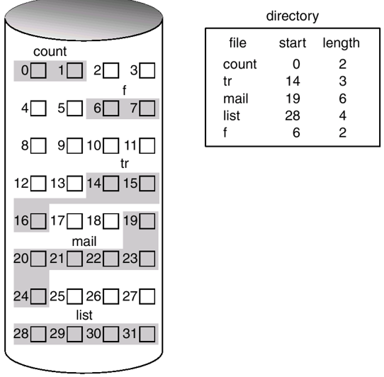
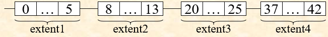

# OS 目录

- [Chapter1 Introduction](Chapter1.md)
- [Chapter2 OS structures](Chapter2.md)
- [Chapter3 Processes](Chapter3.md)
- [Chapter4 Threads](Chapter4.md)
- [Chapter5 CPU Scheduling](Chapter5.md)
- [Chapter6 Process Synchronization](Chapter6.md)
- [Chapter7 Deadlocks](Chapter7.md)
- [Chapter8 Memory Management](Chapter8.md)
- [Chapter9 virtual memory](Chapter9.md)
- [Chapter10 File-System Interface](Chapter10.md)
- [Chapter11 File System Implementation](Chapter11.md)
- [Chapter12 Mass-Storage Structure](Chapter12.md)

# Chapter11 File System Implementation

## Directory Implementation

- list-based
- hash-table-based
  - 使用文件名计算hash

## Allocation Methods文件物理结构

### Contiguous Allocation顺序文件

文件使用连续的存储块，可以随机访问

- 浪费空间，产生外部碎片
- 文件难以动态改变大小

改进：extent-based contiguous allocation

### linked allocation连接文件

- 不浪费空间，可能会有内部碎片(block内)
- 无法随机访问
- 因为block很多，指针长度很长

### indexed allocation索引文件

使用一些文件块作为**索引块**index block or index table

- 随机访问
- 无外部碎片

改进：
- 文件很大时使用多级索引
- 结合其他策略

觉得有用？欢迎[打赏](../../../donate.md)

:)

[返回主页](../../../index.md)