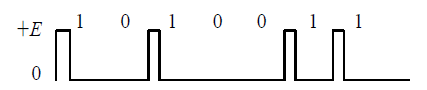
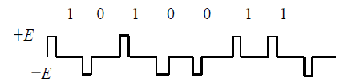
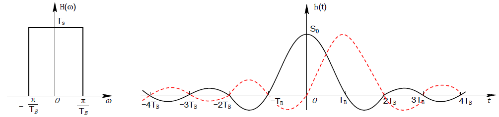
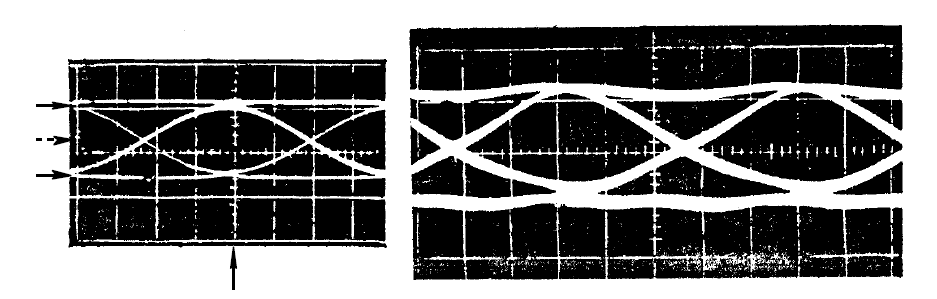

# 通信原理 目录

1. [绪论](1.md)
2. [确知信号分析](2.md)
3. [随机过程](3.md)
4. [信道](4.md)
5. [模拟调制系统](5.md)
6. [数字基带传输系统](6.md)
7. [数字带通传输系统](7.md)
8. [信源编码](8.md)
9. [差错控制编码](9.md)

# 数字基带传输系统

## 基带信号波形

**占空比**为脉冲宽度τ/码元宽度TB

- 单极性不归零码，1-正电位，0-零电位
  - 优点 - 易于产生
  - 缺点 - 存在直流和低频分量
  - 占空比100%
  - 
- 双极性不归零码，1-正电位，0-负电位
  - 等概时无直流分量，抗噪能力优于单极性不归零
  - 占空比100%
  - 
- 单极性归零码，1-正脉冲，0-零电位
  - 含有丰富的位同步信息，是其他码型提取同步信息常用的过渡波形
  - 占空比<100%
  - 
- 双极性归零码，1-正脉冲，0-负脉冲
  - 
- 差分码（相对码），（以传号差分波为例）1-跳变，0-保持
  - 可以消除设备初态影响
  - 可以分为传号差分波（跳变表示1）和空号差分波（跳变表示0）
  - 

## 基带传输码型

原则：
- 不含直流分量，低频分量小
- 有丰富的定时信息
- 功率谱主瓣宽度窄，节省传输频带
- 不受信息源统计特性影响
- 有一定的自检能力
- 编译码简单，降低延时和成本

常用的：
- AMI码（传号交替反转码）
  - 规则 - 1（传号）使用+1和-1交替，0（空号）使用0
  - 译码 - 把所有非0译为1
  - 无直流分量，高、低频分量小
  - 编译码简单
  - 具有宏观检错能力（因为1的正负交替
  - 缺点：连续的0难以获取定时信号
- HDB3码（3阶高密度双极性码
  - 规则 - 在AMI的基础上，把四个连续的0使用`000V`或`B00V`替代。破坏脉冲V（取值可正可负）和前一个非0脉冲极性相同，且相邻的V极性必须交替。如果不能实现，则使用B（取值和后面的V一致）解决V的冲突
  - 译码 - 如果三个0前后的脉冲同极性，则为`000V`，将其译为`0000`。如果两个连续0的前后极性相同，则为`B00V`，将其译为`0000`。然后把所有非0译为1
  - 保留了AMI的优点，且连续0的个数不超过3，有利于定时信息的提取

## 基带信号的频谱特征

公式略

令g1(t)为0码元以概率P出现，g2(t)为1码元以概率(1-P)出现

结论：
- 二进制随机脉冲序列的功率谱包括**连续谱**`Pu(f)`和**离散谱**`Pv(f)`
- 连续谱总是存在，形状取决于g1(t)和g2(t)的频谱与概率P
- 离散谱通常也存在，只有`P=1/(1-g1(t)/g2(t))`的时候离散谱消失，如**等概双极性**信号就**没有离散谱**
- 通常根据连续谱确定信号带宽，根据离散谱确定信号是否有直流分量和位定时分量

例1：01等概单极性不归零和归零波形的功率谱：

结论：
- 01等概单极性不归零
  - 有直流（图中存在脉冲
  - 无定时（脉冲只在原点
  - 以主瓣宽度作为近似带宽时，B=fB
- 01等概单极性归零
  - 有直流（图中存在脉冲
  - 有定时（最近的两个脉冲的距离
  - 以主瓣宽度作为近似带宽时，B=2fB

例2：01等概双极性不归零和归零波形的功率谱：

结论：
- 01等概双极性不归零
  - 无直流（图中无脉冲
  - 无定时
  - 以主瓣宽度作为近似带宽时B=fB
- 01等概双极性归零
  - 无直流（无脉冲
  - **无定时**
  - 以主瓣宽度作为近似带宽时B=2fB

例3：AMI码和HDB3码的功率谱（主瓣部分

结论：
- 无直流
- **无定时**（需要分析信号得到定时信息，信号不自带
- B=fB
- 能量集中

总结：
- 占空比越小，频带越宽
- 01等概双极性码无直流，无定时
- **单极性归零码有定时**，不含定时信息的可以**在接收端转换成单极性归零码**

## 码间串扰ISI

ISI: InterSymbol Interference - 前面的码元波形的拖尾蔓延到当前码元的抽样时刻，导致对码元的判决产生干扰（如波峰被削弱

主要原因是系统传输总特性H(ω)不理想，导致码元畸变、展宽和拖尾

## 消除码间串扰

### 消除ISI的条件

- 时域条件
  - 单个码元在其抽样时刻有值，在其他码元的抽样时刻无值
- 频域条件
  - 如果一个H(ω)能够等效成一个理想句型低通滤波器，在可实现无码间串扰
  - 称为**奈奎斯特准则**

### 无ISI的基带传输特性

满足上述奈奎斯特准则的传输函数的频域与时域图像：

传输速率高于1/TB时存在码间串扰

此理想系统的带宽（奈奎斯特带宽）为fN=1/(2TB)

最高码元速率（奈奎斯特速率）为RB=1/TB=2fN(波特)，即奈奎斯特带宽为fN的信道每秒最多传输2fN个符号，最高频带利用率为2Baud/Hz

**但是上述理想情况无法实现**，实际采用：**升余弦滚降**传输：

传输函数：（不需要背

对应的频谱图：

其中α为**滚降系数**，定义为`f(delta)/fN`

- α越大，拖尾衰减越快，对位定时的精度要求就越低。代价是带宽增大，频带利用率降低
- 升余弦滚降系统的带宽为`B=fN+f(delta)=(1+α)fN`
- 无ISI的最高频带利用率为`η=RB/B=2/(1+α) Baud/Hz`

## 部分响应系统

使用相关编码人为地引入某种相关性，使系统达到2Baud/Hz的最高频带利用率。常用的是第I类和第IV类

假设使用的是L进制系统

整个过程为**预编码-相关编码-模L判决**（如果是2进制系统则为**模二判决**

### 第I类

编码时**人为地引入码间串扰**，使当前码元只对下一个码元产生码间串扰。这样有规律的码间串扰可以通过**预编码**和**模L判决**来消除

预编码的作用是为了避免因相关编码引起差错传播现象，先把输入信码ak转换成相对码bk

- 预编码公式 - bk = ak xor b(k-1) （模L加
- 相关编码公式 - Ck = bk + b(k-1)
- 接收端对Ck进行模L判决恢复ak - ak = Ck mod L

### 第IV类

- 预编码 - bk = ak xor b(k - 2) （模L加
- 相关编码 - Ck = bk - b(k - 2)
- 模L判决 - ak = Ck mod L

### 评价

- 优点 - 消除码间串扰
- 缺点 - 输入数据为L进制的时候，相关编码的电平数量超过L（如I和IV的电平数为2L-1），使抗噪性能变差

## 无ISI基带系统的抗噪性能

研究不考虑ISI的情况下，由加性白噪声n(t)引起的误码率

结论：
- 双极性系带系统的误码率比单极性的低

## 眼图

眼图是一种宏观评价系统性能（ISI和噪声影响程度）的实验手段

- 最佳抽样时刻是眼睛张开最大的时刻
- 定时误差灵敏度是眼眶的斜率。斜率越大，对位定时误差越敏感
- （信号失真）抽样失真反应了抽样时刻上信号受噪声干扰的畸变程度
- 判决门限电平是图中央横轴的位置
- 噪声容限是指系统能容忍的噪声的最大限度，如果噪声的瞬时值超过它就可能发生错判

眼图实例：

觉得有用？欢迎[打赏](../../../donate.md)

:)

[返回主页](../../../index.md)