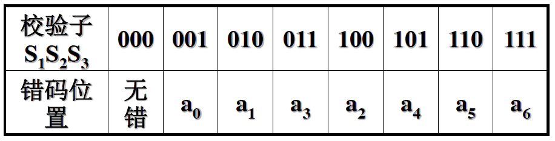

# 差错控制编码

## 概述

差错控制编码（也称纠错编码）属于信道编码范畴，基本原理：**在信息码元序列中按照一定的关系加入冗余码元**（**监督码元**），使译码器利用这种关系发现或纠正可能存在的错码

## 差错控制方式

- 检错重发ARQ - 编码发出能够**检错**的码，重发到接收正确为止
- 前向纠错FEC - 编码发出能够**纠错**的码，接收端自动纠正错误
- 建错删除 - 类似于ARQ，但是直接删除不要求重发
- 反馈校验 - 把接受到的信息原封不动地发送回发送端比较。如果不相同就重发

实际应用中上面的几种方案可能结合使用

## 编码类型

- 线性码 - 监督码元和信息码元的关系是一组线性方程决定的
  - 分组码 - k个信息码元在一起，r个监督码元在一起，总长度为n，可以表示为(n, k)
    - 
  - 非分组码
- 卷积码 - 监督码元不仅和当前一段信息码元有关，还和前面若干个信息段的码元相关。其实是非分组码的一种（因为卷积是线性运算
- 系统码 - 监督码元附加在信息码元后面（上图也是系统码

## 码的属性

- 码长 - 码组（码字）中码元的个数，如`101010`的码长为6
- 码重 - 码组中非0码元的个数
- 码距（汉明距离） - 两个等长码组对应位置上的码元不同的位数
- 最小码距 - 某种编码中各个码组之间距离的最小值，记为d0。**如果是线性码，d0为非零码组的最小码重**

## 最小码距与纠错能力

d0决定了一种编码的检错或纠错能力。对于(n, k)分组码：
- 检测e个错码，要求d0 >= e + 1
- 纠正t个错码，要求d0 >= 2t + 1
- 纠t个同时可检e个错码，要求d0 >= e + t + 1且e > t

## 编码效率与编码增益

- 编码效率（码率） - 信息码元数k与总码元数n的比值
- 编码增益 - 在保持误码率恒定的条件下，采用纠错编码所节省的信噪比称为编码增益

## 线性分组码 - 汉明码

一个(n, k)线性分组码，希望用r=n-k个监督码元指出以为错码的位置，要求`2^r - 1 >= n`

以n=7为例，需要3位监督码监督4位信息码

**汉明码**

假设这7位码分别为a0-a7，其中a0-a2为监督码，设计校验子的错误图样：

监督关系式（监督矩阵）：（以下加法均为二进制加法
- S1 = a6 + a5 + a4 + a2 = 0
- S2 = a6 + a5 + a3 + a1 = 0
- S3 = a6 + a4 + a3 + a0 = 0

编码规则：
- a2 = a6 + a5 + a4
- a1 = a6 + a5 + a3
- a0 = a6 + a4 + a3

