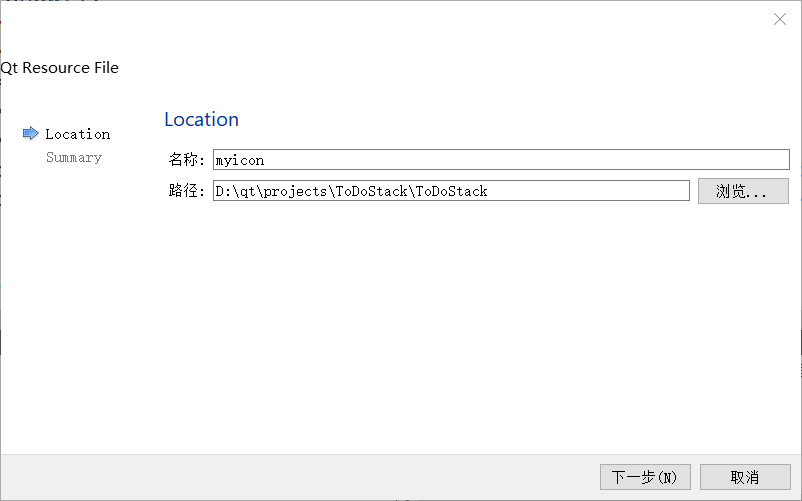

## 预备知识

- 数据 - 信息的载体。符号
- 信息 - 数据的含义
- 知识 - 信息之间的联系

分析数据得到信息（DBMS），综合信息得到知识（AI）

知识的特性：
- 客观性
- 相对正确性 - 在一定条件下正确
- 进化型 - 可能随环境改变
- 依附性 - 所有知识都有载体
- 不确定性 - 因为信息和信息之间关联的模糊性、随机性、不完全性
- 经验性
- 可表示性
- 可利用性
- 可重用性
- 共享性

知识的层次：
- 事实（非常广泛
- 概念（事实的抽象
- 规则（概念之间关系的归纳
- 启发式知识（关于规则的知识

选择知识表示方式需要考虑的因素：
- 充分表示领域知识
- 有利于对知识的利用
- 便于对知识的组织、管理与维护
- 便于理解和实现
- 是否加入启发信息
- 是否有高效的算法

知识的表达方式：
- 基于逻辑的表达
  - 一阶谓词
  - 非经典逻辑
    - 模态逻辑
    - 模糊逻辑
    - 时序逻辑
    - 非单调逻辑
- 面向对象的表达
  - 对象
  - 框架
  - 语义网
- 基于规则的表达
  - 产生式系统
- 基于模型的表达

## 问题表达方法

### 状态空间表示法

需要定义问题的状态空间和状态转移方法

通常使用三元组`(S, F, G)`

- 初始状态 - 
- 操作 - 
- 目标状态 - 

初始状态经过一系列操作到达目标状态

状态空间不变的情况下可以有很多等效的状态转移方法（操作

- 显示说明 - 给出所有结点和操作。状态可穷举
- 隐式说明 - 引入后继算符，逐步动态生成后继结点，扩大状态空间（迭代加深

>显示说明举例：农夫过河问题 - 农夫+狼+羊+菜过河，农夫最多可以携带一个物品。共16个状态

>隐式说明举例：猴子、香蕉问题 - 规划猴子行为使猴子能够抓到香蕉。猴子踩在箱子上才能抓到香蕉。猴子处于无限大二维平面，有无限个状态

### 与或树（图）表示法

解决博弈问题

问题规约法 - 把未解决问题转换为一系列已解决或易解决问题

方法的构成：
- 初始问题描述
- 分解方案
- 已解决的问题（本原问题）

使用与或图表示。
- 与图
  - 问题分解
  - 
- 或图
  - 问题等价
  - 

与或图的结点构成：
- 初始节点 - 原始问题
- 终叶节点 - 本原问题
- 与节点
- 或节点
- 连线 - 分解、转换规则

三种可解节点：
1. 终叶节点
2. 非终叶节点是或节点，后继结点至少有一个可解节点
3. 非终叶节点是与节点，后继结点全部为可解节点

三种不可解节点：
1. 没有后继的非终叶节点
2. 此节点是或节点且后继结点全部是不可解节点
3. 此节点是与节点且后继至少有一个为不可解节点

## 基于知识的表示方法

### 产生式规则表示法

由数学家Post提出，目前应用最广泛的方法之一

`IF XX THEN XX`

基于规则的系统包括三个核心模块：
- 知识库（规则库
- 数据库（包含大量事实
- 推理机（把数据库的输入与知识库的规则相匹配

优点：
- 善于表达领域知识（专家系统
- 控制和知识相分离
- 知识的模块性强
- 便于实现解释推理（可以获得推理过程
- 便于使用启发性知识

缺点：
- 单条规则容易解释，规则之间的逻辑关系难以确定
- 规则数太大时（万数量级），知识库的一致性难以维护
  - `P -> Q` & `P and W -> Q` - 一致性问题
  - `P -> Q` & `Q -> P` - 死循环
- 某些类型的知识难以表示，比如结构性知识

### 谓词表示法

人工智能中的两种逻辑：
- 命题逻辑
- 谓词逻辑

命题 - 要么真要么假的语句。使用大写英文字母表示，如`P: description`

谓词 - 由谓词名和个体/客体变元/变元构成，如`Name(attribute1, attribute2, ..., attributeN)`

一阶谓词 - `P(attribute)`

谓词连接词：
- 非
- 与
- 或
- 蕴含`->`
- 当且仅当`<->`
- 存在量词
- 全称量词

不精确匹配时提供可信度（即一个概率值

### 语义网络表示法

使用图来表示知识、事物概念及语义关系

- 节点 - 概念、实体、事物、事件
- 边 - 关系
- 基本单元 - `<节点><语义关系><节点>`
- 网络 - `<基本单元>`的组合

（属性也可表示为节点

表示情况、动作、事件举例：小燕这只燕子从春天到秋天占有一个窝：

【占有】是所有占有的集合，【占有-1】是某种特定的占有

表示逻辑举例：与会者有男有女，有年老的有年轻的：

（其中ABCD表示`[男, 女] * [老, 少]`

不善于表示逻辑，但是善于表达结构化知识

使用**网络分区+全称链**表示**量化**（部分网络）

例：每个学生都会背一首唐诗

G指向的子空间F仅包含变量。全称链G指向S表示【任意学生】

如果是【所有学生都会背所有唐诗】，则从G再链接一个全称链指向P

如果是【所有学生都会背《静夜思》】则把变量P变为常量《静夜思》，并把P移出变量空间。变量空间只剩下S和R

多元网络 - 一个节点有多个向外的弧

常见语义关系：
- a member of
- composed of
- have
- before/after/at
- located on
- similar to
- a kind of
- part of

如何求解？假设例题：

难以求解，因为模型非严格，没有工人的形式表示体系，且处理复杂性高

### 框架表示法

表示形式更固定的语义网络

- 框架名
- 槽 - 属性
- 侧面（不必须
- 值
- 约束条件

例：

一个框架是语义网络中的一个节点。框架网络是框架与框架之间的联系
- 横向联系 - 一个槽的值是另一个框架
- 纵向联系 - 继承槽，下层框架继承上层框架的属性

常见槽：
- ISA - is a
- AKO - a kind of
- Subclass
- Instance - AKO的逆关系
- Part of
- Infer

特点：
- 嵌套式结构
- 继承性
- 不善于表达过程性的知识

问题举例:

### 剧本表示法

是一种格式固定的框架

描述过程化的知识

规定了11个原子动作：
- PROPEL
- GRASP
- MOVE
- ATRANS
- PTRANS
- ATTEND
- INGEST
- EXPEL
- SPEAK
- MTRANS
- MBUILD

举例：

问题：
- 呆板，局限

### 面向对象表示法

最结构化，抽象程度最高

### 知识图谱

自行搜索知识图谱的概念与相关研究的资料