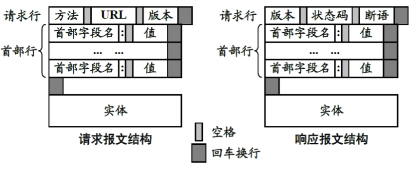

许多协议都是基于**客户-服务器方式(CS)**

## DNS - Domain Name System

32位的IP地址难于记忆。DNS实现符号地址到IP地址的转换。**DNS域名最长为256字节（包括符号）**

- 基于CS模式
- 基于UDP包
- 分布式数据库系统
- 基于域的多层次命名系统

### 因特网域名结构

- 任何一个连接在因特网上的主机或路由器都有一个唯一的层次结构的名字，即域名
- 域名的结构有若干个分量组成，各分量之间用`.`隔开，如`XXX.三级域名.二级域名.顶级域名`
- 各分量分别代表不同级别的域名
- 因特网采用了树状的命名方法，一个高级域名下有多个低级域名

### 域名解析流程

当应用程序（比如浏览器）需要进行域名解析时，它成为域名系统的一个客户，把域名放在DNS报文中向**本地域名服务器**发出请求。本地域名服务器找到IP地址后响应。

本地域名服务器无法完成解析时，它临时变成其上级域名名服务器的客户，递归或迭代解析，知道域名解析完成

- 递归解析

主机`www.ibm.com`获取`xyz.usst.edu.cn`的IP地址的过程如图


高层服务器的态度是“好的我去给你找”，可以看到如果高层服务器（根域名服务器）的任务量非常重

- 迭代解析

相同的问题，迭代解析过程如图


高层服务器的态度是“你应该去这里找”，这样就减轻了高层服务器的任务量

实际应用中使用迭代解析

## WWW万维网(World Wide Web)

简称**WEB**

### WEB的CS模型

每个WEB服务器上都有一个进程在TCP的80端口监听由浏览器发来的请求。连接建立后浏览器和服务器之间使用HTTP超文本传输协议进行信息传输

HTTP协议基于TCP，工作流程：
1. 建立TCP连接
2. Client: HTTP请求报文
3. Server: HTTP响应报文
4. 释放TCP连接

### WEB需要的基本技术

#### 统一资源定位符URL

- 超链接使用URL寻找网页
- URL由三部分组成
	- 协议类型 - HTTP/FTP/...
	- 网页所在机器地址 - 域名或IP
	- 网页文件名
- URL的一般形式：`<Protocol>://<Host><:Port></Path>`
- URL对大小写不敏感

#### 超文本传输协议HTTP

- 基于TCP
- 虽然TCP面向连接，但是HTTP不是面向连接的服务，而是**面向事务**的，一旦事务结束就中断连接
- 服务器默认端口号80

报文结构图：



注意首部结束之后**无论有没有实体都要有一个空行**

- 请求报文

有两个方法：GET & POST，GET在url中附上请求内容，不能附带实体。POST不在url中附上请求，保密性更好。可以附带实体，如表单

请求报文举例：已知一个HTML页面中有标签`<a href="www.info-source.com/welcome.html">click here for info</a>`，点击超链接后发送的请求为：

```
GET /welcome.html HTTP/1.1
Host: www.info-source.com
（空行）
```

- 响应报文

响应报文中含有HTTP状态码

```
2XX - 请求成功
3XX - 资源重定向，需要进一步请求
4XX - 客户请求错误
常用状态码：
200 - OK
403 - Forbidden
404 - Not Found
```

回复信息中的状态行举例（只是状态行，不是完整头）：

```
HTTP/1.1 200 OK
```

#### 超文本标记语言HTML

- 使用**标签**实现对文本的格式化
- HTML文件拓展名为`.htm`或`.html`

#### 搜索引擎（略）

## FTP文件传输协议(File Transfer Protocol)

- 用来从远程主机下载文件或向远程主机上传文件
- 基于CS模式
- 基于TCP协议
- 使用**两个TCP链接**，一个用于控制（端口21），一个用于文件传输（端口20）。好处是简单易实现，在传输文件时也可以控制终止传输
- 采用**交互式**处理方式

首先进行控制连接。如果有传输命令再进行数据连接，传输结束后立即释放数据连接，但是不释放控制连接

## 邮件系统与协议

### 电子邮件格式

邮件地址格式：`name@host`，符号`@`读作`at`，意为“在”

同一个host下的name应该是唯一的

电子邮件格式
- 信封
- 内容
	- 首部
	- 主体

首部的格式：`<关键字>:<内容>`

```
To:一个或多个收信人的邮件地址
Subject:邮件主题
Cc:抄送，表示给某人发送一个邮件的副本
From:发件人地址
Data:发信时间
Reply-To:这封信回复的是哪封信
```

### SMTP简单邮件传输协议(Simple Mail Transfer Protocol)

- 用于**发送**邮件，可以使主机给邮件服务器发送，也可以是邮件服务器之间发送，但是不能是邮件服务器给主机发送
- 基于TCP协议，CS模式，端口25
- 14条命令21种响应信息
	- 每条命令4个字母
	- 响应信息只有一行，由一个3位数字的代码开始，后面可以附加文字说明

### POP3邮局协议(Post Office Protocol v3.0)

- 用于**接收**邮件
- 基于TCP协议，CS模式，端口110
- 15条命令2种响应信息
- 功能简单且有限
- 接收邮件的用户PC机上必须运行POP客户端

### IMAP4交互式邮件存取协议(Internet Message Access Protocol v4.0)

- 用于**接收**邮件
- 是一个**联机协议**，打开邮箱时可以看到所有邮件的首部并制定下载哪些邮件

优点
- 用户可以在不同的地方使用不同的计算机随时上网处理邮件
- 允许收件人只接受邮件的一部分，比如邮件包含了文本和文件，可以先接收文本，有时间了再接收文件

缺点
- 如果用户不把邮件复制到自己的PC机里，优点一直是存放在IMAP服务器上，所以用户需要经常与IMAP服务器建立连接

### IMAP vs POP3

- POP3协议具有存储转发功能。邮件给用户之后POP3服务器不再保存这些邮件。IMAP邮箱只要用户不删除邮件就可以一直保存邮件
- POP3协议是脱机状态运行，IMAP协议是联机状态运行

### 通用因特网邮件扩充MIME

SMTP缺点
- 不能传送二进制文件
- 受限于7位ASCII码，语言受限
- SMTP服务器会拒绝超过一定长度的邮件

MIME主要包括三部分
- 5个新的邮件首部字段
- 定义了许多邮件内容的格式，对多媒体电子邮件的表示方法进行了标准化
- 定义了传送编码，可以对任何内容格式进行转换而不会被邮件系统改变

MIME在底层还是通过SMTP实现的


