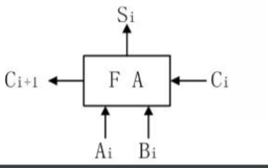
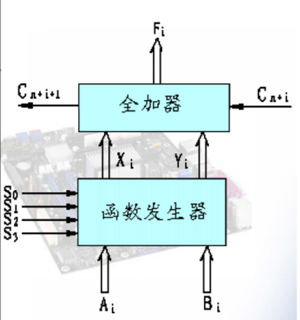

## 定点数的表示方法

没有小数点，只能表示纯小数或纯整数

### 无符号数 & 有符号数

**无符号数都是非负的**。如一个16位2进制数的表示范围为0~65535

有符号数的最左侧位（第一位）为符号位，符号位为0表示正数，符号位为1表示负数

如：8位2进制有符号数00001001表示+0001001，10001001表示-0001001

对小数来说，**个位就是符号位**，如1.0000010表示-0.0000010，0.0101001表示+0.0101001

有符号数花费一位作为符号，取值范围的大小基本不变（也可能取值范围+1，详见补码表示法），但是值的绝对值范围减小了

### 原码表示法

正数第一位为0，负数第一位为1。（如果是纯小数，则个位为符号位）

原码有两个0，以8位二进制数为例：
- `[+0] = 00000000`
- `[-0] = 10000000`

原码表示法简单明了，易于和真值转换，但是**加法运算复杂**（因为需要考虑第一位的正负而不能直接把8位数相加）

### 反码表示法

**正数的反码和原码一样**，负数的反码为原码二进制取反但是**符号位仍然是1**，也就是说**取反操作不对符号位生效**

0的反码：
- `[+0] = 00000000`
- `[-0] = 11111111`

### 补码表示法

**正数的补码和原码一样，负数的补码相当于反码+1**

补码的原理：在数的长度一定时，可以使用补码来代替负数进行加减法。即计算0111+(-0011)和计算0111+1101的结果分别为0100和10100（舍弃首位1，结果相同）

0的补码：
- `[+0] = 00000000`
- `[-0] = 00000000`

**使用补码可以把减法运算变成加法运算**

如果使用原码，一个正数加一个负数不能直接把两个数的原码相加得到结果。如果使用补码，一个正数的补码加一个负数补码可以直接带上符号相加，得到的就是结果的补码

补码的补码等于自身

### 移码表示法

通常用来表示浮点数的阶码

移码把真值向右移动变成了非负数，即把n-1位真值（一位符号位）加上2的n次方得到移码

以6位移码举例
- `[+10101] = 1000000 + 10101 = 1,10101`
- `[-10101] = 1000000 + (-10101) = 0,10101`

可以看到，移码使用了一个**逗号（不是小数点）**把第一位分离了出来，显然第一位为1时是非负数，为0时是负数

### 原码、反码、补码、移码小结


- 四种码制用来解决**有符号数**在机器中的表示与运算。无符号数只有原码就够了
- **正数的原码、反码、补码是一样的**
- 只有移码的正号是1，负号是0，其他都是正号为0负号为1
- 原码与反码的0有两种编码。如果码长8位，负数只能表示到-127
- 补码和移码的0有唯一编码，所以负数可以表示到-128

例题：令`x = 103, y = -25`，下列表达式采用8位定点补码运算时会溢出的是？
- A x+y
- B -x+y
- C x-y
- D -x-y

因为定点补码能够表示-128所以B不会溢出。而定点补码不能表示128所以C会溢出

### 符号位扩展

将n位有符号数转换为n+k位并保持值不变。显然添加的位应该在原串左侧

规则：原串的第一位是0就全补0，是1就全补1

### 移位操作

- 左移一位相当于乘2，右移一位相当于除2（向下取整）
- 使用移位与加减法来实现乘除法
- 移位法则
	- 正数：原码、补码、反码均补0
	- 负数
		- 原码补0
		- 反码补1
		- 补码左移补0右移补1
- 超过串长的位丢弃

例题：某机字长8位，已知整型变量x的补码为11110100，整型变量y的补码为10110000，求整型变量`z=2*x+y/2`

首先进行移位，`x*2`得到11101000，`y/2`得到11011000，然后相加。补码的相加，直接相加即可。得到111000000，第一位越界舍弃，z为11000000

## 浮点数的表示方法

### 基本思想

使用**科学计数法**

以`2.13*10^19`为例，`2.13`为**尾数**，**10**为**基数**，**19**为**阶**

- 尾数常用原码或补码表示。尾数的有效数字位数决定了浮点数的精度
- 阶为定点整数，常用移码或补码表示。阶码决定了浮点数的表示范围

### 规格化尾数

**规格化形式**：**尾数为纯小数且最高位必须为1**（原码表示时为1，如果是补码或反码的负数则最高位为0），个位表示符号，0为正1为负

每个小数都可以转换成一个唯一的规格化数

尾数的规格化表格：


特例：
- `x=-1/2=-0.100...0`的补码`1.100...0`在补码中不是规格化数
- `x=-1`的补码`1.00...00`是规格化数

### IEEE754浮点数标准


在机器中从左向右分为三个部分
- S
	- 1位
	- 浮点数的符号位，0表示正数，1表示负数
- Exp
	- 阶码，用**移码**表示
	- float为8位，double为11位
	- Bias偏移量，float为127(2^7-1)，double为1023(2^10-1)
- Frac
	- 小数字段，用**原码**表示
	- float为23位，double为20位
	- 小数点在尾域的最前面。**规格化数中**尾数`M=1+Frac`（即隐含最高位的1，提升精度，非规格化数中没有这个规则）

关于移码表示的阶码：
- **最小的阶为00...001**
- **最大的阶为11...110**

**阶码为全0与全1被用来表示其他数**

特殊浮点数值：


非规格化数的阶为`1 - Bias = 1 - 127 = -126`（不是-127，保证了非规格化数到规格化数的平滑过渡）

## 定点加减法

### 补码加减法规则

- 补码加法：符号位作为数的一部分参与运算
- 补码减法：减一个数等于加这个数的补码

## 溢出与检测

### 溢出概念

- 正溢 - 运算结果为正且超过机器表示范围
- 负溢 - 运算结果为负且超过机器表示范围
- 上溢 - 结果的绝对值超过机器所能表示的最大绝对值(overflow)
- 下溢 - 结果的绝对值超过机器所能表示的最小绝对值(underflow)

### 溢出检测

- 双符号位法，即**变形补码**法或**模4补码**法

变形补码：前两位为符号位，即00表示正数，11表示负数，两个符号位都参与运算，超过两个符号位的进位丢弃

溢出检测规则：如果结果的双符号位出现了01或10则溢出。最高符号位永远表示结果的正确符号

溢出举例：
```
x = +1100
y = +1000

x变形补码 = 001100
y变形补码 = 001000

x + y
 = 001100
 + 001000
 = 010100
两个符号位不同，溢出
```

可以看到溢出的直观表现为“两个正数相加得到了负数”，类似也有“两个负数相加得到正数”

- 单符号位法

从双符号位法可以看出，溢出的条件为“最高有效位与符号位只有一个进位”，由此得到单符号位溢出判别法：**如果最高有效位和符号位只有一个进位则判别为溢出**

举例：
```
x = +1100
y = +1000

x补码 = 01100
y补码 = 01000

x + y
 = 01100
 + 01000
 = 10100

最高有效位向符号位进位1
但是最高有效位自身没有进位1，溢出
```

### 加法器

一位全加器FA



Ai和Bi为两个输入，Ci为前一位运算传来的进位，C(i+1)为此次运算生成的进位，Si为运算结果

先行加法器：直接用逻辑运算取代加法运算来获得进位（并行进位）

并行进位举例：某加法器进位链小组信号为C4C3C2C1，低位来的进位信号为C0，写出串行进位和并行进位下C4C3C2C1的表达式

```
串行进位下，令
Gi = AiBi
Pi = Ai xor Bi
则Ci = Gi + PiC(i-1)，即
C1 = A1B1 + (A1 xor B1)C0
C2 = A2B2 + (A2 xor B2)C1
C3 = A3B3 + (A3 xor B3)C2
C4 = A4B4 + (A4 xor B4)C3

并行进位下，不等待进位
直接把C(i-1)的表达式代入Ci中，得到
C1 = G1 + P1C0
C2 = G2 + P2(G1 + P1C0)
C3 = G3 + P3(G2 + P2(G1 + P1C0))
C4 = G4 + P4(G3 + P3(G2 + P2(G1 + P1C0)))
```

## 定点乘除法

### 无符号阵列乘法

即把符号先单独拿出来，把两个数作为正数相乘，再把符号位加上

符号的计算只需要把两个数的符号做异或即可。下面只讨论两个正数相乘

**部分积**：1位乘法计算出来的积

部分积举例：`A = 11011, B = 10101`，计算`A*B`

令`aibj`表示`A`中第`i`位乘`B`中第`j`位得到的部分积，则得到如下部分积矩阵

```
a4b0=1 a3b0=1 a2b0=0 a1b0=1 a0b0=1
a4b1=0 a3b1=0 a2b1=0 a1b1=0 a0b1=0
a4b2=1 a3b2=1 a2b2=0 a1b2=1 a0b2=0
a4b3=0 a3b3=0 a2b3=0 a1b3=0 a0b3=0
a4b4=1 a3b4=1 a2b4=0 a1b4=1 a0b4=1
```

按照乘法的原则，应该对这些部分积做如下操作来得到结果

```
       11011
 +    00000
 +   11011
 +  00000
 + 11011
```

所以设计如下阵列乘法器


### 有符号阵列乘法

使用原码的机器可以直接使用无符号数乘法器进行运算，把符号单独处理即可

使用补码的机器使用间接补码乘法运算（直接补码乘法不要求掌握）

**间接补码乘法**：
- 正数：尾数使用无符号数乘法器即可
- 负数：由补码求出其绝对值后再使用无符号数乘法器运算
- 符号位仍单独计算
- 如果乘积是负数，把乘积的绝对值经过求补电路得到补码（因为机器使用的是补码，所以结果需要求补而不能直接使用原码）

求补电路：人工计算补码时是先求反码再+1。求补电路的策略是**从数的最右端开始从右向左找到第一个1，这个1保持不变，这个1以左的所有位求反**

间接补码阵列乘法器：


### 定点除法

**加减交替法（不恢复余数法）**

利用了2进制数的特性

- 已知被除数Ci和除数B
- 计算Ci-B得到结果C(i+1)
- 如果C(i+1)为负（即第一位为1）则此位结果为0，下一次操作改为加法。C(i+1)左移一位
- 如果C(i+1)为正（即第一位为0）则此位结果为1，下一次操作仍为减法。C(i+1)左移一位

## 定点运算器的组成

### 运算器的基本结构

- 算术逻辑运算单元ALU
- 阵列乘除法器
- 寄存器组
- 多路开关
- 三态缓冲器
- 数据总线

### ALU内部结构

使用**函数发生器**和**全加器**实现



函数发生器根据功能选择信号把输入数据进行处理，变成能够通过全加器计算逻辑或算数运算的数据

## BCD码加法

矫正：BCD码进行十进制运算时，如果结果大于9，必须使结果+6得到修正值

## 总线结构

- 单总线结构


所有部件在同一个总线上，简单，但是速度慢

- 双总线结构


两个操作数可以同时放入特殊寄存器，控制电路稍复杂，速度快

- 三总线结构


两条总线输入一条总线输出，算术逻辑运算可以在一步控制下完成。控制电路复杂，速度快

## 浮点数加减法

### 算法

1. 检查操作数是否为0（因为浮点运算复杂，先判断0可以有效减少运算量）
2. **对阶**，以阶码大的数为基准，使阶码小的数**右移**（此时移位不舍弃多余的位，在对结果舍入的时候再舍弃）
3. 对尾数进行加减法求结果
4. 规格化，舍入（可能再次规格化），进行溢出检查（阶码是否溢出）

### 对阶规则

为什么对阶时以阶码大的数为基准，阶码小的数右移？因为结果是以阶码大的数的精度决定的，阶码小的数需要牺牲精度

### 结果规格化

左规：向左规格化

- 尾数为原码时，结果应为x.1xxxx
- 尾数为补码时，尾数的最高位应与符号位相反，否则左移，右侧补0，阶码-1
- 对IEEE754浮点格式，注意省略尾数的第一个1

右规：向右规格化

- 尾数求和的结果为01.xxx或10.xxx时应将运算结果右移以实现规格化
- 尾数每右移1位阶码+1

### 舍入处理

有四种舍入方式

- 就近舍入
- 朝0舍入
- 朝正无穷舍入
- 朝负无穷舍入

做题时0舍1入即可

### 溢出判断

- 阶码上溢，视为正负无穷
- 阶码下溢，视为0
- 尾数上溢，尾数右移，阶码+1
- 尾数下溢，舍入处理

## 浮点数乘除法

## 算法

1. 检查操作数是否为0
2. 阶码加减
3. 尾数乘除
4. 规格化与舍入
5. 溢出检测

