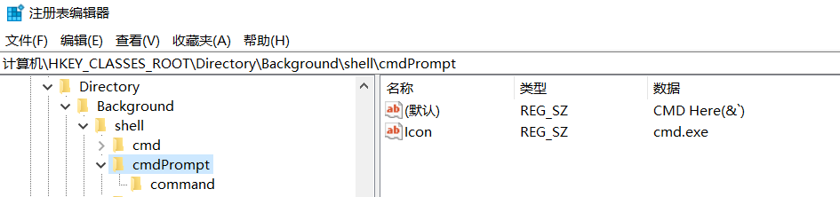
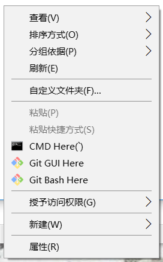

## 基本概念

**指令(Instruction)**指计算机执行某种操作的命令

- 高级语言 - 语句和用法与具体机器的指令系统无关
- 低级语言 - 面向机器的语言，和具体机器的指令系统密切相关

| 比较 | 高级语言 | 低级语言 |
| --- | --- | --- |
| 通用算法 | 有 | 有 |
| 语言规则 | 少 | 多 |
| 编程需要硬件知识 | 不需要 | 需要 |
| 独立于机器 | 独立 | 不独立 |
| 编程难易度 | 易 | 难 |
| 编程时间 | 短 | 长 |
| 程序执行时间 | 长 | 短 |
| 编译过程中对计算机资源的占用 | 多 | 少 |

## 指令格式

### 基础

**指令字**（简称指令），即表示一条指令的机器字（机器码）

指令的构成：
- 操作码字段 - 定义操作
- 操作数地址字段 - 指定操作数的地址

**操作码**：表示指令对应的操作。操作码字段的长度取决于计算机指令系统的规模。如某指令系统有8条（种）指令，操作码只需3位即可。指令字中的操作码长度可以使固定的也可以是变长的

### 按操作数地址数量分类

按照指令中操作数（地址）的个数X（类似于高级语言中函数的参数），可以把指令称为**X操作数指令**或**X地址指令**

通常指令可以根据操作数地址数量划分为：
- 三地址指令
- 二地址指令
- 一地址指令
- 零地址指令

**零地址指令**：只有操作码，没有地址码

**一地址指令**：称为**单操作数指令**，指令中只有一个操作数或者是指令默认以运算器中累加寄存器AC中的数为一个操作数，类似于高级语言函数中的默认参数。符号表达为`(AC) OP (A) -> AC`，其中OP表示操作，AC和A表示地址。AC为累加寄存器地址。地址加括号表示取地址中的数据，类似于C语言中对指针的解引用

**二地址指令**：称为**双操作数指令**。两个地址码表明两个操作数的地址，结果存放在其中一个地址处。符号表达为`(A1) OP (A2) -> A1`

**三地址指令**：指令字中有三个操作数地址。符号表达为`(A1) OP (A2) -> A3`。A1为**被操作数地址**或**源操作数地址**。A1为**操作数地址**或**终点操作数地址**。A3为存放结果的地址

### 按照操作数的物理位置分类

操作数地址可以是存储器地址，也可以是寄存器地址。因此可以把指令分为以下三类

- 存储器-存储器(SS)型指令
	- 参与操作的数都在内存里需多次访存。慢
- 寄存器-寄存器(RR)型指令
	- 操作数都在寄存器中，从寄存器取操作数，结果也存放在寄存器。速度很快，不需要访存，但需要多个寄存器
- 寄存器-存储器(RS)型指令。既要访问存储器又要访问寄存器的指令

### 指令字长度

即指令字中比特的个数

回忆-机器字长：计算机能处理的二进制数据的位数，决定了计算机的运算精度。**机器字长通常和寄存器的位数一致**

指令分类：
- 单字长指令
- 半字长指令
- 双字长指令

使用多字长指令，地址的位数更多，能够提供更大的地址空间，但是CPU必须两次或多次访问内存才能取出一条指令，降低了CPU的运算速度

### 定长操作码与扩展操作码（不定长操作码）

定长操作码指令格式：

显而易见的缺点：地址长度不统一（实际计算机中地址长度是统一的），存在没有被使用的位，浪费空间

所以诞生了变长操作码/扩展操作码：

## 指令助记符

典型的指令助记符

| 典型指令 | 助记符 |
| --- | --- |
| 加法 | ADD |
| 减法 | SUB |
| 传送 | MOV |
| 跳转 | JMP |
| 转子 | JSR |
| 存储 | STR |
| 读取 | LDA |

## 指令与数据的寻址方式

存储器既可以存放数据，也可以存放指令

### 如何区分数据和指令

从时间来说
- 取指令事件发生在**取指周期**
- 取数据事件发生在**执行周期**

从空间来说
- 取出的代码是指令，一定**送往指令寄存器（控制器）**
- 取出的代码是数据，一定送往**数据寄存器（运算器）**

### 寻址方式概述

在存储器中，写入或读出操作数/指令字的方式：
- 地址指定方式（**几乎所有计算机都采用这种方式**）
- 相联存储方式
- 堆栈存取方式

当**采用地址指定方式**时，**形成操作数或指令地址的方式**，称为**寻址方式**

寻址方式：
- 指令寻址方式（简单）
	- 顺序寻址方式
	- 跳跃寻址方式
- 数据（操作数）寻址方式（复杂）
	- 隐含寻址
	- 立即寻址
	- 直接寻址
	- 间接寻址
	- 寄存器寻址
	- 寄存器间接寻址
	- 偏移寻址
		- 相对寻址
		- 基址寻址
		- 变址寻址
	- 段寻址
	- 堆栈寻址

### 顺序指令寻址

通常执行程序时是一条指令接一条指令的顺序执行

从内存取出第一条指令，然后执行，然后取出第二条，然后执行，然后取出第三条，然后执行。。。

需要使用**程序计数器PC（又称指令指针寄存器）**存放**下一条指令**的地址

指令顺序寻址示意图：

### 跳跃指令寻址

程序根据条件需要跳跃执行时采取跳跃寻址，即下一条指令的地址码不是由PC给出，而是由本条指令给出。即**本条指令改变PC内数据**（因为PC内是下一条指令地址），本条指令执行结束后会跳到PC指向的地址

跳跃后继续顺序执行指令，PC也要跟着改变

使用跳跃可以实现程序转移与循环

指令跳跃寻址示意图：

### 操作数隐含寻址

隐含寻址：在指令中不显示给出操作数。如某些单地址指令拥有隐含的操作数AC

### 操作数立即寻址

即**指令的地址字段给出的不是操作数地址，而是操作数本身**。准确来说根本没有寻址

这种指令执行速度快，不需要访存，取指的同时就取到了操作数

### 操作数直接寻址

最“正常”的寻址方式。即指令的操作数字段内容为操作数的地址A，CPU去地址A取出数据D。可以表示为`D = (A)`，和之前说的一样，括号可以视为C语言中对指针的解引用

### 操作数间接寻址

指令的操作数字段给出了地址A1，但是`(A1)`也是一个指针（地址），指向了另一个地址A2，即`A2 = (A1)`，地址A2指向的才是数据D，即`D = (A2) = ((A1))`

因为地址A2可以有很多位，所以间接寻址可以扩大寻址范围

需要两次访存，速度慢，早期曾主流，现在已不太使用

### 操作数寄存器寻址

指令中地址字段给出的不是内存地址而是CPU中通用寄存器的**编号**。假设编号为R，则数据`D = (R)`

### 操作数寄存器间接寻址

类似于间接寻址，寄存器R的内容A不是数据而是一个地址。操作数`D = (A) = ((R))`

### 操作数偏移寻址

是**直接寻址**和**寄存器间接寻址**方式的结合

大致思想：目标地址`EA = (R) + A`，R是一个寄存器的编号，A是指令字中给出的一个**偏移量（形式地址）**，是**有符号数**，即**可以为负**

分为三类：
- 相对寻址
	- 即相对于当前PC的寻址。把PC的内容加上偏移量A
	- 优点是程序员不需要使用绝对地址编程
- 基址寻址
	- CPU中的**基址寄存器**的内容加上偏移量A
	- 优点是扩大寻址范围。基址寄存器的位数可以设置的很长
- 变址寻址
	- CPU中的**变址寄存器**的内容加上偏移量A
	- 与基址寻址类似，但是**变址寄存器的内容自动递增或递减**
	- 使用变址寻址的目的不在于扩大寻址空间，而是实现**程序块**的**规律性变化**

### 操作数段寻址

基于基址寻址。只是把地址空间划分为段

某计算机有20位地址。容量1MB。以64KB为单位划分为16段。则可以把20位地址划分为一个4位段号和一个16位段内偏移量。CPU内有一个**段寄存器**保存一个段号，计算地址时把段号左移16位再加上偏移量即可

### 堆栈寻址

使用栈，数据的存取只通过栈顶进行。后进先出LIFO

可以分为：

- **寄存器堆栈**

存储区域为若干个寄存器。CPU中有一组专门的**串联堆栈寄存器**，每个寄存器能保存一个字

入栈和出栈时**栈顶不变，数据移动**，即栈顶的地址为定值

优点：访问速度快

缺点：堆栈大小受限。**数据的读出是破坏性的**

- **存储器堆栈**

存储区域为主存的一部分。需要一个**堆栈指示器**来指示栈顶位置。CPU中有一个专用的寄存器作为堆栈指示器(SP: Stack Point)

栈顶变化时由SP指示而数据不动 

优点：比串联堆栈灵活。长度几乎不受限。个数也不受限。对存储器寻址的指令对堆栈同样适用

压栈操作：

对应的表达式：`(A) -> (SP), SP - 1 -> SP`。此处使用的策略是**栈顶指向空单元**，即**先压数据再移动指针**，**栈顶为空**。当然也可以使**栈顶指向满单元**（略）

弹栈操作：

对应表达式：`SP + 1 -> SP, (SP) -> A`。在栈顶指向空单元策略下**先移动指针再读取数据**

### 使用标志位区分寻址方式

即在指令字中除了操作码和操作数地址外给出若干个寻址方式标志位（特征位）来说明寻址方式

### 基本寻址方式总结

令指令字中的地址字段为A，R为寄存器，SP为栈顶指针，EA为实际地址，操作数为D，`D = (EA)`

| 方式 | 算法 | 优点 | 缺点 |
| --- | --- | --- | --- |
| 隐含寻址 | 默认操作数地址 | 不访存 | 数据范围受限 |
| 立即寻址 | D = A | 不访存 | 操作数值范围受限 |
| 直接寻址 | EA = A | 简单 | 地址范围受限 |
| 间接寻址 | EA = (A) | 地址范围大 | 多次访存 |
| 寄存器寻址 | EA = R | 不访存 | 地址范围受限 |
| 寄存器间接寻址 | EA = (R) | 地址范围大 | 访存 |
| 偏移寻址 | EA = A + (R) | 灵活 | 复杂 |
| 段寻址 | EA = A + (R) | 灵活 | 复杂 |
| 堆栈寻址 | EA = SP | 不访存 | 应用受限 |

## 复杂指令系统与精简指令系统

### 复杂指令系统计算机CISC

- 指令系统庞大，指令条数可达几百条
- 指令长度不固定，指令格式种类多，寻址方式种类多
- 能够访存的指令不受限制
- 各种指令使用频度差别大
- 各种指令执行时间差别大，不利于流水线
- 一般采用微程序控制
- 难以优化编译生成高效目标代码

复杂指令系统给很多运算设置了独立的指令。比如二进制加减法有指令，十进制加减法也有自己的指令（而不是使用二进制加减法实现），甚至十六进制也有自己的指令。或者乘除法也有自己的指令而不是通过加减法指令实现

### 精简指令系统计算机RISC

- 选取使用频率最高的简单指令，**指令条数少**
- **指令长度固定，指令格式种类少，寻址方式种类少**
- **只有取数/存数指令访存**。其余指令都在寄存器之间进行
- **指令功能简单，控制器多使用硬布线**
- CPU中通用寄存器多，减少访存
- 大部分指令能在一个机器周期完成，利于流水线
- 使用硬布线控制逻辑，控制器简单，留出更多芯片空间来实现大容量cache
- 注重编译的优化

即指实现简单的指令。复杂指令通过简单指令的组合实现

## 典型指令

- 数据传送指令
	- 一般传送
	- 数据交换
	- 堆栈操作
- 算术运算指令
	- 定点浮点加减乘除
	- 加一、减一
	- 求反、求补
	- 移位、比较
	- 十进制加减
- 逻辑运算指令
- 程序控制指令（转移指令）
	- 条件转移
	- 无条件转移
	- 转子程序
	- 返回主程序
	- 中断返回
- 输入输出指令
- 串处理指令
	- 串传送
	- 串存储
	- 串加载
	- 串比较
	- 串扫描
- 特权指令（一般不提供给用于，只能操作系统使用）
	- 系统资源分配管理
	- 系统工作方式设置
	- 用户访问权限检测
	- 段表、页表的修改
	- 任务的创建和切换
- 其他指令
	- 状态寄存器置位、复位
	- 测试
	- 停机
	- 空操作

