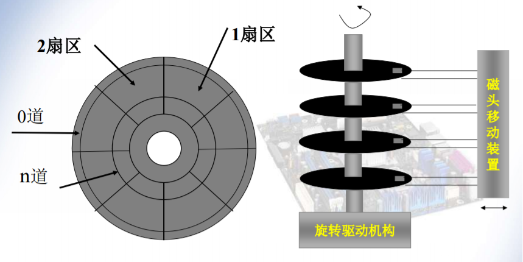

# 计算机组成原理 目录

- [第一章 计算机系统概论](Chapter1.md)
- [第二章 运算方法与运算器](Chapter2.md)
- [第三章 存储系统](Chapter3.md)
- [第四章 指令系统](Chapter4.md)
- [第五章 中央处理器](Chapter5.md)
- [第六章 总线系统](Chapter6.md)
- [第七章 外围设备](Chapter7.md)
- [第八章 输入与输出系统](Chapter8.md)

# 第七章 外围设备

## 磁盘存储设备

### 优缺点

优点：
- 存储量大，位价格低
- 记录介质可重复使用
- 记录信息可长期保存不丢失
- 非破坏性读出

缺点：
- 存取速度慢
- 机械结构复杂
- 工作环境要求高（无尘）

### 分类

- 按盘片结构分
	- 可换盘式
	- 固定盘式
- 按磁头分
	- 可移动磁头
	- 固定磁头

### 基本组成

- 磁记录介质
	- 硬质圆形盘片的磁表面存储器
- 驱动器
	- 写入电路与读出电路
	- 读写转换开关
	- 读写磁头与磁头定位私服系统
- 磁盘控制器
	- 控制逻辑与时序
	- 数据并-串变换电路和串-并变换电路

### 磁盘驱动器

对环境要求高，必须在超净的环境下组装

主要包括
- 定位驱动系统
- 主轴系统
- 数据转换系统

### 磁盘控制器

磁盘存储器是**高速外存设备**，与主机之间采用成批交换数据方式

是**主机与磁盘驱动器之间的接口**（控制器），所以有两个接口：
- 与主机的接口 - 控制外存与主机总线之间交换数据
- 与设备的接口 - 根据主机命令控制设备的操作

### 磁盘上信息的分布

磁盘地址：面-磁道-扇区

寻址过程：驱动器号 - 磁头号（面） - 磁道号（柱面） - 扇区号

因为距离圆心的距离不同，磁道长度不同，但是同一面上的不同磁道的信息总量是相同的，所以**越远离圆心，磁道上的信息越稀疏**

### 技术指标

- 存储密度
	- 道密度 - 沿磁盘**半径方向**单位长度上的磁道数，单位为“道/英寸”
	- 位密度 - **磁道**单位长度能记录的二进制代码位数，单位“位/英寸”，随磁道位置的不同而不同。同一张磁盘上有最大位密度和最小位密度
	- 面密度 - 道密度与位密度的乘积，单位“位/平方英寸”
- 存储容量
	- 一个磁盘存储器所能存储的字节总量。分为格式化容量和非格式化容量
	- **格式化容量** - 按照某种**特定的记录格式**所能存储信息的总量，也就是**用户可以使用的容量**
	- **非格式化容量** - 磁记录表面可利用的磁化单元总数=磁头数（面数）\*每个面的磁道数（柱面数）\*每个磁道的扇区数\*每个扇区的字节数
	- 格式化容量一般为非格式化的60%-70%
- 平均存取时间
	- **平均寻道时间**(seek time) - 把磁头定位到目标磁道上所需的时间。是**最大找道时间**与**最小找道时间**的平均值。5-10ms
	- **平均等待时间**(rotational latency) - 已经找到指定磁道后需要访问的信息到达磁头下面的时间。简称**等待时间**，与磁盘转速有关，用**磁盘旋转一周所需时间的一半**来表示。3-6ms
	- 平均存取时间 = 平均寻道时间 + 平均等待时间
- 数据传输率
	- 单位时间内能够读出的数据量。等于每个磁道的信息量除磁盘转一周的时间

### 优化磁盘存储技术

- 提高磁盘机主轴转速
- 提高IO总线速度
- 使用磁盘cache弥补慢速磁盘与高速主存之间的速度差异

### 独立/廉价磁盘冗余阵列RAID

Redundant Arrays of Independent/Inexpensive Disks

把多个独立的物理硬盘按照不同的方式组合起来，形成一个虚拟硬盘

- 利用数据分块技术和并行处理技术，在多个磁盘上**交错存放数据**，使之可以**并行存取**
- 设置**冗余信息**，如两个盘保存同样的内容，这样一个盘坏掉的时候可以使用冗余信息重建用户信息

优点：
- 传输速率高（得益于并行性）
- 容错功能强（得益于冗余信息）
- 比起传统大容量磁盘驱动器，价格低

组成RAID的不同**方式**称为RAID的**级别**

不同的级别拥有不同的
- 存储性能
- 数据可靠性
- 存储成本

目前存在的级别有RAID 0、RAID 1、RAID 2、RAID 3、RAID 4、RAID 5、RAID 1+0。。。

## 磁带存储设备

和磁盘的区别：磁带只能**顺序访问**，磁盘可以**直接访问**

## 光盘

### 光盘分类

- 只读式光盘CD-ROM(Compact Disc-Read Only Memory)
- 写读光盘WORM(Write Once Read Memory)
- 可擦写光盘

### 光盘扇区格式

信息记录的轨迹称为**光道**。光道上有若干**扇区**，为光盘的**最小可寻址单位**。扇区结构图：

光盘有两个存储模式：
- 模式1，只在数据区存储数据，容量2048B/扇区
- 模式2，把校验区也存数据，容量2048+288=2336B/扇区，适用于存放声音、图像

## 显示设备

### 概念

- 分辨率 - 显示器能显示的像素个数。像素越密集，分辨率越高，图像越清晰
- 灰度级 - 像素点的亮暗差别（黑白层次）。灰度级越高，图像层次越清楚越逼真
- 刷新频率 - 越高，屏幕越不闪烁
- 刷新存储器 - 容量取决于分辨率与灰度级如1024\*768分辨率32位真彩色，需要1024\*768\*32/8B=3MB。带宽取决于容量和刷新频率，如上述显示器的刷新频率75Hz，则刷新存储器带宽3MB\*75Hz=225MB/s
- 扫描方式
	- 随机扫描 - 只在需要显示的地方扫描。速度快，图像清晰，驱动复杂，价格贵
	- 光栅扫描 - 电子书扫描整个屏幕，从上到下从左到右

觉得有用？欢迎[打赏](../../../donate.md)

:)

[返回主页](../../../index.md)