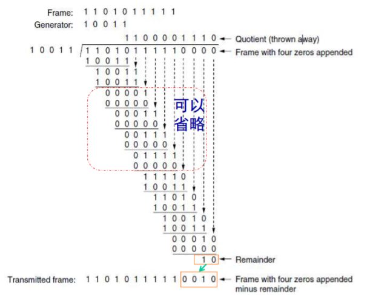

## 数据链路层的主要功能

- 链路管理 - 数据链路的简历、维持和释放
- 帧同步 - 接收方能从收到的比特流中区分帧的开始和结束
- 差错控制 - 能够检错重传或纠错
- 流量控制 - 使接收方能够接受所有发送方发送的数据
- 透明传输 - 把数据和控制信息分开
- 寻址 - 保证每一帧都能够发送到目的地

## 区分

- 物理层带宽(Hz)&数据链路层带宽(bps)

## 封装成帧

### 字符计数法

在帧头加一字节表示帧长度

**注意帧长度包括了帧头**

缺点是一旦帧头出错，很难查错。所以**不能在有误码的信道上使用**

### 字符填充法

PPP协议使用

使用控制字符ESC

在所有ESC和FLAG前加ESC

缺点是控制信息很多时信道利用率低

### 比特填充法

HDLC协议使用

开头和结尾加01111110

在数据中连续出现五个1时在第五个1后面填充一个0

### 物理层编码违例法

利用物理层编码的违例标识控制信息，详见物理层 - 曼彻斯特编码部分

## 差错控制

### 纠错码(ECC Error Correcting Code)

定理：
- 长度不小于t+1的码可以检测t个错误
- 长度不小于2t+1的码可以纠t个错误

#### 海明码

海明距离：两个码做或非操作

假设海明查错码n位，数据码m位，共m+n位，m+n应小于2n

海明查错码的第n位应在海明码的第2n-1位上

计算海明码

### 检错码

#### 奇偶校验

分为奇校验和偶校验

可检测出奇数个*位翻转错误*
其他情况漏检率50%

#### 交错校验

横着写数据码
竖着算校验码

假设数据码n位共k个
则校验码n位

可以检测出长度不超过n的突发错误(横向)

#### 多项式编码(Polynomial Code)

又叫
- CRC循环冗余校验(Cyclic Redundancy Check)
- FCS帧校验序列(Frame Check Sequence)

G(x)成为生成多项式(Generator polynomial)

校验位长度为生成多项式长度-1

数据对生成多项式进行模二除法得到余数即为校验位

r位校验位可以查出所有长度小于r的突发错误

CRC总是放在数据包的**尾部**而不是头部，因为：
- 发送方的硬件电路可以边发送边计算CRC校验和，最后追加到尾部
- 接收方可以便接受边计算CRC校验和，最后和尾部CRC比较

## 流量控制协议

- 基本协议
	- 乌托邦单工协议
	- 无差错信道单工停等协议
	- 有噪声信道单工停等协议
- 滑动窗口协议
	- 1bit滑动窗口协议
	- GBN协议
	- 选择重传协议

滑动窗口协议允许**全双工**和**捎带应答(piggybacking)**

### 乌托邦单工协议(Utopian Simplex Protocol)

信道要求
- 单工
- 无差错 不需要差错控制
- 数据缓冲区无穷大 不需要流量控制

一直发

### 无差错信道单工停等协议(Simplex Stop-and-Wait)

与乌托邦协议相比 数据缓冲区非无穷大

- 发送帧 等待
- 接收方接收帧之后发送ACK
- 接收ACK 发送下一帧

### 有差错信道单工停等协议Positive ACK with Retransmission(PAR)

在协议2的基础上 信道不可靠

使用ARQ(Automatic Repeat request)自动重复请求

添加ACK序号和计时器，超时未收到ACK则重发。ACK序号是为了防止“ACK在网络中滞留，发送方超时重发，接收方再次发送ACK，发送方接收到网络中滞留的ACK后发送下一个包，然后发送方接收到了上一个包的重发ACK后以为新的包已经送达”的问题

### 1bit滑动窗口协议

低效

### GBN协议(Go Back N)

**窗口大小**如果不特指发送窗口还是接收窗口，就表示**帧序号范围**。为了避免混淆下面都用帧序号范围来描述

- 发送窗口大小**大于**1，**小于**帧序号范围最大值
- 接收窗口大小**等于**1

为什么发送窗口不能等于帧序号范围最大值？假设帧序号3位，范围0-7，假设发送窗口的窗口大小也为8，一次性把0-7这8个序号都发出去了，接收方一个接一个正确接收并发送ACK，但是ACK全部丢失，发送方超时重发，接收方发现新来的帧又是从0开始的，自己也应该接收0，就会把重发的包当做新的包

而如果发送窗口大小只是7，一次性发出去0-6，接收窗口知道自己该接收7，那么发送窗口重发就可以被接收窗口识别

### 选择重传(Selective Repeat)

- **只重传出错或丢失的帧**
- 设置ACK定时器，没有数据发送时也可以发送ACK，用于捎带确认
- 增加NAK帧，发送方只需要重发NAK+1的帧而不需要Go Back N
- 收集齐整个接收窗口的帧后**有序**上交网络层

窗口大小相关：
- 发送窗口+接收窗口不大于序号范围，即2的n次方
- 发送窗口和接收窗口不大于帧序号范围的一半，即2的n-1次方
- 发送窗口不小于接收窗口
- 通常两个窗口取值都是2的n-1次方

