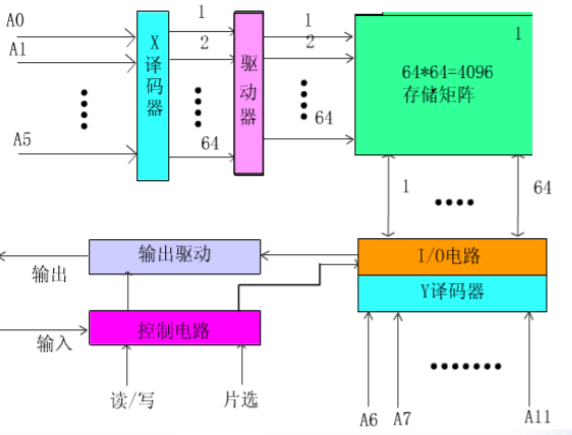

## 存储系统基本知识

### 存储器层次系统

程序运行的局部性：
- 空间局部性 - 短时间内程序所访问的存储器地址在很大比例上集中在存储器地址空间的很小范围内
- 时间局部性 - 在一小段时间内最近被访问过的程序和数据很可能再次被访问

越接近CPU，速度越快，容量越小，成本越高

### 存储器编址方式

- 按字节编址
- 按字编址
- 按半字编址等

物理存储器中低字节存放在前面、高字节存放在后面，成为LE(Little Endian)，反之成为BE(Big Endian)

### 存储器主要的性能指标

- 容量
- 存取速度
	- 访问时间（存取时间）TA
		- 从存储器接收到读写命令到信息被读出或写入所需的时间
	- 存储周期TM
		- 在存储器连续读写过程中一次完整的存取操作所需的时间（CPU连续两次访问存储器的最小时间间隔）
	- 通常TM >> TA
- 存储器带宽
	- 单位时间能够传送的信息量

### 处理器与主存储器的连接

通过**地址、数据、控制**三类总线与CPU或其他部件连接

- 地址总线n位的话可寻址最大主存空间为2n
- 数据总线宽度为一个地址内的比特数，通常为8的倍数
- 控制总线确定总线周期的类型和本次操作完成的时刻

### 存储器读写过程

- 读过程
	- 给出目标地址
	- 给出片选信号与读命令
	- 外部保存读出内容
- 写过程
	- 给出目标地址
	- 给出片选信号与待写入数据
	- 给出写命令

## SRAM静态存储器

### SRAM基本信息

片选线生效时表示选中了此芯片，读写信号才有效

存储体内是一个二维的寻址结构，输送地址时需要两个地址（X坐标和Y坐标）

上图为双译码方式寻址（比单译码结构节省选择线的条数），使用两组地址线输送地址

双译码结构图：

### SRAM的组成
- 驱动器
- IO电路
- 片选与读写控制电路
- 输出驱动电路

### SRAM实例

CS信号为片选信号，WE信号为写使能信号

### SRAM时序图

读周期时序图：

tRC为**读周期**。在tRC的起始部分，地址线给出了有效地址，然后给出了片选信号CS与读命令（读使能）OE，在下一次时钟脉冲时存储器发现片选信号和读命令，于是将数据送入IO总线。**需要注意的就是地址信号、CS/OE信号和数据出现的时间顺序**

写周期时序图：

tWC为**写周期**。同样是先给出地址，然后片选信号生效，接下来是写命令。在写命令之前数据就应该已经放在数据总线了。在tWD时间内写入数据。为了写入可靠，片选信号维持了比读周期更长的时间

一般取tRC = tWC，称作**存取周期**

## DRAM动态存储器

### DRAM基础

一个SRAM的存储单元需要六只晶体管，DRAM可以减少晶体管的使用，但是需要周期充电以维持存储内容不丢失（称为**动态刷新**）。所以DRAM需要额外的**刷新电路**

因为DRAM存储密度大，所以引脚会不够用。采用**分时复用地址线**的策略，第一次送出行地址，第二次送出列地址。所以需要行地址选中信号**RAS**和列地址选中信号**CAS**，还需要地址锁存器来保存之前的地址

### DRAM读写周期

需要注意的是**先给出行地址和列地址之后才能读写数据，RAS与CAS信号在对应时间段生效**

### DRAM刷新策略

- 集中式刷新

一次性刷新所有存储单元。缺点是刷新时间内无法访问存储器，无法响应系统紧急事件

- 分散式刷新

刷新操作嵌入到正常的读写操作中，且一行一行的刷新

例如某DRAM有1024行，刷新周期8ms，则每隔7.8μs刷新一行

使用**CAS在RAS之前的刷新操作**，正常读写时先送RAS再送CAS，如果先送CAS就表示进行刷新操作

### DRAM vs SRAM

| DRAM | SRAM |
| --- | --- |
| 通常用于主存 | 通常用于cache |
| 晶体管数量少 | 晶体管数量多 |
| 每2-8ms需要刷新 | 不需要刷新 |
| 读操作是破坏性的，需要回写(write-back) | 读操作不是破坏性的 |
| 存储密度大 | 访问速度快 |
| 一组地址线分时复用（引脚不够） | 两组地址线 |

## 存储器容量扩展

- 位扩展 - 增加存储器字长
- 字扩展 - 增加存储器字的数量，需要增加一些地址作为片选信号
- 字位同时扩展

### 位扩展

不需要增加片选信号，地址信号和片选信号同时作用于所有芯片，芯片一起输出到数据线

### 字扩展

增加了寻址空间，需要增加地址线作为片选信号。地址线和读写线同样同时作用于所有芯片，只有被片选线选中的芯片做出响应。被选中的芯片将数据发送到数据总线

## ROM只读存储器

### 掩膜式只读存储器

在芯片的制造过程中就编好程序，使用时只能读出不能修改

优点：可靠性高，集成度高，价格便宜，适合大批量生产

缺点：不能重写

### 一次编程只读存储器PROM

出厂时所有存储元均制成0，用户根据自己的需要把存储元改为1。此改变是一个不可逆的过程（如把熔丝烧断或击穿PN结）

## FLASH闪速存储器

闪存分两类：
- NOR闪存
	- 擦除写入时间较长。能够随机存取。适用于存储偶尔需要修改的程序代码
- NAND闪存
	- 擦除写入速度快，有较高的密度和较低的位成本。更多的擦除次数。只允许顺序存取数据。适用于高容量存储设备，如U盘

**闪速存储器是目前唯一具有大容量、非易失性、低价、可在线改写、较高速度的存储器**

FLASH比SRAM成本低，比SRAM集成度高，信息不易失

擦写次数和速度逊于DRAM，不能取代DRAM

闪存可以按照区块sector或页面page组织内容，能够通过不同的命令进入不同的状态（如整片擦除、页面擦除、整片编程等）

## 并行存储器

### 双端口存储器

拥有两组相互独立的读写控制线、地址线和数据线，提供了两个相互独立的端口（左端口与右端口）

当两个端口读写的地址不同时读写操作不会产生冲突。当地址相同时，为了解决冲突，设置了BUSY标志线，由内部逻辑部件判断哪个端口优先操作，而另一个端口的BUSY设置成有效，延迟读写操作

### 多模块存储器

由若干个模块组成的主存储器是线性编址的。编址方式有两个：

- 顺序方式

数据顺序放在链式连接的存储器中

只能**串行访问**。某一模块故障不影响其他模块。增加模块可扩充存储器容量

- 交叉方式

数据交叉放在不同存储器中

假设CPU先给M0发出了读信号，M0需要时间（一个存储周期）去准备数据，此时CPU可以给其他存储器发送读信号，等CPU回来接收M0的数据时M0已经准备好数据了。**流水线操作**，提升效率和存储器带宽

假设模块存取一个字的存取周期为T，总线传送周期（即在两个模块之间转移的时间）为t，那么令m = T / t称为**交叉存取度**，显然存储器的交叉模块数量应该等于交叉存取度m，以此实现效率最大化

交叉方式连续存取m个字所需的时间为`T + (m - 1)t`，而顺序方式存储器连续读取m个字需要时间为`mT`。以此可以计算出带宽

## cache存储器

### cache概论

大容量的主存储器通常使用DRAM构成，访问速度慢，静态SRAM速度快而容量小

cache: 高速缓冲存储器，一般由SRAM构成，全部由硬件调度，对用户透明

利用了程序的空间局部性与时间局部性

cache可以有很多级，越高级，容量越小，速度越快。高级cache拷贝低级cache中的内容供CPU查找

### cache的缺失类型

- 冷启缺失/义务缺失(Cold miss/Compulsory miss)
	- cache为空时就是冷启缺失
- 冲突缺失(Conflict miss)
	- 如果低级层的不同数据映射到高级层的同一位置则产生冲突缺失
- 容量缺失(Capacity miss)
	- 活动的cache块的数量超过cache的容量就会产生容量缺失

### 基本参数

- **命中率**

程序执行期间，令Nc为cache完成存取的总次数，Nm为主存完成存取的总次数，则命中率h=Nc/(Nc+Nm)，即cache命中次数除以总访问次数

- **平均访问时间**

tc为命中时cache的访问时间，tm为未命中时主存的访问时间，则cache/主存系统的平均访问时间ta=htc+(1-h)tm，即cache访问时间和主存访问时间的加权和

- **访问效率**

访问效率e=tc/ta，即cache访问时间除以平均访问时间

- **命中时间**

从cache传送一个字到CPU所需的时间

- **缺失率**

等于`1-命中率`

- **缺失损失/缺失处罚**

加载低一层cache中的数据到当前层cache的时间+把数据交给处理器的时间。通常远大于cache命中时间（加入cache命中时间为1个时钟，缺失处罚可能为100个时钟）

### 地址映射的基础：内容可寻址存储器CAM

CAM(Content Addressable Memory)是一种利用内容寻址的存储器

普通存储器是输入地址输出数据，CAM则是输入数据输出地址（或另一数据）

### 主存与cache地址的映射

cache数据块称为**行**，主存数据块称为**块**。cache中通常保存一个**标签(tag)**来保存地址映射关系

地址映射/地址变换的三种策略：

- **全相联映射(Fully Associative Mapping)**

把主存中的**一小部分块**拷贝在cache中。全相联映射中主存中的每个块都可以放在cache中的**任意位置**，主存地址与cache地址没有直接关系，需要链式查找

地址转换逻辑把CPU发送来的地址分成两部分，一个**tag**部分，一个**偏移量**部分。使用分离出的tag匹配cache中所有行的tag，如果命中则从偏移量处开始读取。如果未命中则取下一级cache中寻找或取主存中寻找

举例：假设一个32位CPU试图从0xFF0144地址读取一个字（32位），每个块有32个字

全相联映射把块名作为tag，因为每个块有32个字，所以后5位用来表示**偏移量**，前32-5=27位作为**tag**。使用16进制表示，不是4的整数倍补前导0，得到tag为0x7F80A。在cache中链式查找，找到后根据偏移量读取数据

缺点：需要CAM存储器来比对tag，电路复杂

- **直接映射(Direct Mapping)**

直接映射是**多对一**的映射关系，一个主存块只能映射到cache中的**一个**特定位置。因为主存中的块比cache中的多，必定有很多块使用同一个cache地址

举例：假设一个32位CPU试图从0xFF0144地址读取一个字（32位），每个块有32个字。cache容量为8行

因为直接映射使用多对一映射，每个主存块只能存放到指定的cache行中。因为每个块有32个字，所以后5位仍为**偏移量**。因为cache容量为8行，所以偏移量前面的3位表示了**行号**，**cache根据行号可以直接访问到指定cache行（而不需要链式查找）**，在当前行内判断剩下的32-3-5=24位是否匹配。如果匹配则cache命中

实现简单，但易产生冲突缺失

- **v路组相连映射(v-way Set Associative Mapping)**

简称组相连映射，是上面两个方法的结合体

在直接映射（多对一）的基础上采取多对多的形式，把cache分组，主存中的每个块只能对应到cache中的特定**组**（参考直接映射），因为主存容量大于cache容量，所以必定存在很多主存块对应同一个cache组。cache组可以存放多个块，cache在组中链式查找目标标签（参考全相联映射）

如果cache中的组内可以存放v个块，则称v路组相连映射

所以组相连映射的检索过程：
1. 根据CPU地址传来的到cache中寻找对应的组（这个组一定存在）
2. 在组中链式寻找标签匹配者
3. 如果找到，使用偏移量访存
4. 如果没找到，到下一级cache或者主存中去找

举例：假设一个32位CPU试图从0xFF0144地址读取一个字（32位），每个块有32个字。cache内含4组，使用v路组相连映射

每个块32个字，则**偏移量**为后5位。cache内含4组，则**组号**2位，标签32-5-2=25位，补0得到16进制**标签**。根据组号直接选中一个组，然后在组内链式匹配标签

集成了全相联映射和直接映射的优点，**被普遍采用**

- **三种映射方式的比较**

- 全相联映射
	- 每个主存块可以存放在任意cache行
	- 需要CAM
- 直接映射
	- 每个主存块只能映射一个唯一cache行
	- cache中定位时不需要链式查询
	- cache未命中时新的主存块会立即更新cache行
- 组相连映射
	- 每个主存块映射一个唯一cache组内的任意行
	- 在组内链式查询时需要CAM
	- cache未命中时，新的主存快会替换掉某个cache组内的一行

### cache替换策略

使用组相连映射，cache未命中时新的主存块会替换掉cache组中的一行。替换哪一行？

- 随机替换(RAND)
	- 硬件随机选择
- 先进先出(FIFO: First-In First-Out)
	- 最先调入此cache组内的块被替换
- 最少使用(LFU: Least Frequently Used)
	- 需要为每个cache行设置访问计数器
- 最久未使用(LRU: Least Recently Used)
	- 需要为每个cache行设置计时器

### cache的写操作

数据的多份拷贝同时存在于cache与主存（或其他存储器）中，有如下写操作策略：

- 写命中(write hit) - cache中有目标块/行
	- 写穿透/直写(write through)
		- 写操作同时更新cache和主存（和其他存储器），每次写都会占用总线带宽
	- 写回(write back)
		- 只写入cache，当cache缺失，当前cache行需要被替换时将数据写到主存（和其他存储器）
		- cache中存在一个标志位用来判断是否被修改
		- 显著减少总线占用。实现复杂
- 写缺失(write miss) - cache中没有目标块/行（略）

## 虚拟存储器

### 基础

思想：
- 主存太小，把主存中不使用的数据暂时放到外存中
- 编写程序时不需要考虑程序是否能在物理存储器中存放的下，也不需要考虑存放在什么位置

用户编写程序时使用的地址称为**虚拟地址(Virtual Address)**或**逻辑地址(Logical Address)**；CPU实际发送出来的用来寻址的地址称为**物理地址(Physical Address)**或**实地址(Real Address)**

使用**主存-辅存**两级存储器组成

### 段式存储管理

- 利用程序的模块化性质，按照程序的逻辑结构划分成多个相对独立的段（如把程序分为**代码段**与**数据段**）
- 使用**段表**来控制，各个段有不同的名称、起点和**不同的段长**
- 有利于实现信息共享和内存保护，但是因为长度不等所以容易产生内存碎块，影响主存储器利用效率

### 页式虚拟存储器

把虚拟空间和主存空间划分成**大小相同的页**（大小为2的整数幂个字），以页为单位进行虚存与主存的信息交换

虚拟地址被分为**虚拟页号**+**页内地址**，物理地址被分为**物理页号（页框号）**+**页内地址**

缺点是处理、保护和共享都不如段式管理方便

优化：使用**TLB**（快表，其实就是页的cache）和多级页表

### 段页式虚拟存储器

- 程序先按照逻辑单位分段，再把每段分成固定大小的页
- 操作系统使用**页面**为单位进行操作

优点是集合了段氏和页式的优点，能够按段实现共享与保护，也可以按页管理内存

缺点是地址映射过程中需要多次查表。地址映射通过一个段表和一组页表来进行

### 页面替换算法

- LRU最近最少使用
- LFU最不经常使用
- FIFO先进先出

### 写回处理

出现修改就应该写回，所以需要设置标志位

## 虚存与cache的比较

相同点：
- 二者都利用了程序的局部性原理
- 目标都是提升系统性价比而诞生的层次性存储体系

不同点：

| 虚存 | cache |
| --- | --- |
| 解决存储容量问题 | 解决存储速度问题，使存储器的访问速度尽量不影响CPU的运行速度 |
| 单位时间内交换次数少，每次交换数据量大 | 单位时间内交换次数多，每次交换数据量小 |
| 由操作系统（软件）和硬件协同完成，对系统程序不透明，对应用程序透明 | 完全由硬件实现 |

## 存储保护（略）

## 附录：存储器的分类

- 按照存储器与CPU的耦合程度
	- 内存（主存+cache）
	- 外村
- 按照读写功能
	- 读写存储器 RWM Read/Write Memory
	- 只读存储器 ROM Read-Only Memory
- 按照数据存取的随机性
	- 随机存取存储器 RAM Random Access Memory
	- 顺序存取存储器 SAM Sequential Access Memory
	- 直接存取存储器 DAM Direct Access Memory
- 按照存储器的访问方式
	- 按地址访问的存储器
	- 按内容访问的存储器 CAM 相联存储器
- 按照半导体存储信息的方法
	- 静态存储器
	- 动态存储器

存储器的习惯分类：
- 易失性半导体存储器统称为RAM
- 非易失性半导体存储器统称为ROM
- RAM可以分为
	- 静态RAM(SRAM)
	- 动态RAM(DRAM)
- ROM可以分为
	- 掩膜ROM(MASK ROM)
	- 可编程ROM(PROM)
		- 一次性可编程ROM(OTP ROM)
		- 可擦除PROM(EPROM)
			- 紫外线擦除EPROM(UV EPROM)
			- 电擦除EPROM(EEPROM/E2PROM)
			- 闪速存储器(FLASH ROM)

