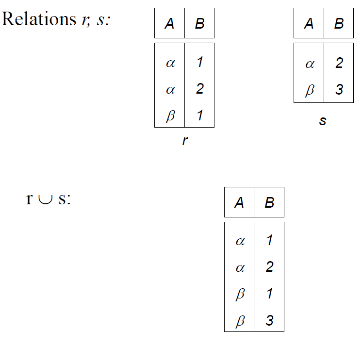
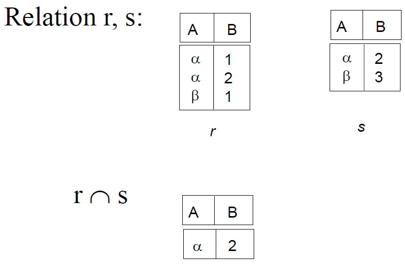
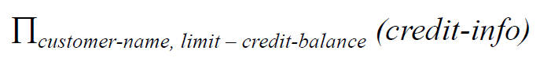
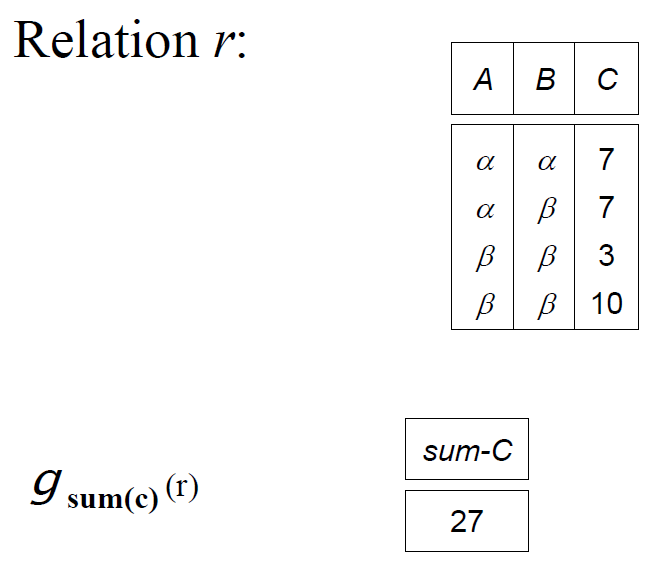

## 预备知识

每个关系视为一个二维表（类似于Excel

- 元组 - 一行
- 数据项 - 一个单元格
- 属性 - 一列

- superkey超键 - 任意两个元组没有相同的超键。可以视为候选键+冗余属性
- candidate key候选键 - 最小超键（没有冗余属性的超键），满足唯一性、最小性
- primary key主键 - 候选键中的一个（根据实际情况从候选键中选择
- foreign key外键
  - 定义外键时要给DBMS指明外键的对应关系。所以外键和外部主键的名字可以不同。可以指向自身表的主键

支持的**完整性约束(Integrity Constraint)**:
- 实体完整性约束(IC of Primary Key) - 主键取值非空（如果主键包含多个属性，则任何属性都不能为空
- 参照完整性约束(Referential IC) - 外键取值要么为空，要么为其参照的主键值
- 用户自定义完整性约束

模式图：
- 表名
- 属性集
- 下划线 - 主键（可能由多个属性构成
- 外键引用对应关系


## 关系代数

### 概述

六大基本操作：
- 选择select
- 投影project
- 并unoin
- 差set difference
- 笛卡尔乘积Cartesian product
- 更名rename

附加操作（可以由基本操作组合表示）：
- 交Set intersection
- （自然）连接(Natural) join
- 除法Division（略
- 赋值Assignment
- 广义投影Generalized Projection
- 外连接Outer Join
- 聚集函数Aggregate Functions

### 选择select

一元操作，从一个表中选出满足特定关系的元组


其中p是选择条件，r是一个关系

p中可以使用以下符号进行逻辑拼接：


（下文中会使用`and` & `or` & `not`表示以上三种逻辑拼接

p里面可以使用的操作包括`=, !=, >, >=, <, <=`，操作的两侧可以是属性，也可以是常量

例：


### 投影project

一元操作，从一个表中取出特定的列

去重（可选


其中A1...Ak是关系中的属性名，r是关系

例：


### 并unoin

二元操作，合并两个表。表头可以不一样，但是要求属性数量相同，相同位置的属性相容

去重（可选


例：



### 差set difference

二元操作，在删除关系r中出现在关系s中的元组。两个关系必须拥有相同的属性数量，相同位置的属性必须相容


例：


### 笛卡尔乘积Cartesian product

二元操作，把关系r中的每个元组与关系s中的每个元组相互组合。要求两个关系不存在相同的属性名


如果两个关系有相同的属性名，则需要重命名操作

例：


### 更名rename

一元操作，常用于自连接


其中X为关系的新名字（如果仅改属性名则不必给出），A1...An为各个属性的新名字（如果仅改关系名则不必给出）。

### 交Set intersection

二元操作，求两个关系内相同的元组。要求两个关系属性数量相同且同位置属性相容


可以使用基本操作表示：


例：



### 连接与自然连接join & Natural join

连接，也叫内连接

二元操作，相当于笛卡尔乘积的基础上做选择操作。


例：


自然连接 - 在两个表的相同属性上面做等值连接


例：


### 除法Division（略

逆笛卡尔乘积


例：


思想：（参考[这里](https://www.geeksforgeeks.org/sql-division/)

使用上面的`r(A, B, C, D)`和`s(C, D)`两个关系

1. 寻找所有`r(A, B)`和`s(C, D)`的组合，得到`r1(A, B, C, D)`

| A | B | C | D |
| --- | --- | --- | --- |
| a | b | c | d |
| a | b | e | f |
| b | c | c | d |
| b | c | e | f |
| e | d | c | d |
| e | d | e | f |

2. 使用r1减去r得到r2

| A | B | C | D |
| --- | --- | --- | --- |
| b | c | c | d |

3. 使用`r(A, B)`减去`r2(A, B)`得到`r3(A, B)`

| A | B |
| --- | --- |
| a | b |
| e | d |

r3即为`r/s`

假设关系为`r(x, y)`和`s(y)`，则对应的sql语句为：

```sql
SELECT * FROM R 
WHERE x not in ( SELECT x FROM (
(SELECT x , y FROM (select y from S ) as p cross join 
(select distinct x from R) as sp)
EXCEPT
(SELECT x , y FROM R) ) AS r );
```

或

```sql
SELECT * FROM R as sx
WHERE NOT EXISTS (
(SELECT p.y FROM S as p )
EXCEPT
(SELECT sp.y FROM  R as sp WHERE sp.x = sx.x ) );
```

### 赋值Assignment

用来保存运算的中间结果，符号为`<-`

### 广义投影Generalized Projection

允许对投影后的属性进行运算。允许常量出现


其中F1...Fn允许是算术表达式，比如两个属性（或属性和常量）的加减乘除

例：



### 外连接Outer Join

内连接仅挑选了符合条件的元组，会导致信息丢失。外连接保存所有元组，不符合条件的元组使用null来填充未知值

外连接的结果包含内连接的结果

可以用来检错

分类
- 左外连接
- 右外连接
- 全外连接

例：已知以下两个关系：


### 聚集函数Aggregate Functions

输入一组值，输出单个值。通常是统计函数，比如：
- max
- min
- avg
- sum
- count

写作：


其中G1...Gn为分类条件，是一系列属性（非必需）。F1...Fn是聚集函数，A1...An是聚集的属性名

例：




## 空值null

使用`null`表示

与null相关的数学表达式结果都是null

聚集函数通常忽略空值

比较值是否相等时，两个null视为相等

与null相关的真值表：


连接语句、选择语句把null视为不满足条件

投影、并、交、差操作在去重时把null视为重复的因素

## DML

### Deletion


### Insertion


### Updating

可以使用广义投影实现


例：

