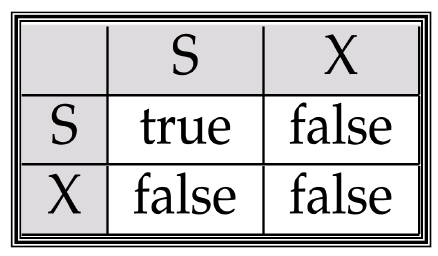
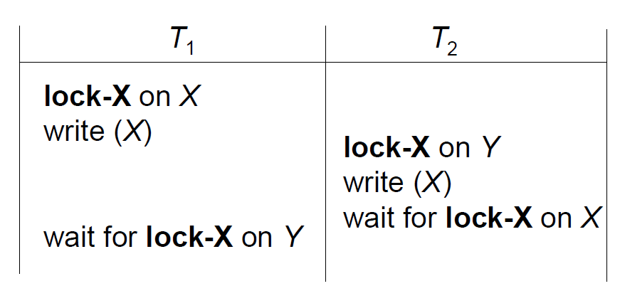

## 并发控制协议

用来保证调度可串行。

- 基于锁的协议lock-based protocol
- 基于时间戳的协议timestamp-based protocol（略

## 基于锁的协议

### 两种锁

数据可能处于两种状态

- 互斥状态exclusive mode(即被上了互斥锁X) - 可以被读写
- 共享状态shared mode(即被上了共享锁S) - 仅能读

上锁时的相容性矩阵：



每个事务操作数据时都要根据条件给数据上锁。如果不能上锁则等待

### 简单上锁协议

如果读数据，就近上锁：

```
lock-S(A)
read(A)
unlock(A)
```

如果写数据，就近上锁：

```
lock-X(A)
read(A)
write(A)
unlock(A)
```

缺陷：
- 死锁 & 饥饿
- 执行错误（假设读A然后读B然后输出A+B，那么读B的时候因为没有锁A所以A可能被修改

### 两阶段封锁协议

**two-phase locking protocol**

思想：批量上锁解锁。一旦释放了锁就不能再申请锁，直到已申请的锁全部释放

- **增长阶段growing phase** - 批量加锁，不能释放锁
- **缩减阶段shrinking phase** - 批量解锁，不能上锁
- **封锁点lock point** - 最后上锁的位置

此协议保证了冲突可串行化。只要排序封锁点即可得到正确执行顺序。但是不能保证不死锁，也不能保证没有级联回滚

优化：
- **严格两阶段封锁协议strict two-phase locking protocol**
  - 事务在commit/abort之前必须一直持有它的互斥锁
  - 防止死锁
- **强两阶段封锁协议rigorous ..**
  - 更严格
  - 事务在commit/abort之前必须一直持有它的所有锁
  - 事务串行化的顺序就是commit的顺序

### 锁转换

lock conversions

因为两阶段封锁协议比较严格，可能会限制功能，所以允许锁在两个阶段存在转换

- **升级upgrade** - 共享锁变互斥锁（添加使用权限
- **降级downgrade** - 互斥锁变共享锁（减少使用权限

第一阶段允许：
- 获得S/X锁
- 升级S -> X

第二阶段允许：
- 释放S/X锁
- 降级X -> S

修改后的协议仍然可以保证可串行化

### 多粒度

multiple granularity

使用不同粒度访问数据，形成一个树形结构。叶节点为最小粒度的数据，上面的结点是大粒度数据。方便访问以组为单位的数据。每个节点都可以单独加锁


父节点加锁会隐式给子节点加锁。那子节点加锁，父节点如何表示？

引入 **意向锁intention lock**机制，事务不必搜索到根节点就可以判断是否能够加锁

- **意向共享锁intention-shared(IS)** - 表示子节点加了共享锁
- **意向互斥锁intention-exclusive(IX)** - 表示子节点加了互斥锁
- **共享意向互斥锁shared and intention-exclusive(SIX)** - 表示某个子节点加了共享锁，这个子节点的子节点加了互斥锁

相容性矩阵：


自顶向下上锁，自底向上解锁。如果想读，自顶向下加IS，最后加S。如果想写，自顶向下加IX，最后加X

## 死锁处理

死锁举例：



### 死锁预防策略

保证死锁不可能发生

- 在事务开始时获得所有需要的锁，如果无法获得就全部释放而不等待（操作系统-银行家算法
  - 缺陷 - 事务开始时难以知道需要哪些锁。数据项利用率低，可能锁了半天的数据不使用
- 类似于树形结构，给所有数据项加一个次序，按顺序访问
- 超时机制，超时后回滚，释放所有锁

利用时间戳的死锁预防：
- **死亡等待协议wait-die**
  - 非抢占
  - 假设事务i需要的数据被事务j占有，如果事务i比事务j早开始（i比j老）则等待，否则i回滚死亡
- **伤害等待协议wound-wait**
  - 抢占
  - 假设事务i需要的数据被事务j占有，如果事务i比事务j晚开始（i比j年轻）则等待，否则j回滚（j被i伤害，即被抢占

上述两种方案都可能引起不必要的回滚

### 死锁检测

使用 **等待图wait-for graph**

如果无环即无死锁（可拓扑排序


### 死锁恢复

检测到死锁后，需要回滚一些事务。步骤：
1. 选择牺牲者，尽量减少回滚代价
2. 回滚，可以彻底回滚或部分回滚
3. 避免饿死。如果每次回滚选择的牺牲者是同一个事务，就会导致永久死锁恢复。所以要记录事务回滚的次数，防止饿死