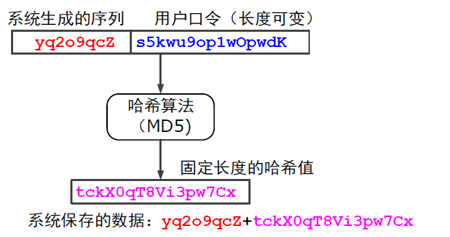

## 预备知识

### 大小写

- Linux shell区分大小写
- windows不区分大小写

### 行律line discipline

处理一行内字符的缓冲、回显与编辑，直到按下回车键

会进行数据加工，比如把换行变成回车换行，把ctrl+c变成终止进程运行的信号

可以使用stty指令进行修改

### 转义序列

使用ESC后面加其他字符构成转义序列（ESC的ASCII码为0x1B/0d27/0o33

转义序列的功能：
- 控制光标位置
- 改变字符颜色
- 改变字符大小
- 设置终端字符集
- 控制打印机、刷卡机、磁条机、密码键盘...
- ...

举例: `Esc[2J`

可以在控制台直接输入转义字符（按下ESC后会发现接下来按下的几个字符没有回显），也可以通过其他输出到控制台的方法输入转义字符（比如系统自带的cat指令）。如果使用cat或其他指令意外导致控制台乱码，可能是转义字符把终端字符集改了。重启终端即可

### 终端流量控制

问什么需要流量控制？
- 终端的显示速度跟不上主机的发送速度
- 主机发送的内容需要暂停显示

流量控制方式：
- 硬件方式 - 添加CTS(Clear To Send)信号线。麻烦
- 软件控制 - 使用流控制字符Xon & Xoff，方便

终端希望主机暂停发送时，终端向主机发送Xoff，否则发送Xon

默认情况下行律把Ctrl+S视为暂停显示（即Xoff），把Ctrl+Q视为恢复显示（即Xon）

古早计算机屏幕打印速度慢，可以直接通过以上两个字符控制屏幕打印以阅读大量信息。现在基本上用户不用这个东西，都是终端和主机通信使用。如果在Linux系统误使用Ctrl+S造成控制台没反应了，使用Ctrl+Q恢复（但是在Ctrl+S和Ctrl+Q之间输入的字符仍然有效

### Shell提示符

登陆成功后会出现Shell提示符

常见的Shell提示符：
- MS DOS - `C>`
- Bourne Shell(/bin/sh) - `$`
- C Shell(/bin/csh) - `%`
- Korn Shell(/bin/ksh) - `$`
- 当前用户为root - `#`

Shell提示符可以根据需要使用命令进行改变

### 关机

使用命令`shutdown`（仅root用户可以关机

如果直接断电可能会导致数据丢失（可能保存在cache而没有保存到文件

### 死机

Linux系统稳定，普通应用程序不应该会导致死机。死机现象是由于系统内核态程序有问题，通常是外设的驱动程序的BUG

## 账号相关

### 账号管理

- 系统管理员可以创建用户（比如使用useradd命令
- root用户不受权限制约，可以随意修改与删除文件
- 普通用户受权限制约

### 登录过程

出现提示符`login:`时输入用户名，回车

出现提示符`password:`时输入密码（密码不回显

### 密码

命令`passwd`

- 普通用户使用时需要先验证原本的口令
- root用户不需要验证原本的口令（但是登录需要啊
- root用户可以修改其他用户的口令

系统内部不保存密码明文，而是保存一个token:

使用的哈希算法非对称，这保证了系统被入侵也无法根据token反推密码

### 查询用户

- 指令`who`可以查询当前登录的所有用户
- 指令`who am i`可以查询自己
- 指令`whoami`也可以查询自己（输出格式会有不同
- 指令`tty`输出当前终端的**设备文件**名（Linux中所有设备也视为文件（特殊的文件），设备文件存放在目录`/dev`下。所以把信息输入这个文件就可以把字符输出到控制台）。tty是teletypewriter的简写。设备文件通常名为`tty*`，DOS下设备文件名为CON

## 查阅联机手册

命令`man`

## 时间

命令`date`读取系统日期和时间。可以加上一个字符串命令行参数以定制输出格式

使用命令`ntpdate`通过NTP协议校对系统时间，root用户可以设置系统时间，所有用户都可以查询时间

命令`cal`可以打印日历

## 系统状态

命令`uptime`输出系统自启动到现在的运行时间、用户数、最近1分钟、5分钟、15分钟内CPU负载

命令`top`显示任务管理器，其中
- VIRT为进程逻辑地址空间的大小(virtual)
- RES为驻留内存数(Resident)，即占用物理内存数量
- SHR为进程与其他进程共享的内存数(Share)
- %CPU显示CPU占用百分比
- %MEM显示内存占用百分比

命令`ps`查询进程状态(process status)，包括：
- UID - 用户ID
- PID - 进程ID
- PPID - 父进程PID
- C - CPU占用指数，最近一段时间的CPU占用情况
- STIME - 启动时间
- SZ - 进程逻辑内存大小
- TTY - 终端的名字
- COMMAND - 命令名
- WCHAN - 进程在内核的何处睡眠(Wait Channel)
- TIME - 累计执行时间（占用CPU时间
- PRI - 优先级
- S - 状态，包括S(Sleep), R(Run), Z(Zombie)

命令`free`查询系统内存使用情况

命令`vmstat`查询系统负载：
- Procs
  - r - 等待运行的进程数
  - b - 处在非中断睡眠状态的进程数
- Memory
  - swpd - 交换分区使用情况
  - free - 空闲内存
  - buff/cache - 用来作为缓存的内存数
- Swap - 磁盘/内存的交换页数量（KB/s
- IO - 块设备IO块数，单位块/s
- System
  - in - 每秒的硬件中断数，包括时钟中断
  - cs - 每秒的环境切换次数(context switch)
- CPU - 按CPU百分比来显示
  - us - user
  - sy - system
  - id - idle
  - wa - wait for disk I/O

## 计算器

命令`bc`

功能强大，支持编程功能（包括循环、变量等），可以进行 **任意精度**的运算

精度：
- 使用命令`bc`的时候默认精度为0，即只能进行整数运算
- 使用命令`bc -l`的时候默认精度为小数点后20位
- 可以设置变量scale的值自行决定小数点位数

## 文本文件格式与汉字编码

### 行尾字符

windows & linux文本文件行尾不同

- 回车符 - 光标回到本行行首
- 换行符 - 光标下移一行

linux系统文件行尾仅保存**换行**字符，windows行尾保存**回车换行**两个字符

相关命令：
- 格式转换
  - dos2unix
  - unix2dos
  - todos
  - frodos
- `file`查看文件数据类型（仅供参考

### 中文编码

通常使用`UTF-8`与`GBK`两种编码来表示中文

使用命令`iconv`可以进行字符转换，参数`-f/--from-code`为输入编码，`-t/--to-code`为输出编码

## 远程图形桌面

### Virtual Network Computing远程桌面

检查并修改~/.vnc/xstartup
vncpasswd
vncserver
Windows上执行VNC察看器

### Samba服务 - 使得Windows可共享Linux磁盘

启动smb服务
samba配置
服务器配置
用户配置
共享文件目录配置
关闭SELinux和防火墙
Windows中“搜索计算机”

## 其他

makefile通过时间戳判断文件是否被修改

linux系统配置参数使用文件保存