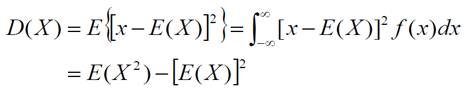
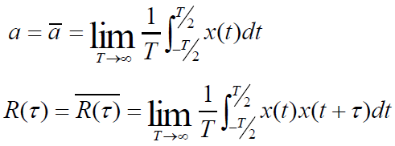

## 随机变量

### 数学期望/均值

### 方差

### 协方差与相关函数

其中E(XY)称为相关函数

- 独立 -> f(x, y) = f(x)f(y)
- 不相关 -> COV(X, Y) = 0
- 正交 -> E(XY) = 0

## 随机过程

### 概率分布

### 一维概率密度

### 数学期望/均值

对x积分，得到关于t的函数

### 方差

### 协方差

表示随机过程在两个时刻间的线性依从关系

### 相关函数

表示随机过程在两个时刻的取值的关联程度

随机变量越平缓，相关性越大，如下图，左边函数相关性大，右边函数相关性小

## 平稳随机过程

### 定义

随机过程的各属性与时间起点无关则为平稳随机过程

即
- 均值为常数，与时间t无关
- 自相关函数只与时间间隔τ = t2 - t1有关

### 各态历经性/遍历性

**各态历经性** - 随机过程的任意一个实现（样本）的时间平均值等于此随机过程的统计平均值

时间平均含义：

含义 - 随机过程的任一实现都经历了随机过程的所有可能状态

- 具有各态历经性的随机过程**一定**是平稳过程
- 平稳过程**不一定**具有各态历经性

## 高斯随机过程和高斯白噪声

信道中的噪声：
- 脉冲噪声
- 窄带噪声
- 起伏噪声
	- 热噪声
	- 散弹噪声
	- 宇宙噪声

起伏噪声为高斯随机过程

### 高斯随机变量

概率密度函数

- 对称于x = a
- 面积恒为1

### 高斯白噪声 - 时域特性

随机过程在任意时刻的取值（随机变量）都符合高斯分布，则称此随机过程服从高斯过程

- 若高斯过程宽平稳，则也严平稳
- 高斯过程不同时刻取值相互独立
- **高斯过程经过线性系统仍然是高斯过程**

**高斯噪声** - 各种起伏的噪声在任意时刻的振幅都符合均值为0的高斯分布，则成为高斯噪声

### 高斯白噪声 - 频域特性

**白噪声** - 功率谱密度在整个频域内都均匀分布

高斯白噪声可近似认为是白噪声

白噪声的自相关函数：

仅在τ=0时自相关函数非0，说明白噪声在任意两个时刻的取值都是不相关的，独立的

## 随机过程通过线性系统

随机过程通过线性系统，输出仍为随机过程

