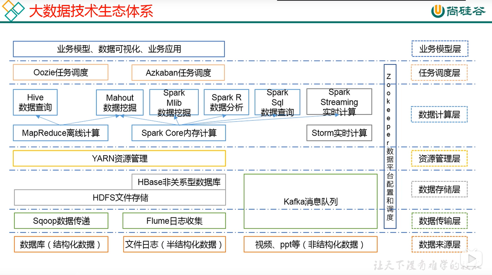

## 前言

本文是观看[此视频](https://www.bilibili.com/video/BV1cW411r7c5)时的笔记

## 什么是大数据

### 概念

**无法**在**一定时间范围**内使用**常规软件/工具**（比如MySQL，JAVA SSM框架）进行**存储与计算**的数据集合

### 大数据的特征

4V:

- Volume
  - 数据量大
- Velocity
  - 数据产生的速度很快
  - 处理数据的效率非常重要
- Variety
  - 非结构化数据越来越多
  - 数据格式不固定
- Value
  - 低价值密度。数据量越大，有价值的数据越少，需要ETL

### 业务流程

1. 产品经理提需求
   1. 统计XXX
2. 数据部门搭建平台进行数据收集与清洗
3. 数据可视化
   1. 报表
   2. 邮件通知
   3. 大屏幕展示

### 大数据部门组织架构

- 平台
  - 框架平台的搭建
    - Hadoop
    - Flume
    - Kafka
    - HBase
    - Spark
  - 集群性能监控和调优
- 数据仓库
  - ETL工程师 - 数据清洗
  - Hive工程师 - 数据分析、数据仓库建模
- 数据挖掘
  - 算法工程师
  - 推荐系统工程师
  - 用户画像工程师
- 报表开发
  - Java EE工程师

### 大数据生态体系

- 数据获取
  - 结构化数据（数据库）
  - 半结构化数据（文件日志）
  - 非结构化数据（媒体数据）
- 数据传输
  - Sqoop数据传递
  - Flume日志收集
  - Kafka消息队列
- 数据存储
  - HDFS文件存储
  - HBase k-v NoSQL
  - Kafka
- 资源管理
  - Yarn
- 数据处理
  - 离线计算
    - MapReduce离线计算
    - Spark Core内存计算
    - Hive(based on MapReduce)使用SQL语言实现数据查询
    - Mahout(based on MapReduce & Spark Core)数据挖掘
    - Spark Mlib(based on Spark Core)数据挖掘
    - Spark R(based on Spark Core)图形化数据分析
    - Spark SQL(based on Spark Core)数据查询，类似于Hive
  - 实时计算
    - Storm实时计算（基本淘汰）
    - Spark Streaming(based on Spark Core)准实时，批处理
  - > 除了Spark生态，还有Flink生态有类似的功能
- 任务调度
  - Oozie重量级调度
  - Azkaban轻量级调度
- 数据平台配置和调度
  - Zookeeper
- 业务模型层
  - web数据可视化