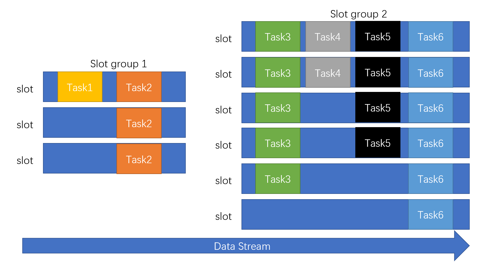
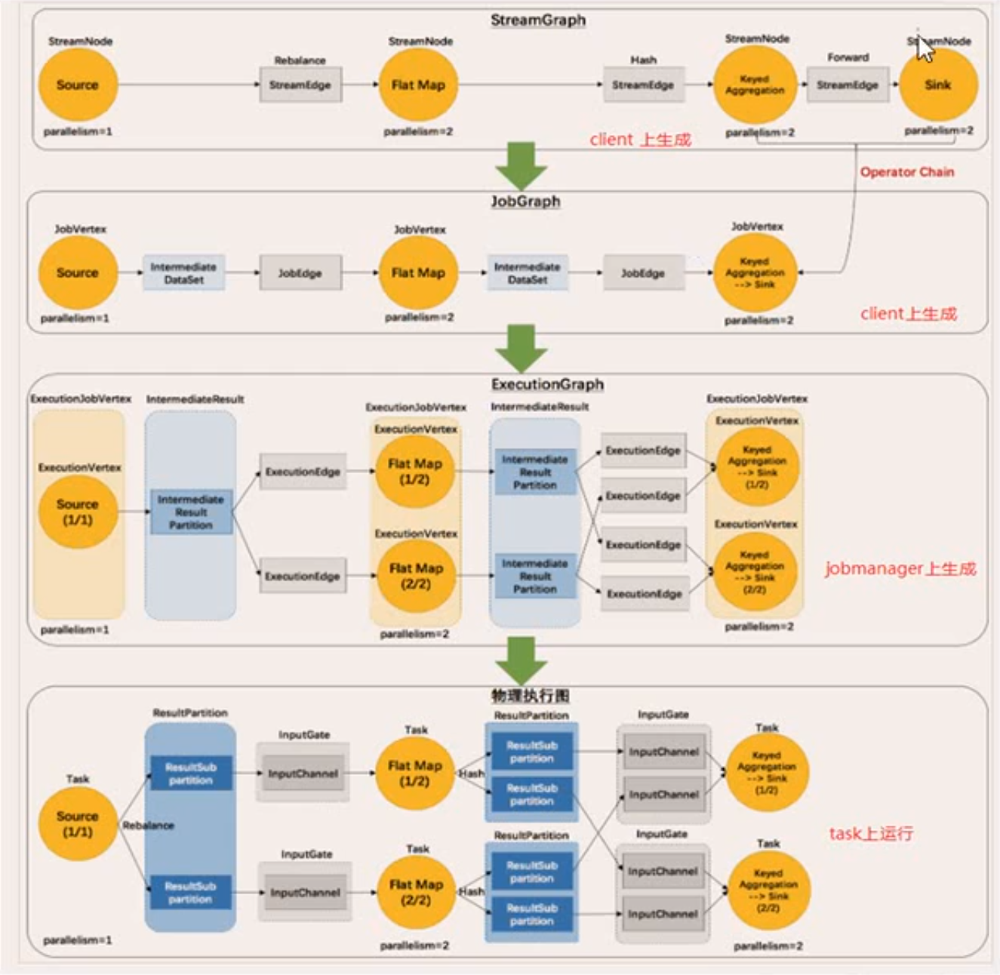

## 前言

本文是观看[此视频](https://www.bilibili.com/video/BV1qy4y1q728)时的笔记

## Flink

### Flink 概述

- 早期是一个德国大学研究项目，后来捐给了 Apache 基金会，由阿里接管
- Flink: 德语 - 快速灵巧
- 是一个框架/分布式处理引擎，对无界/有界数据流进行状态计算
  - 离线数据就是有界的流。Flink 里面只有流的概念
- 目标
  - 低延迟
  - 高吞吐
  - 准确 & 容错（保证顺序、高可用、状态恢复）
- 有分层 API，可以按需使用
  - SQL 级/表级 API
    - 最高层，可以直接写 SQL
  - 数据流/批 API
    - DataStream(在线流) / DataSet(离线流)
    - 支持窗口函数
  - 有状态/事件驱动 API
- 支持多种时间语义
  - 事件时间(event-time)
  - 处理时间(processing-time)
- 保证精确处理一次的一致性(exactly-once)
- 低延迟，高吞吐：毫秒级延迟，每秒百万事件
- 支持连接到众多常用存储系统，实现落盘
- 高可用，动态扩展，可以 7x24 全天候跑

### 流数据处理场景

- 电商
  - 实时报表
  - 广告投放
  - 业务流程
- IOT
  - 传感器数据收集可视化
  - 实时报警
  - 交通运输
- 电信
  - 基站流量调配
- 银行金融
  - 实时结算
  - 推送通知
  - 异常检测
- 解决痛点：大数据批处理带来的 N+1 问题（第二天才能得到前一天的结果）

### 数据处理演变

- 仅 RDBMS
  - 关系型数据库
  - 实时，但是扩展性差
- RDBMS -> ETL -> 数据仓库 -> Ad-Hoc 分析/报表
  - 慢。高并发，但是高延迟
- 有状态流式处理
  - 把状态保存在内存，处理流式数据
  - 周期落盘(checkpoint)
  - 分布式之后，难以保持顺序（准确性）
- Lambda 架构
  - 两套系统：批+流
  - 流系统解决实时的问题（快速、近似正确的结果）
  - 批系统解决准确性的问题
  - 缺点：两套系统，额外开发成本
- Flink（可以视为第三代流处理器）
  - 流批一体
  - 低延迟高吞吐
  - 可以保证正确性

### 对比其他流处理器

- Storm
  - 快，低延迟，毫秒级
  - 吞吐量也不能太大
  - 无法保证时间正确
- Spark Streaming
  - 从批处理演变而来。处理的不是流(stream)，而是微批(micro-batch)
  - 架构上决定其无法做到 Storm 一样的毫秒延迟。有几百毫秒
  - 高吞吐
- Flink
  - 快，毫秒级
  - 高吞吐
  - 准确

Flink YES!

### WordCount

```java
// batch
public static void main(String[] args) throws Exception {
  ExecutionEnvironment env = ExecutionEnvironment.getExecutionEnvironment();

  DataSet<String> input = env.readTextFile("path");

  input.flatMap(new MyFlatMapper())
    .groupBy(0) // 根据第0个位置的元素进行分组
    .sum(1) // 求第1个位置的元素的和
    .print();
}

// stream
public static void main(String[] args) throws Exception {
  StreamExecutionEnvironment env = StreamExecutionEnvironment.getExecutionEnvironment();

  ParameterTool pt = ParameterTool.fromArgs(args);
  String host = pt.get("host");
  int port = pt.getInt("port");

  // DataStream<String> input = env.readTextFile("path"); // file is also supported
  DataStream<String> input = env.socketTextStream(host, port);

  input.flatMap(new MyFlatMapper())
    .keyBy(0) // 根据第0个元素的哈希进行重分区
    .sum(1) // 求第1个元素的和
    .print();

  env.execute("app-name"); // 输出分区编号和结果。源文件的每一行都会对应一行输出
}

// use Flink Tuple2 instead of Scala Tuple2
public static class MyFlatMapper implements FlatMapFunction<String, Tuple2<String, Integer>> {
  @Override
  public void flatMap(String value, Collector<Tuple2<String, Integer>> out) throws Exception {
    String[] words = value.split(" ");
    for (String word : words) {
      out.collect(new Tuple2<>(word, 1));
    }
  }
}
```

### 部署

#### 部署模式

- Standalone 模式
- YARN 模式
  - Session Cluster 模式(Session 模式)
    - 预先在 Yarn 中申请资源。未来创建的作业都会在这个资源池中进行
    - 如果资源不足，则新作业只能等待
    - 如果作业比较小、时间比较短、有限时间可以执行完毕（释放资源），则可以使用此模式
  - Per Job Cluster 模式(Job 模式)
    - 每个作业都会在 Yarn 上面创建一个 Flink 集群
    - 资源完全独享
    - 适合时间比较长、资源一直不释放的作业
- k8s 模式，略

#### 配置

- `conf/flink-conf.yaml`主配置文件
- `conf/masters`主节点
- `conf/slaves`从节点

```yaml
# conf/flink-conf.yaml 主要配置项

jobmanager.rpc.address: localhost
jobmanager.heap.size: 1024m # JVM堆内存大小
taskmanager.memory.process.size:
  1728m # TaskManager进程的内存大小
  # 不仅是堆内存，还有保存状态消耗的内存，etc
taskmanager.numberOfTaskSlots:
  1 # 每个TaskManager支持多少个并发任务（最大并行度）
  # 推荐的值为taskmanager的CPU核心数
parallelism.default: 1 # 默认并行度
```

### 原理

#### 并行度

- 一个算子/任务的子任务(subtask)个数，被称为并行度(parallelism)
- 配置文件可以设置默认并行度
- 通过 jar 包创建任务的时候可以设置并行度
- 代码中初始化环境的时候可以设置并行度
- 对 DataStream/DataSet 的每一个操作都可以单独设置并行度
- 优先级（从先到后）
  - > 输入输出的并行度通常都是固定的 1，以免出现冲突
  - 代码里面对操作单独设置的并行度
  - 代码中初始化环境时设置的并行度
  - 提交作业的时候设置的并行度
  - 配置文件中默认的并行度
- 所有单个任务(task)的并行度加在一起，就是整个作业(job)的任务数量
  - 比如一共三个任务，并行度分别是 1，2，3，那么整个作业一共 6 个任务
  - 默认情况下占用的 slot 数量为作业中并行度最高的任务的并行度。上述任务需要 3 个 slot。详见下文【运行时组件-TaskManager】
    - 即一个 stream 的并行度是所有算子的最大并行度
  - 如果 slot 不足，就无法启动任务，任务处于等待状态，直到超时
  - 有些简单的任务如果并行度相同，可能会被合并

#### 运行时组件

- JobManager（作业管理器）
  - 是一个作业的主进程
  - 接收客户端提交的 APP。APP 包括：
    - 作业图(JobGraph)
    - 逻辑数据流图(Logical Dataflow Graph)
    - 打包之后的所有类、库和 jar 包
  - JobManager 会把 JobGraph 转换为物理层面的执行图(ExecutionGraph)
    - 包含了所有可以并发执行的任务
  - JobManager 会向 ResourceManager 请求资源
    - 这里的资源就是 TaskManager 上面的 slot
    - 一旦获取到了足够的资源，就会把 ExecutionGraph 分发到对应的 TaskManager 上
  - JobManager 会负责所有需要中央协调的操作，比如 checkpoint 的协调
- TaskManager（任务管理器）
  - Flink 中的 worker 进程（是一个 JVM 进程）
    - 会在独立的线程上执行多个子任务（一个 slot 是一个线程）
  - Flink 中通常会有多个 TaskManager
  - 每个 TaskManager 都包含了一定数量的 slots（至少一个）。slot 的数量限制了 TaskManager 能够执行的任务数量
    - 推荐 slot 数量为 TaskManager 的 CPU 核心数
    - 默认情况下，Flink 允许不同任务的子任务共享 slot（不同阶段的子任务），以减少对 slot 的消耗。所以一个 slot 甚至就可以执行所有子任务。任务出错恢复的时候，需要恢复的 slot 数量也会减少
    - 可以像设置每个任务/算子的并行度一样，给每个算子设置 slot 组，从而手动指定合并同一个组的子任务到一个 slot，不同的组的子任务到不同的 slot
      - `stream.sum(1).slotSharingGroup("xxx")`
      - 默认 slot 组为`default`
      - 默认情况下，新的算子所属的组和前一个算子的相同
      - 所以如果不显式指定 slot 组，所有算子都会在同一个 default 组中
  - 启动之后，TaskManager 会向 ResourceManager 注册 slot
  - 收到任务时，TaskManager 会把 slot 提供给 JobManager，JobManager 就可以向 slot 分配 task 了
  - 同一个 job 的不同 TaskManager 之间可以交换数据
- Resource Manager（资源管理器）
  - 主要负责管理 slot
  - Flink 为不同的环境提供了不同的 ResourceManager
    - YARN / Mesos / k8s / standalone
  - 资源不足时还可以向云平台申请资源
- Dispatcher（调度器）
  - 可以跨 job 运行
  - 为应用的提交提供了 REST 接口
  - 当应用被提交的时候，就会启动 Dispatcher 并把 job 交给一个 JobManager
  - Dispatcher 有一个 WebUI，默认 8081 端口。可以用来可视化管理任务
  - Dispatcher 在架构中不是必需的。也可以通过其他方式提交应用

#### 任务提交流程

1. 比如通过 WebUI，把任务交给 Dispatcher
2. Dispatcher 启动一个 JobManager，并把任务交给 JobManager
3. JobManager 向 ResourceManager 请求 slots
4. ResourceManager 如果没有足够的资源，会启动/申请新的 TaskManager
5. 新 TaskManager 向 ResourceManager 注册 slots
6. ResourceManager 向 JobManager 提供 slots
7. JobManager 向 TaskManager 提供 ExecutionGraph
8. TaskManager 执行任务，并在 TaskManager 之间交换数据

如果使用 Yarn(Job 模式):

1. 客户端上传任务的 jar 包和配置到 HDFS
2. 客户端提交 Job 到 Yarn ResourceManager
3. Yarn ResourceManager 启动 Yarn Application Master，包含 JobManager 和 Flink ResourceManager
4. JobManager 向 Flink ResourceManager 申请资源，后者向 Yarn ResourceManager 申请资源，创建 TaskManager
5. 执行任务

#### 任务调度原理

- 如何实现并行计算，提升性能？
  - 设置 Task 的并行度
- 计算 slot
  - 根据上文【运行时组件-TaskManager】的规则
    - 默认情况下所有 Task 都属于同一个 slot group（default 组）。也可以手动拆分 Task 到不同的 slot group
    - 每个 slot group 需要的 slot 数量为组内 Task 的最大并行度

> 举个例子：目前有 6 个算子/任务，并行度分别为 1/3/5/2/4/6，其中前两个任务属于组 A，其他任务属于组 B，求子任务的数量和所需要的 slot 数量。
>
> - 子任务数量为`1+3+5+2+4+6=21`
> - 组 A
>   - 两个任务，最大并行度为 3，所以需要 3 个 slot
> - 组 B
>   - 4 个任务，最大并行度为 6，所以需要 6 个 slot
> - 一共需要 9 个 slot
>
> 

#### 程序，数据流和执行图

- 所有 Flink 程序包含三个部分
  - Source
    - 读取数据源
  - Transformation
    - 使用算子处理数据
  - Sink
    - 输出
- 上述三部分形成一个逻辑数据流(DataFlow)
  - 类似一个 DAG
  - 可以有多个 source
  - 可以有多个 sink
- 程序最终执行的时候会参考执行图(ExecutionGraph)
  - 有四种抽象等级
    - StreamGraph
      - 根据 Stream API 生成的图，用来表示程序的拓扑结构
    - JobGraph
      - 被提交给 JobManager
      - 合并可以被合并的算子
    - ExecutionGraph
      - JobManager 根据 JobGraph 生成 ExecutionGraph
      - 是 JobGraph 的并行化版本（按照 Task 的并行度进行拆分）
      - 是调度层最核心的数据结构
    - 物理执行图
      - 每个 Task 如何对应 TaskManager
      - 并不是一个具体的数据结构



#### 数据传输和重分区

- 算子之间的数据传输有两种模式
  - one-to-one(forwarding)
    - 不会重分区。输入一个分区，输出一个分区
    - 数据顺序可以保持不变
    - 比如 map, filter, flatMap
  - redistributing
    - 分区会发生改变，数据顺序通常也会变
    - 类似于 spark 中的 shuffle
    - 比如 keyBy, broadcast, rebalance(轮询), rescale, global
- Flink 使用了任务链(Operator Chains)优化通信
  - 需要
    - 多个算子的并行度相同
    - 都是 one-to-one 算子
    - 在相同的 slot group
  - Flink 会通过本地转发(local forward)的方式连接算子
  - 如果不想使用任务链优化，也不想通过 slot group 的方式额外占用一个 slot
    - 可以在算子之间添加一个重分区操作，比如 rebalance 或者 shuffle
    - 或者修改算子：`xxx.disableChaining()`
    - 或者添加全局配置：`env.disableOperatorChaining();`
  - 主动使用任务连：`xxx.startNewChain()`

#### 数据类型

- Flink 支持所有的 Java/Scala 基础数据类型
- Tuples
- Scala case classes
- Java 简单对象(POJOs)
  - 必需有一个空参数的构造方法
  - 所有字段，要么是 public 的，要么有 getter/setter

#### 算子函数和富函数

- 很多算子都会接收一个函数作为参数
  - 比如`map`会接收一个`MapFunction`作为参数
- 也可以使用匿名函数
- 所有算子的参数函数都有一个富函数(rich function)版本
  - 比如`RichMapFunction`
  - 可以进行更精细的管理，获取当前状态，实现更复杂的功能，或者实现有状态的操作，或者维持和数据库的连接
  - 函数里面会有更多的生命周期

#### 时间语义

- Flink 支持的时间语义分类
  - Event Time: 事件被创建的时间，由客户端产生
    - 有些场景下，事件时间比处理时间更重要
    - 为了保证正确性，避免乱序，基于事件时间的处理可能比较慢
    - 基于事件的时间戳处理基于时间的算子
  - Ingestion Time: 事件进入 Flink 的时间，由 source 算子产生
  - Processing Time: 执行算子，对数据进行操作的本地系统时间
    - 是默认的时间语义
- 设置时间语义
  - `env.setStreamTimeCharacteristic(TimeCharacteristic.EventTime)`
- 通常和窗口函数一起使用
  - 通常情况下，假设我们设置了 5 秒滚动窗口。那么在接收到任何时间戳大于等于 5 的事件时，处理`[0, 5)`时间段的数据。但是如果先收到了第 5 秒的事件，又收到了第 2 秒的事件，第 2 秒的事件就无法被处理。这个问题仅会出现在事件时间语义下
  - 解决方案：使用水位线(Watermark)
    - 应该关闭窗口时，先不关闭窗口，而是等待一段时间。然后再输出第一个结果
    - 通常设置几百毫秒
    - 水位线是一条特殊的事件，必需单调递增
      - 由 Flink 引擎根据配置，自动生成，而不是来自事件源
      - 默认按照一定的周期生成(`AssignerWithPeriodicWatermarks`，基于当前最大时间戳，默认周期 200 毫秒)。也可以根据传入的数据生成(`AssignerWithPunctuatedWatermarks`)，也可以自定义
        - 根据传入数据生成 watermark 的好处是，watermark 更新特别快，坏处是数据量可能翻倍，因为 watermark 也算是特殊的数据
        - 所以，数据稠密的时候用周期 watermark，数据稀疏的时候用基于事件的 watermark
    - 比如设置了 5 秒滚动时间窗口，处理`[0, 5)`时间段的数据，设置 3 秒水位线，那么当时间戳大于等于 8 的事件出现时，才关闭 5 的窗口
    - watermark 在上下游算子之间的传递规则
      - 子任务会保存所有父任务的当前水位
      - 父任务会把最小的 watermark 广播给下游
      - 如果 watermark 不变则不广播
      - 含义：使用最小的 watermark，意为此 watermark 之前的数据都视为成功接收，所以向下广播最小的 watermark
  - 使用水位线机制之后，可以再使用 window 操作的`allowLateness`，设置更长的接收迟到数据的时间。最后，还可以使用 side output 的方式把仍然迟到的数据收集到。一共有三重保障
    - 如果接收到了数据，会输出一个新结果（不是第一个结果）
    - 可以设置分钟级别

```java
// 给流配置时间戳和水印

// watermark延迟为2秒
stream.assignTimestampAndWatermarks(new BoundedOutOfOrdernessTimestampExtractor<MyType>(Time.seconds(2)) {
  @Override
  public long extractTimestamp(MyType data) {
    return data.getTimestamp();
  }
})

// 如果确定事件有序，可以使用升序时间戳提取器
stream.assignTimestampAndWatermarks(new AscendingTimestampExtractor<MyType>() {
  @Override
  public long extractAscendingTimestamp(MyType data) {
    return data.getTimestamp();
  }
})
```

#### 状态管理

- 状态
  - 保存在内存中，Flink 维护状态的一致性、故障处理、高效存储
  - 两种状态
    - managed state - 被 Flink 管理的状态
    - raw state - 手动管理的状态，通常用不到
  - 状态和算子关联，和任务绑定，正常运行时不会有网络传输
- 算子状态(Operator State)
  - 作用范围限定为算子的子任务
  - 无法跨子任务访问
  - 只要在同一个分区，访问的状态就是相同的
  - 数据结构
    - list - 一组数据（因为如果存在多个子任务，就会有多个状态值）
    - union list - 一组数据，并且指明了在出现故障时如何恢复
    - broadcast - 跨子任务共享的状态
- 键控状态(Keyed State)
  - 根据输入流中定义的 key 来维护和访问
  - 每个 key 都会有一个状态，所以一个算子会产生很多状态
  - 数据只能访问自己的 key 对应的状态
  - 数据结构
    - value - 单个值（单个 key 只可能存在在一个子任务中）
    - list - 列表
    - map - kv 对
    - reducing & aggregating - 用于聚合的列表
- 状态后端(State Backends)
  - 是用来管理状态的组件
  - 负责管理本地状态，以及把 checkpoint 写入远程存储
  - 插件化
  - Flink 提供三种状态后端
    - MemoryStateBackend(jobmanager)
      - 使用内存，状态保存在 TaskManager 的内存里，checkpoint 保存在 JobManager 的内存
      - 快速，低延迟，不稳定
      - 开发测试。通常不会用在生产
    - FsStateBackend(filesystem)
      - checkpoint 保存在远程的文件系统（HDFS），本地状态保存在内存
      - 内存级别的访问速度+更好的容错
      - 适合大部分生产场景
    - RocksDBStateBackend(rocksdb)
      - 把所有状态序列化之后保存在本地的 RocksDB
      - 内存 kv 存储，数据量大的时候自动落盘
      - 比内存慢一些，适合超多状态 OOM 的场景
  - 配置文件: `state.backend: filesystem`

```java
// 自定义算子，设置算子状态
// 需要继承ListCheckpointed，即使用list保存checkpoint
public static class MyMapper implements MapFunction<String, Integer>, ListCheckpointed<Integer> {
  private Integer count = 0;

  @Override
  public Integer map(String value) throws Exception {
    ...
  }

  @Override
  public List<Integer> snapshot(long checkpointId, long timestamp) throws Exception {
    return Collections.singletonList(count)
  }

  @Override
  public void restore(List<Integer> state) throws Exception {
    for (Integer num : state) count += num;
  }
}

// 键控状态
public static class MyRichMapper extends MyRichMapFunction<String, Integer> {
  private ValueState<Integer> keyCountState;

  @Override
  public void open(Configuration parameters) throws Exeption {
    keyCountState = getRuntimeContext().getState(new ValueStateDescriptor<Integer>("name", Integer.class));
  }

  @Override
  public Integer map(String value) throws Exception {
    Integer count = keyCountState.value();
    count ++;
    keyCountState.update(count);
    return count;
  }
}
```

#### 容错

- checkpoint（一致性检查点）
  - 主要用来保存状态，而不是保存数据
    - 毕竟数据可以从 kafka 重新读
    - 可以在状态里面保存 kafka 数据偏移量，这样就可以从断点继续处理数据
  - 当一个输入被完全处理完毕时，保存状态
  - 启动检查点：`env.enableCheckpoint()`，默认 500ms 间隔
  - 支持设置模式：AT_LEAST_ONCE 和 EXACTLY_ONCE
    - `env.getCheckpointConfig().setCheckpointingMode(CheckpointingMode.EXACTLY_ONCE)`
  - 支持设置超时时间
    - `env.getCheckpointConfig().setCheckpointTimeout(60000L)`
  - 支持设置 checkpoint 并行度
    - `env.getCheckpointConfig().setMaxConcurrentCheckpoints(2)`
  - 设置 checkpoint 最小间隔
    - `env.getCheckpointConfig().setMinPauseBetweenCheckpoints(100L)`
    - 设置间隔之后，checkpoint 并行度只能是 1
  - 使用检查点还是保存点
    - `env.getCheckpointConfig().setPreferCheckpointForRecovery(true)`
    - 是否选择 checkpoint 而不选择手动创建的更新的 savepoint
  - 容忍保存检查点失败
    - `env.getCheckpointConfig().setTolerableCheckpointFailureNumber(0)`
  - 重启策略，即如何读检查点
    - `env.setRestartStrategy(RestartStrategies.noRestart())`
    - 固定间隔尝试重启：`fixedDelayRestart(3, 10000L)`尝试 3 次，间隔 10 秒
    - 指定失败次数和时间：`failureRateRestart(3, Time.minutes(10), TIme.minutes(1))`，10 分钟内最多尝试 3 次重启，间隔 1 分钟
- 从 checkpoint 恢复状态
- checkpoint 算法
  - 基于`Chandy-Lamport`算法的【分布式快照】
    - 每个 task 做自己的快照（这样就不用等其他 task），然后由 job manager 进行快照碎片的拼接
    - 把检查点的保存和数据处理分离开，**不会暂停整个应用**
    - 使用【检查点分界线(checkpoint barrier)】把数据分隔开
      - 检查点分界线是一条特殊的数据
      - Flink 接收到检查点分界线的时候，把当前状态保存在状态后端
      - 检查点分界线也会被广播给下游
      - job manager 会向每个 source 任务发送一条带有 checkpoint ID 的消息，启动检查点
      - source 任务把状态写入检查点，然后生成检查点分界线，向下游广播
        - 状态后端写入状态完毕后，会返回通知给 source 任务，然后 source 任务通知 jobManager 确认完成
        - jobManager 收到所有任务的确认信息之后，合并检查点碎片（其实并没有一个拼接的过程），得到检查点数据
      - 分界线对齐：下游任务会等待所有上游任务都把某个检查点 ID 传递过来之后，再保存状态
        - 如果某个上游任务已经把检查点 ID 传递给了下游，而其他上游任务还没有把检查点 ID 传递给下游，那么此上游任务继续发送的数据会被下游任务缓存，因为它的状态正在等待被保存，不能被修改
- save points（保存点）
  - Flink 提供了可以自定义的镜像保存功能，即保存点
  - 保存点和检查点的算法相同。保存点可以视为有额外元数据信息的检查点
  - Flink 不会自动创建保存点，所以需要显式触发
  - 除了故障恢复，还可以用来
    - 计划备份
    - 更新程序
    - 版本迁移
    - 暂停/重启应用

#### 状态一致性

- Flink 使用检查点实现 exactly-once 语义
- 为了实现端到端(end-to-end) exactly-once，需要流缓冲中间件
  - 保证每个处理环节的数据都不能丢，且只能处理一次
  - source 端要保证数据可以重复读取，且可以重置偏移量
  - sink 端实现幂等写入、事务写入
    - 事务实现方式
      - 预写日志(WAL: write-ahead log)
        - 简单，任何 sink 都可以用
        - DataStream API 提供了一个模板类`GenericWriteAheadSink`来实现事务 sink
        - 但是思想类似于批处理，延迟会高
      - 二阶段提交(2PC)
        - 真正实现 exactly-once
        - 需要 sink 自身支持事务
        - Data Stream API 提供了一个抽象类`TwoPhaseCommitSinkFunction`
  - 通常用 Flink+Kafka
    - source: 使用 kafka consumer 作为 source，故障恢复时重置偏移量，重新消费数据
    - 业务逻辑使用 checkpoint 保存状态
    - sink: 使用 kafka producer 作为 sink，使用两阶段提交
    - 流程：
      - 第一条数据进入 kafka 时，开启一个 kafka 事务，数据写入 kafka 分区日志，但是标记为【未提交】
      - jobmanager 触发 checkpoint 操作，barrier 从 source 向下游传递。遇到 barrier 的算子把状态保存在状态后端，并通知 jobmanager
      - sink 收到 barrier，触发 checkpoint 保存状态，通知 Jobmanager，并开启下一阶段事务（不是当前事务），用于提交下一个 checkpoint 的数据
      - jobmanager 收到所有任务的通知，发出确认信息，表示 checkpoint 完成
      - sink 收到 Jobmanager 的确认信息，正式提交数据

总结表格：

| Source   | Sink | 一致性                                 |
| -------- | ---- | -------------------------------------- |
| 不可重置 | 任意 | 最多一次                               |
| 不可重置 | 幂等 | 最多一次                               |
| 不可重置 | WAL  | 最多一次                               |
| 不可重置 | 2PC  | 最多一次                               |
| 可以重置 | 任意 | 至少一次                               |
| 可以重置 | 幂等 | 精确一次（故障恢复时可能短时间不一致） |
| 可以重置 | WAL  | 至少一次                               |
| 可以重置 | 2PC  | 精确一次                               |

### 命令

- `bin/start-cluster.sh` & `bin/stop-cluster.sh`启动/停止集群
- `bin/flink`
  - `flink run -c <class-name> -p 3 <jar-path> <params>`提交 job
    - 如果没有 Yarn Session，则提交到本地（standalone）
    - `-m yarn-cluster`使用 Yarn Per Job Cluster 模式提交 job
  - `flink list`查看所有运行中的 job
    - `-a`包括终止的 job
  - `flink cancel <job-id>`
- `bin/yarn-session.sh -n 2 -s 2 -jm 1024 -tm 1024 -nm test -d`启用 Yarn 模式 session cluster
  - `-n`为 TaskManager 的数量。新版本取消了这个参数，动态分配 TaskManager 以防资源不足时作业等待
  - `-s`为每个 TaskManager 的 slot 数量
  - `-jm`JobManager 的内存（MB）
  - `-tm`每个 TaskManager 的内存（MB）
  - `-nm`Yarn 的 APP 名
  - 如果需要停止任务，需要在 Yarn 控制台停止 application

### 流处理 API

#### Environment

- `getExecutionEnvironment`
  - 创建执行环境，类似于 spark context
  - 会自动判断是本地模式还是远程模式，生产/开发环境切换时不需要改代码
- `createLocalEnvironment`
  - 使用本地多线程模拟一个环境。用于开发测试
- `createRemoteEnvironment`
  - 创建一个集群环境
  - 需要指定 IP、端口、jar 包

#### Source

- 从集合读数据（从内存读数据）
  - `env.fromCollection`
  - `env.fromElements`
- 从文件读数据
  - `env.readTextFile`
- 从 Kafka 读数据
  - 需要引入 flink-connector-kafka 的依赖包
  - `env.addSource(new FlinkKafkaConsumer011<String>(topic, deserializer, props))`
- 自定义
  - 继承`SourceFunction`接口
  - 实现`run`方法
    - 用来循环收集数据
  - 实现`cancel`方法
    - 用来清理资源

```java
public static class MySource implements SourceFunction<String> {
  private boolean running = true;

  @Override
  public void run(SourceContext<String> ctx) throws Exception {
    while (running) {
      ctx.collect(data);
    }
  }

  @Override
  public void cancel() {
    running = false;
  }
}
```

#### Transform

- 基本转换算子/简单转换算子（one-to-one）
  - `map`
  - `flatMap`
  - `filter`
- 聚合操作相关算子
  - `keyBy`
    - 并不是转换，而是分区
    - 把数据分为多个分区，每个分区都有相同的 key
    - 内部使用 hash 实现
    - 数据格式从`DataStream`变为其子类`KeyedStream`
      - 基于`KeyedStream`可以做一些聚合操作
  - 滚动聚合算子(Rolling Aggregation)。可以对`KeyedStream`执行
    - `sum`
    - `min`
    - `max`
    - `minBy`
    - `maxBy`
  - `reduce`
    - 输入`KeyedStream`，输出`DataStream`
    - 传入一个 ReduceFunction
  - 多流算子
    - `split`（过时。新版本使用 side output API。见下文）
      - 输入`DataStream`输出`SplitStream`
      - 逻辑上是输出多个流，物理上还是一个流，只不过给数据打上了不同的标签，然后调用`select`算子
    - `connect`
      - 逻辑上连接两个流。保持数据类型不变，两个流仍然互相独立，数据类型可以不同
      - 输入`DataStream`，输出`ConnectedStream`
      - 通过执行`map`或者`flatMap`才能把`ConnectedStream`变为`DataStream`
    - `union`
      - `connect`只能合并两个流。`union`可以合并多个流
      - 要求：所有流的数据类型必需相同

#### Sink

- 写文件
  - `writeAsCsv`
  - `writeAsText`
- 输出到 socket
  - `writeToSocket`
- 自定义
  - `addSink(new MySink())`
  - 比如写入到 kafka, redis, ElasticSearch, JDBC 等
- 第三方
  - Apache Bahir，给 Flink 提供第三方连接器
    - ActiveMQ / Flume / Redis / Akka / Netty
  - Kafka

#### Window

- 把无界流拆分为有界流
- 窗口类型
  - 时间窗口(time window)
    - 滚动时间窗口(Tumbling Time Window)
      - 时间对齐，窗口长度固定，没有重叠
    - 滑动时间窗口(Sliding Time Windows)
      - 窗口长度固定，滑动距离固定，可以有重叠
    - 会话窗口(Session Window)
      - 时间不对齐。根据事件判断窗口
      - 如果一段时间没有收到数据，则认为会话结束
  - 计数窗口(count window)
    - 滚动计数窗口
    - 滑动计数窗口
- API
  - 窗口分配函数
    - `window`
      - 创建一个窗口。必需在`keyBy`之后才能调用
      - 后面需要接一个聚合函数，用来聚合 window 里面的数据
    - `timeWindow`
      - 创建一个时间窗口。必需在`keyBy`之后才能调用
    - `countWindow`
      - 创建一个计数窗口。必需在`keyBy`之后才能调用
    - `windowAll`
      - 可以直接在 DataStream 上调用。把所有数据放到一个分区中，并行度变为 1
      - 不建议用
  - 增量聚合函数(incremental aggregation functions)
    - 每条数据来的时候就会计算，需要保持一个简单的状态
    - `reduce`, `aggregate`
  - 全窗口函数(full window functions)
    - 先收集数据。等到要计算的时候再遍历数据进行计算。类似于 Spark 的微批
    - 不需要维持状态，但是需要保持数据
    - 可以看到更多的元数据信息
    - `process`, `apply`
  - 其他
    - `trigger`
      - 定义 window 什么时候关闭，触发计算输出结果
    - `evictor`
      - 从窗口中移出某些数据
    - `allowedLateness`
      - 允许处理迟到数据
    - `sideOutputLateData`
      - 使用侧输出流输出迟到数据。即使窗口关闭了也可以收集数据
    - `getSideOutput`
      - 获取侧输出流

```java
// 直接使用window方法创建任意窗口
stream.keyBy("id").window(TumblingProcessingTimeWindows.of(Time.seconds(15))); // 滚动时间窗口
stream.keyBy("id").window(EventTimeSessionWindows.withGap(Time.minutes(1))); // 会话窗口

// 快速创建时间窗口
stream.keyBy("id").timeWindow(Time.seconds(15)); // 滚动时间窗口
stream.keyBy("id").timeWindow(Time.seconds(15), Time.seconds(5)); // 滑动时间窗口

// 快速创建计数窗口
stream.keyBy("id").countWindow(100); // 滚动计数窗口
stream.keyBy("id").countWindow(100, 100); // 滑动计数窗口
```

### 底层 API

ProcessFunction API

#### 底层 API 概述

- 流处理 API 无法访问时间戳或 watermark
- 底层 API 可以访问：
  - 访问时间戳
  - watermark
  - 注册定时事件
  - 输出特定事件（比如超时）
- 用来构建事件驱动应用
- Flink SQL 就是基于底层 API 实现的

#### Process Function

- 分类
  - `ProcessFunction`
  - `KeyedProcessFunction`
  - `CoProcessFunction`
  - `ProcessJoinFunction`
  - `BroadcastProcessFunction`
  - `KeyedBroadcastFunction`
  - `ProcessWindowFunction`
  - `ProcessAllWindowFunction`
- 用法：`stream.process(ProcessFunction)`
- 所有 ProcessFunction 都是 RichFunction，有生命周期

#### KeyedProcessFunction

最常见的 Process Function

```java
stream.keyBy("id").process(new MyKPF()).print();

public static class MyKPF extends KeyedProcessFunction<Tuple, String, Integer> {
  @Override
  public void processElement(String value, Context ctx, Collector<Integer> out) {
    out.collect(value.length())
  }

  @Override
  public void onTimer(long timestamp, OnTimerContext ctx, Collector<Integer> out) {
    ...
  }
}
```

- 可以通过`ctx`获取以下内容
  - `timestamp`当前时间戳
  - `key`分区键
  - `output`定义侧输出流
  - `timerService`
    - `currentProcessingTime`获取处理时间
    - `currentWaterMark`获取水位
    - `registerEventTimeTimer`注册事件时间定时器
    - `registerProcessTimeTimer`注册处理事件定时器

#### 侧输出流

SideOutput

自定义侧输出流实现分流操作

```java
OutputTag<String> sideOutputTag = new OutputTag<String>("tag-name") {};

SingleOutputStreamOperator<String> mainStream = stream.process(new ProcessFunction<String, String>() {
  @Override
  public void processElement(String value, Context ctx, Collector<String> out) throws Exception{
    if (xxx)
      out.collect(value);
    else
      ctx.output(sideOutputTag, value);
  }
});
mainStream.print();
mainStream.getSideOutput(sideOutputTag).print();
```

### Table API

#### 概述

- 批处理/流处理统一的上层 API
- Flink 是 SQL 实现了 SQL 标准的 Apache Calcite

#### 表和流

- 表(table)
  - 表的层级结构
    - catalog - database - table
    - 默认 catalog 和 database 都是 default
  - 分类
    - 常规表，通常是和真实的数据源绑定
      - `tableEnv.connect(...).withFormat(...).withSchema(...).createTemporaryTable("name")`
    - 虚拟表(view)，通常是内存中的数据中间状态
- 表和流的转换
  - Flink 里面的表是动态表(Dynamic Table)
  - 其实表的内容是 Flink 所维护的状态
  - 接收到新数据的时候，更新动态表，即更新状态
  - 输出表的时候，把表的更新以流的方式输出出去

#### 更新模式

更新模式，决定了流式输出如何和外部连接器之间交换数据

- Append（追加模式）
  - 仅插入
- Retract（撤回/替换模式）
  - 支持写入、删除、更新（删除+写入）
  - 撤回原数据，更新为新的数据
  - 返回`(false, 原数据)`和`(true, 新数据)`
- Upsert（更新插入模式）
  - 更新和插入被视为 upsert，删除被视为 delete
  - ElasticSearch/MySQL/Redis 等支持 Upsert 模式

#### 时间属性

- Time Attributes
- 基于时间的操作（比如窗口操作）需要定义时间语义和时间数据来源
- 定义处理时间(Processing TIme)
  - 定义 schema 的时候通过添加`.proctime`来**创建**处理时间字段，类型为`TIMESTAMP(3)`
  - 只能作为 schema 里面的最后一个字段
  - 从流创建：`tableEnv.fromDataStream(stream, "id, timestamp, pt.proctime");`
  - 从数据源创建：`xx.withSchema(new Schema().field("id", DataTypes.STRING()).field("pt", DataTypes.TIMESTAMP(3)).proctime());`
  - 用 SQL 创建`create table xxx(id varchar(20) not null, ps as proctime())`
- 定义事件时间(Event Time)
  - 定义 schema 的时候通过添加`rowtime`来**指定**事件时间字段，类型为`TIMESTAMP(3)`（覆盖原数据类型）
  - 从流创建：`tableEnv.fromDataStream(stream, "id, timestamp.rowtime")`
    - 如果不想数据类型被覆盖，可以使用`tableEnv.fromDataStream(stream, "id, timestamp as ts, rt.rowtime");`创建此字段
  - 从数据源创建：`xxx.withSchema(new Schema().field("timestamp", DataTypes.BITINT()).rowtime(new Rowtime().timestampsFromField("timestamp")).watermarksPeriodicBounded(1000));`
  - 用 SQL 创建`create table xxx(id varchar(20) not null, rt as to_timestamp(from_unixtime(ts)), watermark for rt as rt - internal '1' second)`

#### 窗口

- Table API 中有两种窗口
  - Group Windows（分组窗口）
    - 根据时间或计数，把行聚合到一个 group 中，对每个 group 执行聚合函数
    - 从数据源创建
      - `table.window(SomeWindow.as("w")).groupBy("w, a").select("a, b.sum")`
        - 窗口字段为`w`。窗口必需有名字，才能被引用
        - 根据字段`a`和窗口字段`w`进行分组
      - 预定义好的窗口
        - 滚动窗口(Tumbling windows)
          - 事件时间：`table.window(Tumble.over("10.minutes").on("rt").as("w"))`
          - 处理时间：`table.window(Tumble.over("10.minutes").on("pt").as("w"))`
          - 行数：`table.window(Tumble.over("10.rows").on("pt").as("w"))`
        - 滑动窗口(Sliding windows)
          - 同上，只不过把`Tumble`改成`Slide`
        - 会话窗口(Session windows)
          - `table.window(Session.withGap("10.minutes").on("rt").as("w"))`
    - 用 SQL 创建
      - `TUMBLE(time_attr, interval)`滚动窗口
      - `HOP(time_attr, step, length)`滑动窗口
      - `SESSION(time_attr, interval)`会话窗口
      - 获取窗口起始时间和结束时间：`TUMBLE_START/TUMBLE_END(rt, interval '10' second)`
  - Over Windows
    - 原生 SQL 语句就有 over window
    - 针对每一行，计算相邻行范围的聚合
    - 只能聚合当前事件之前的事件，不能聚合当前事件之后的事件
    - 从数据源创建
      - `table.window(SomeWindow.as("w").select("a, b.sum over w, c.min over w"))`
      - 预定义好的窗口
        - 无界窗口
          - 基于时间（聚合之前所有时间的事件）：`table.window(Over.partitionBy("a").orderBy("rt").preceding(UNBOUNDED_RANGE).as("w"))`
          - 基于行数（聚合之前所有行的事件）：`table.window(Over.partitionBy("a").orderBy("rt").preceding(UNBOUNDED_ROW).as("w"))`
        - 有界窗口
          - 基于时间（聚合之前一段时间的事件）：`table.window(Over.partitionBy("a").orderBy("rt").preceding("1.minutes").as("w"))`
          - 基于行数（聚合之前一些行的事件）：`table.window(Over.partitionBy("a").orderBy("rt").preceding("10.rows").as("w"))`
    - 使用 SQL 创建
      - 所有聚合必需在同一个窗口，即相同的分区、排序和范围
      - `select xxx over(partition by xxx order by pt rows between 2 preceding and current row) from xxx`

#### 内置函数

- 比较函数
  - SQL
    - `=` / `>` / `<` / ...
  - DSL
    - `===` / `>` / `<` / ...
- 逻辑函数
  - SQL
    - `AND` / `OR` / `IS FALSE` / `NOT` / ...
  - DSL
    - `||` / `.isFalse` / `!` / ...
- 算数函数
  - SQL
    - `+` / `-` / `*` / `/` / `power(a,b)` / ...
  - DSL
    - `+` / `a.power(b)` / ...
- 字符串函数
  - SQL
    - `||` / `UPPER` / `CHAR_LENGTH` / ...
  - DSL
    - `+` / `.upperCase()` / `.charLength()` / ...
- 时间函数
  - SQL
    - `DATE` / `TIMESTAMP` / `CURRENT_TIME` / `INTERVAL` / ...
  - DSL
    - `.toDate` / `toTimestamp` / `currentTime()` / `.days` / `.minutes` / ...
- 聚合函数
  - SQL
    - `COUNT()` / `SUM()` / `RANK()` / `ROW_NUMEBR()` / ...
  - DSL
    - `.count` / `.sum0` / ...

#### UDF

- 自定义函数
- 通过`tableEnv.registerFunction`注册函数
- 标量函数(Scalar Functions)
  - 输入一个值，输出一个值
  - 继承`ScalarFunction`并实现方法`eval`
- 表函数(Table Functions)
  - 输入一个值，输出一个表
  - 继承`TableFunction`并实现`eval`方法
- 聚合函数(Aggregate Functions)
  - 输入一个表，输出一个值
  - 继承`AggregateFunction`并实现`createAccumulator` / `accumulate` / `getValue`方法
- 表聚合函数(Table Aggregate Functions)
  - 输入一个表，输出一个表
  - 继承`TableAggregateFunction`并实现`createAccumulator` / `accumulate` / `emitValue`方法

#### 示例程序

```java
// 创建流环境
StreamExecutionEnvironment env = StreamExecutionEnvironment.getExecutionEnvironment();
stream = env.XXX;

// 从流环境创建表环境
StreamTableEnvironment tableEnv = StreamTableEnvironment.create(env);

// 直接创建表
tableEnv.connect(...).createTemporaryTable("xxx");
tableEnv.from("xxx").select("xxx");

// DSL
Table table = tableEnv.fromDataStream(stream);
table.select("xxx").filter("xxx").where("xxx");

// SQL
table.createTemporaryView("xxx", table);
Table result = tableEnv.sqlQuery("select * from xxx");
```

#### 输入输出

```java
// 连接数据源
tableEnv.connect(new FileSystem().path(path))
  .withFormat(new Csv())
  .withSchema(new Schema().field("id", DataTypes.STRING())
  .createTemporaryTable("table-name");

// 处理数据
table.groupBy("id").select("id, id.count as count, temp.avg as avg");
tableEnv.sqlQuery("select id, count(id) as cnt, avg(temp) as avgT from xxx");

// 输出到流
tableEnv.toAppendStream(resultTable, Row.class).print("result");
tableEnv.toRetractStream(resultTable, Row.class).print("result");

// 输出到文件，仅支持append模式
tableEnv.connect(new FIleSystem.path(path))
  .withFormat(new Csv())
  .withSchema(new Schema().field("id", DataTypes.STRING()))
  .createTemporaryTable("output-table-name");
resultTable.insertInto("output-table-name");

// 连接Kafka。仅支持append模式
tableEnv.connect(
  new Kafka()
  .version("0.11")
  .topic("xxx")
  .property("bootstrap.servers", "localhost:9092")
)
  .withFormat(new Csv())
  .withSchema(new Schema().field("id", DataTypes.STRING()))
  .createTemporaryTable("output-table-name");
```
