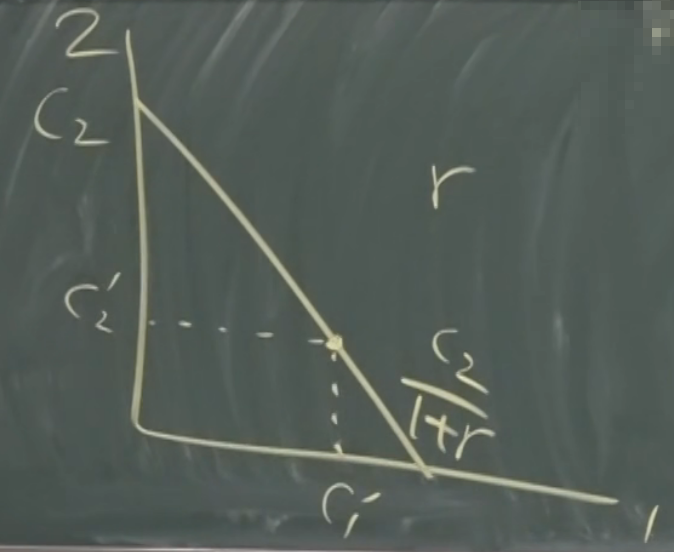
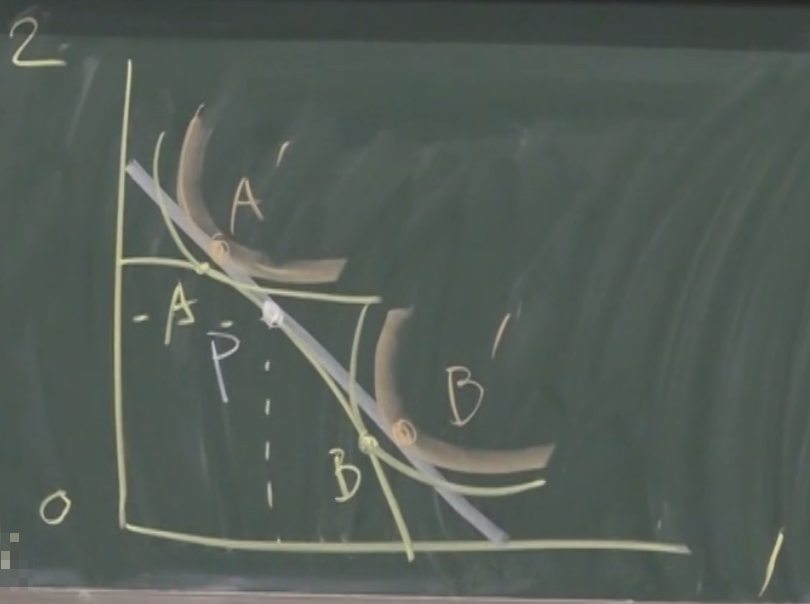

## 前言

本文是观看[此视频](https://www.bilibili.com/video/BV1Bx411d714)时整理的笔记

## 股票

- Stock
  - 是剩余索取权(residual claim)
- 和债券(Bond)最大的差别：Stock 有风险
  - 债券的支付是确定的，说是多少就是多少
  - 股票要根据公司的营收，决定分红
- 计算股票价格，需要面临两个问题
  - 未来值多少钱(payoff)
  - 折现是多少(discount/discount rate)
    - 也就是现在要卖多少钱
    - 很难算，直到 CAPM 框架出现
- 因为风险的存在，股票通常更贵一些

本节课假设 payoff 和 discount 已知，计算一些股票相关的指标

> 这里说的都是普通股。还有一种优先股，会提供一个确定的红利，但是比较少，此处不讨论

## DDM 模型

- dividend discount model
  - 股利贴现模型
  - 用来计算股票现在的价格
- 变量
  - $t$
    - 时间
  - $D_t$
    - 股票分红(dividend)
  - $S_t$
    - 除红利价格(ex-dividend price)
    - 支付完分红之后，股票的价格
  - $r$
    - discount rate
    - 在这一讲里面，假设 r 是已知的。以后会学习如何计算出来 r
- 价格计算公式：$S_0 = (D_1 + S_1) / (1 + r)$
  - 现在的价格 $S_0$ ，等于【未来的价格 $S_1$ + 分红 $D_1$ ，再折现】
  - 同理，$S_1$ 可以用 $S_2$ 算
  - 无穷推导下去，可以得到：
    - $S_0 = D_1 / (1+r) + D_2 / (1+r)^2 + \cdots + D_n / (1+r)^n + S_{n+1} / (1+r)^{n+1}$
    - $S_0 = \sum_{t=1}^\infty D_t/(1+r)^t + \lim_{t \rightarrow \infty} S_t/(1+r)^t$
- 结论：股票未来分红之和，决定了现在的股票价格
- 为了简化计算，假设 $D_t$ 以不变的速率增长（等比数列）
  - $D_t = D_1 (1+g)^{t-1}$
  - 其中 $g$ 就是假设的增长率
    - 或者说，是未来增长率的平均数（期望）
  - 带入到上述公式，并忽略最后一项，可以得到：
    - $S_0 = (D_1/(1+g)) \cdot \sum_{t=1}^\infty((1+g)/(1+r))^t$
    - 利用等比数列求和公式，假设 $r>g$ 保证等比数列是收敛的，可以得到：
      - $S_0 = D_1 / (r-g)$
      - 这个结论，也叫：戈登模型(Gordon)，是 DDM 模型的简化（因为加了假设）
      - 分子的数量级通常比分母的数量级大 1 到 2
        - r 和 g 通常都是 0.1 左右，差值更小，可能 0.0x
        - D 通常在 1 左右
      - r 和 g 的微小变化，会引起 S 的巨大变化

> 可以看到，资产的价格和过去没有关系，是根据未来的预期而定价的

## 横截性条件

- Transversality Condition(TVC)
- 上文在计算的时候，忽略了 $\lim_{t \rightarrow \infty} S_t/(1+r)^t$ ，就是因为假设了一个 TVC：这个值是 0
  - 也就是说，这个股票，在无穷久之后的贴现值为 0
  - 如果不这么假设，那么此极限必大于 0，意味着股价 S 趋近于无穷，且上涨极其之快，甚至快过了折现率
    - 注意：这里的折现率不是无风险利率（来自于银行），而是用来折现股票的一个风险利率（来自于股票市场）
  - 如果此极限大于 0，那就可以无脑买，而不关心红利
    - 这会形成资产泡沫(Bubble)：纯粹因为资产价格的上涨而引发大家的购买
      - 买了就是为了以后卖出去，而不是为了分红
    - 根据历史，Bubble 最终都会破灭
    - 所以这里的 TVC 是在假设资产定价里面没有 Bubble (No Bubble Condition)
      - 或者说，是在假设 Bubble 都会破灭
    - 当然，有些学者专门研究泡沫，那这里就不能忽略了

## 市盈率

- P/E，简写：PE
  - 即：每股价格 P 除以 每股盈利 E
  - 通常我们说的股票的估值，就是指市盈率
- 公式
  - 假设公司盈利为 $E_t$
  - 假设分红比例为 $k$ ，即把盈利中的 k 部分拿出来分红
    - $D_t = k \cdot E_t$
  - 带入到 Gordon 模型中，得到： $PE = S_0 / E_1 = k / (r-g)$
    - 所以 PE 正比于分红率 k，和折现率 r 负相关，和增长率 g 正相关
- 回报率的计算
  - rate of return
  - $= (D_1 + S_1)/S_0 - 1$
  - 使用 Gordon 模型可以得出：结果就是 $r$
  - 所以在 Gordon 的假设下，所有股票的回报率，就是折现率 r
    - 不论市盈率是多少，回报率是固定的
    - 数学逻辑：我们本来就是在假设回报率是 r，所以算出来当然是 r
    - 经济学逻辑：因为是从未来反推现在，而我们本来就在期望未来的回报率是 r，所以算出来当然是 r
      - 这也是在假设市场是有效的前提下。因为假设市场是有效的，所以所有股票的回报率必定一样，否则就会有人投机套现
  - 所以股票定价里面，最重要的就是 r
- 动态 PE：$S_0 / E_1$
- 滚动 PE(trailing PE)：$S_0 / E_0$

## 现实

- 巴菲特的价值投资(Value Investing)
  - 找到被低估的公司，并长期持有
  - 被低估/高估的公司：这里指的是实际 PE 比 PE 期望值低/高
    - 注意是相对的低/高，而不是绝对的
  - 但是仅凭本节课讲的内容（所有股票回报率都是 r），显然无法解释为什么价值投资是可行的
    - 现实比理论更复杂

## 股份公司的经营决策

### 分红可能性边界

- 如何确定 k？即：如何确定分红率
- 公式：
  - 盈利会分为两部分：分红+投资，即 $E = D + I$
    - 其中 $k = D / E$

假设一个项目只有两期，把这两期的分红作为 x/y 轴，可以画出来一个图像

- 曲线就是：分红可能性边界
- 为什么曲线是凸的？因为边际递减
  - 边际投资回报率：在一定的投资量水平上，增加一单位的投资带来的回报
  - 假设 1 期完全不投资，全分红，显然 2 期是没有分红的
  - 此时，只要我们从 1 期里面抽出来一点点资金，2 期就会有快速上升的回报
  - 但是，随着从 1 期里面抽出来的资金的增加，2 期的上升速度会变慢（边际递减）
- 如果实际情况是在边界里面，那就是资源没有被有效利用，投资没有得到应有的产出
- 图中的 A 和 B 是：两个投资人的无差异曲线，这两个投资人的时间偏好不同
  - 无差异曲线：上面的每个点，人们做出选择的组合虽然是不同的，但是收益是相同的
  - 通过这里的无差异曲线，可以看出：A 比 B 更有耐心
    - 因为 A 和分红边界的交点靠上

### 费雪分离定理

- 在上图中，我们应该如何设计 k 呢？
  - 是迁就 A 还是迁就 B？
  - 其实 A 和 B 会达成一致
- 我们可以让 A 或者 B，使用市场利率 r，在资本市场进行借贷，实现资源调配
  - 资本市场的利率 r 是稳定的，所以 A/B 可以通过借贷，实现自己的资本处于下图中的任意一点
  - 下图中的直线为：市场机会线，斜率为 $1/(1+r)$
    - 市场机会线：代表了用市场利率 r，在第一期和第二期之间调配资源，所能形成的配置

所以我们只需要找到市场机会线和分红可能性边界的切线，并把它设置为 k 即可。此时，A 的曲线为 A'，B 的曲线为 B'，且他们都可以通过借贷，到达 P 点。并且 P 点代表着：企业的投资回报率等于 r

并且，市场机会线与坐标轴 x 的交点，值为 $D_1 + D_2 / (1+r)$，也意味着公司现在的股价 $S_0$

显然，当市场机会线与分红可能性边界相切时，公司的一期股价最高

相当于：一个企业即将上市的时候，根据市场环境，就可以算出来一个市场对企业的期望。如果这个企业遵循市场的期望进行分红配置，就可以实现股价最大化，另所有股东满意。市场是可以对企业的行为进行修正的

所以，一个公司上市时，会发生以下事情：

1. 企业根据市场机会线和分红可能性边界，确定 P 点，得到 D1 和 D2
2. 股东通过借贷，实现自己的消费计划，使效用最大化

这就是 费雪分离定理(Fisher Separation Theorem)
