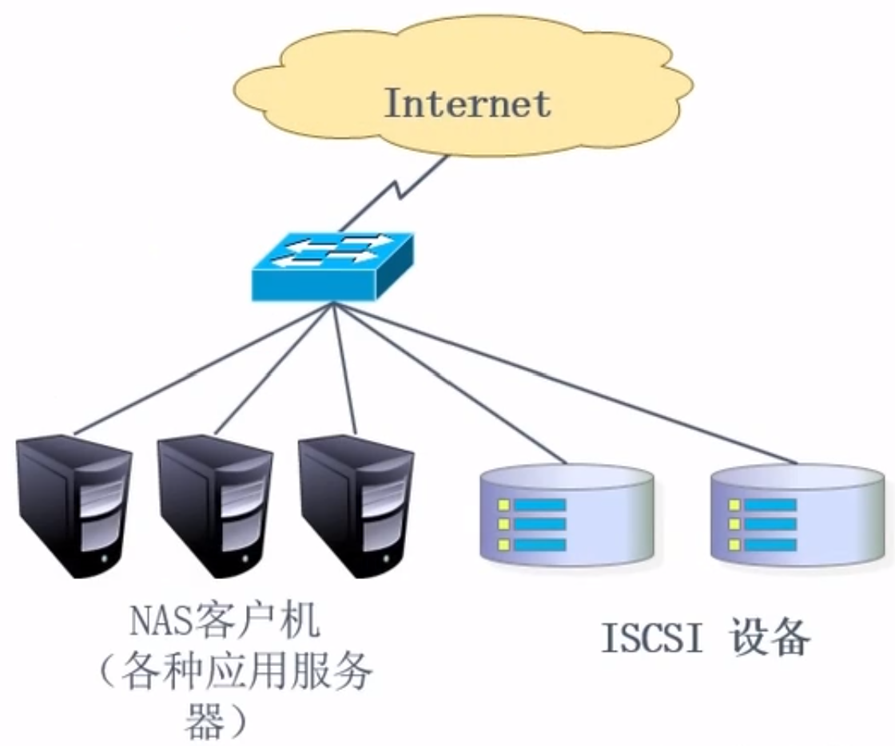
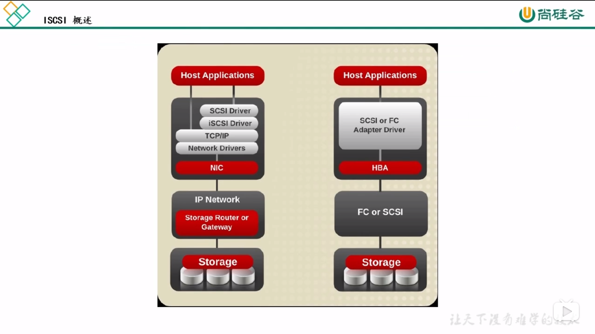

## 概述

本文是观看[此视频](https://www.bilibili.com/video/BV1Db411G7pf)时的笔记

## 网络存储分类

- 按照网络拓扑分类
  - DAS(Direct Attached Storage，直接附加存储)
    - 非网络存储。也就是本地硬盘。网络存储最终还是会访问到本地存储
    - 优点
      - 技术简单
      - 传输速度高
    - 缺点
      - 存储设备和磁盘绑定
  - NAS(Network Attached Storage，网络附加存储)
    - 很常见。有些家用路由器可能就自带NAS
    - 之前用SMB、FTP、NFS实现的就是NAS
    - 公网用户 > 交换机 > 应用程序服务器 > 交换机 > 存储设备
      - 【公网用户访问服务】和【服务访问存储设备】使用的是相同的交换机
      - 应用程序服务器和存储设备是平级的
    - 
    - 优点
      - 技术相对简单
      - 存储服务器和客户端能够通过网络通信即可
      - 通常放在局域网
    - 缺点
      - 存储速率较慢，交换机压力大
  - SAN(Storage Area Network，存储区域网络)
    - 公网用户 > 其他交换机 > 应用程序服务器 > 内网交换机 > 存储设备
      - 也就是说应用程序服务器比存储设备的层级高
      - 相比于NAS，【公网用户访问服务】和【服务访问存储设备】使用不同的网络设备
    - 
    - 优点
      - 安全性高
      - 速度较高
    - 缺点
      - 贵
      - 技术难度相对高
- 按照存储技术分类
  - 块存储
    - 硬盘。是最底层的存储技术
    - 优点
      - 可以通过RAID、LVM等技术提供容错、扩容等功能
    - 缺点
      - 不利于共享
  - 文件存储/网络存储
    - FTP、SMB、NFS
    - 优点
      - 构建所需资金不多
      - 跨平台共享
    - 缺点
      - 读写速度慢
  - 对象存储/分布式存储
    - 把对象的元数据和对象数据分开存储，可以分别扩展、实现冗余，实现超高吞吐量
    - 优点
      - 读写效率高
      - 跨平台
    - 缺点
      - 造价昂贵
      - 技术实现难度高

举例：

- 硬盘
  - 块存储 + DAS
- iSCSI集群
  - 块存储 + NAS
  - 块存储 + SAN
- NFS
  - 文件存储 + NAS
- MFS(MooseFS驯鹿/RHCS红帽集群套件)
  - 对象存储 + SAN

## NFS

Network File System

### NFS概述

- 跨平台
- 已经被整合到Linux内核。所有Linux都支持
- 依赖RPC(Remote Procedure Call)

### NFS软件与命令

- 需要安装的软件
  - nfs-utils
    - 内含rpc.nfsd, rpc.mountd, daemons
  - rpcbind
    - CentOS 5.X的软件名为portmap
- 配置文件：`/etc/exports`
  - 格式：`共享目录 客户端CIDR(参数...)...`
    - 参数：
      - `rw`可读写。只有同时开启文件系统的写权限和NFS的写权限才能成功写文件
      - `ro`只读
      - `sync`同步写入硬盘和内存。慢，安全
      - `async`先写到内存，异步写到硬盘。快，有些不安全。但是很常用，因为服务器不容易宕机，有些服务器还有内存恢复机制
      - `no_root_squash`如果使用root连接NFS，则操作NFS时也有root权限。显然此选项不安全
      - `root_squash`如果客户端使用root，则操作NFS时使用匿名用户，即nobody或nfsnobody
      - `all_squash`操作NFS时永远使用匿名用户
      - `anonuid`匿名用户的UID，通常是nobody或nfsnobody
      - `anongid`匿名用户的GID
- 挂载命令`mount -t nfs <ip>:<path> <path>`
- 查看某个服务器启动了哪些挂载：`showmount -e <ip>`

## MFS

### MFS概述

MooseFS，驯鹿

- 具备冗余容错能力的分布式文件系统（对象存储）
  - 同一个对象会在多个物理服务器拥有多个副本
  - 所有副本都被独立地保存在一个磁盘或分区上。即对象不会被拆开存储到不同物理设备
- 优点
  - 高可靠，因为冗余存储
  - 高可扩展，可以轻松添加主机实现扩容
  - 高可容错，可以设置对象回收站，对象被删除后一段时间内可以恢复
  - 高数据一致性，即使对象正在被写入或访问，仍然可以轻松完整文件的一致性快照
- 缺点
  - master节点在MFS免费版中是单点。如果master宕机，数据虽然不会丢，但是服务会中断。虽然会把数据同步到备份服务器，但是恢复需要时间
    - 企业版MFS的master不是单点
  - master对内存要求较高
    - MFS会把所有对象元数据保存在内存中，因为效率高（但是硬盘上也有同样的备份）
    - 100万个文件大约需要300MB内存。1亿个文件大约需要30GB内存
  - 默认metalogger复制元数据时间较长（可调整）
    - 即完整备份元数据时间较长
    - 如果元数据比较少，可以修改备份周期，比如一个小时备份一次
- 应用场景
  - 大规模高并发网络文件存储，大文件、小文件均适用
  - 大规模数据处理，如日志分析

### MFS组件

- master(managing server)
  - 在内存中存储对象的元数据（大小、存储位置、拥有者、权限等）
  - 分发用户请求
  - 社区版MFS中只有一个master节点。可以自行使用keepalive等工具实现高可用
  - 内存中的数据会同步持久化到存储设备
    - 一个更新请求到达的时候，先更新内存，然后更新存储，最后发送响应
- metalogger(metadata backup servers)
  - 实时备份master上面的元数据。master可以宕机但是数据不能丢
- chunk server
  - 存储对象的数据
  - 对象以chunk为单位进行存储，每个chunk最大64MB，可以小于64MB。超过64MB的对象会被切分
  - chunk server的剩余空间大于1GB的时候新的数据才能被写入（实际可能比1GB更大）
  - 如果对象的存储次数为1(goal=1)，则对象会被随机存储到一个chunk server上。如果goal大于1，则由master调度保存在不同chunk server。如果goal大于chunk server的数量，则多出的数量无效，即每个chunk server最多保存一个copy
  - 如果chunk server挂了，master会在新的chunk server上面创建对象的copy来维持对象的goal值。如果旧chunk server恢复了，master会随机删掉一个copy来维持goal
- client
  - 挂载并使用MFS文件系统
  - 读写文件时，客户端会先访问master获得metadata，然后根据metadata访问chunk server获得文件
  - 通过fuse mechanism实现MFS文件系统的挂载
    - fuse: 用户空间文件系统，由IBM和微软开发。正常的文件系统在内核空间，而fuse在用户空间
    - 只要系统支持fuse，就可以使用MFS客户端

### MFS文件操作

- 遍历
  - 客户端问master得到对象列表
  - 客户端不会访问到chunk server
- 读对象
  - 客户端问master
  - master在元数据中检索，如果文件存在，返回chunk server的IP、端口、chunk ID
  - 客户端连接到chunk server获取数据
- 删除对象
  - 客户端请求master
  - master删除元数据，然后在一个异步队列中添加一条【删除对象数据】的消息
  - 等待一段时间后（反悔期），master删除chunk server中的对象数据
- 修改对象
  - 客户端请求master
  - master在chunk server上面拷贝对象A，得到一个新对象B
  - master返回新对象B的位置
  - 客户端修改新对象B。修改过程中如果有其他读对象的请求，master会返回旧对象A的位置
  - 客户端完成修改，master会对比对象A和对象B的内容
    - 如果对象A和对象B内容不同，则master会拷贝对象B得到对象C，然后删除对象AB，更新元数据
    - 如果对象A和对象B的内容相同，则删除对象B，并更新对象的修改时间
- 创建对象
  - 客户端请求master，请求中包含对象的元数据，包括文件名、大小等
  - master在chunk server中创建对象，并告诉客户端新对象的位置
  - 客户端连接到chunk server的对象，上传数据
  - 客户端通知master上传完毕
  - master去chunk server检查对象的实际大小等信息

## ISCSI

### ISCSI概述

- 基于IP网络的块存储
- 系统 > SCSI驱动 > iSCSI驱动 > IP网络 > 存储设备

### iSCSI组件

- 服务端（存储设备） - target
  - LUN(Logical Unit)逻辑单元，即把服务器的存储分割成很多块，而不是把所有存储都共享出去。每个块是一个LUN
- 客户端（应用程序） - initiator

