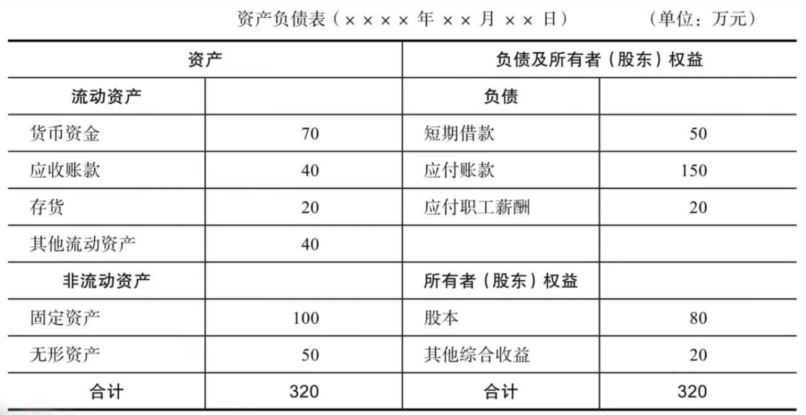

## 资产负债表

- 反映一个公司（也可以是其他东西，比如家庭）在某一时刻的体量
- 资产：家底有多厚
- 负债与权益：家底从哪来
- 【资产】减去【负债】就是【所有者权益】
  - 比如：一个家庭，银行存款+基金+房子一共价值 350W，但是买房负债 250W，那么所有者权益就是 100W
  - 如果负债高于资产，就会【资不抵债】
  - 资产和负债都会动态变动
    - 国家调控导致放假下跌
    - 升职加薪
  - 随着时间的变化，资产可能会成为负资产
    - 比如一个房子买的时候 300W，后来跌到 200W，就变成了负资产。如果此时因为现金流不健康而出手，就会亏损 100W
    - 当然，负资产也可能随着时间的变化，成为正资产。前提是现金流可以支撑到那个时候
- 注意有些资产是有区别的，比如投资型房产 vs 自住型房产
- 无形资产：没有实物形态，并且不是金融资产
  - 比如：商标，域名，数据，知识产权，短视频，专利
  - 信息时代，非实体类的经济比重大大增加，无形资产在上市公司的资产比重中一直在增加
- 把负债利率从高到低排序，优先解决利率高的贷款

## 现金流量表

- 反映当前现金状况
- 公式：期初现金+本期流入现金-本期流出现金=期末现金
- 新事物开创的阶段，通常是不能盈利的，那么时刻监控并计算现金流是很重要的
- 正常一个公司创办的时候，可能需要筹备 18 个月的开支
- 评估一个初创公司是否可以活下去，现金流也是一个很重要的方面
- 个人找工作、换工作，同理，确保现金流健康
- 现金盈亏平衡点：现金从亏损变为盈利的时间点。cash break-even point
  - 显然，一个公司如果可以撑到现金盈亏平衡点，就有很大概率可以活下来
  - 如果撑不到，就只能不断融资、借贷续命。并且这和项目积累了多少资产毫无关系

## 损益表

- 公式：收入-成本=利润
- 折旧
  - 假设一台电脑 1W2，可以使用 48 个月
  - 买电脑的花销应该均摊到整个使用的生命周期，而不是一开始就算完
  - 最简单的平均年限折旧法：1W2 的电脑，48 个月，每个月折旧 250 元
  - 注意：在现金流上面体现的还是第一个月就支出了 1W2，但是在损益上面的体现是第一个月支出了 250 元

## 家庭收支表

- 类似公司的损益表，有一些家庭层面特有的属性
- 主动收入 vs 被动收入
  - 提升被动收入，是改善人生财务状况的全局杠杆解
- 支出
  - 衣食住行
  - 房贷，车贷，医疗，教育
- 收入大于支出之后，就有钱进行投资

## 收支资产负债模型

- 根据资金流向，可以把人划分为 4 种类型
  - 无产无债
    - 收入只会流向支出
    - 零资产，零负债
    - 月光族
    - 一旦失去工作/收入，现金流就会断裂
    - 需要慢慢攒钱
  - 无产有债
    - 消费贷的重度用户
    - 消费超出收入水平
    - 贷款买了很多没有资产属性，不保值/无法增值的商品
      - 衣服、包、手机、旅游、整容等
    - 需要改变消费习惯
    - 是所有人都要避免成为的类型
    - 最大的坑就是消费贷
  - 有产有债
    - 中产
    - 有资产，同时有负债
    - 花费巨资贷款买自住房，但是无法带来任何被动收入，却带来了负债和日常费用
    - 很容易使用隐形的负债，购买了劣质的，无法产生被动收入的资产
    - 一旦人到中年，产业调整，收入下跌，就很尴尬
      - 负债和支出不变，收入却可能无法提升
    - 这类人认为：收入是用来让自己过得越来越好的工具
      - 分不清什么是好资产，对高息负债不敏感
  - 高产低债
    - 尽可能获得被动资产，并把新获得的收入投入到被动资产
    - 实现钱生钱
    - 这类人认为：收入是用来投资获得更多收入的工具
      - 尽可能扩大能够产生被动收入的资产份额，尽量承担低息负债
- 贷款购买自住房是很多人生的分水岭。自住房越贵，贷款越多，越容易被锁死在中产
- 主要要解决的是多余资产的分配问题
  - 优先无形资产/被动资产，避免劣质资产
