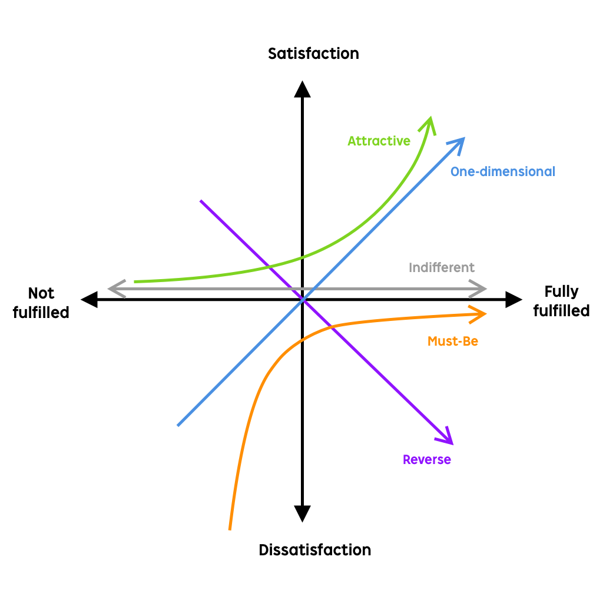

## 前言

本文是观看[此视频](https://www.bilibili.com/video/BV1vx411p758)时的笔记

## 产品定义、类型、产品经理工作中的大局观

- 产品的定义和价值
  - 定义产品的三个要素
    - 产品的本质
      - 满足了用户什么需求？
        - kano模型分析方式
          - 基本需求
          - 期望需求
          - 想象不到的需求
    - 产品的形式（比如淘宝是C2C、天猫是B2C、京东是B2C+物流）
      - 功能设计
      - 内容构成
      - 视觉设计
      - 服务方式
    - 产品理念
      - 一句话概括目标
      - 通常比较“假大空”，起【指导】作用
  - 用户心中的产品价值
    - 核心价值
      - 这款产品能为我带来什么？
      - 是用户选择这款产品的【先决条件】
      - 例：微信的聊天功能
    - 期望价值
      - 除了核心价值，我还能够得到什么？
      - 例：微信的朋友圈功能、群聊功能
    - 附加价值
      - 用户想不到的服务
      - 例：微信的公众号、摇一摇、小程序
- 什么样的产品能成为成功的产品
  - 抓住用户需求
    - 方向很重要
    - 但是很少有产品一开始就能精准解决需求
  - 专注
    - 花时间
    - 产品需要逐步完善。可能需要半年到一年
  - 新的理念
    - 敢于尝试别人不愿意去做的事情
  - 贴合用户，同时有良好的商业化方案
    - 现代世界对用户体验的追求非常泛滥。千万不要盲目追求用户体验而忽视了盈利性
  - 快速反应用户新需求
  - ...
- 产品类型
  - 五种主要的产品类型（类型不相互排斥）
    - 工具型
      - 笔记、词典、音乐、安全卫士...
    - 媒体型
      - 36Kr、优酷、极客公园...
    - 社区型
      - 内容型社区（以内容为核心）
        - 豆瓣、大众点评
      - 关系型社区（以人为核心）
        - QQ空间、微博、Facebook
    - 游戏型
    - 平台型（为第三方提供平台支撑）
      - 淘宝、微信、线下的大卖场和商圈...
  - 互联网产品的演化
    - 很多互联网产品一开始就是一个工具，随着用户量的增加而慢慢添加其他类型的特征。但是要保证自己的核心类型在市场中占有优势，不要盲目转型
- 产品战略和战术
  - 行业分析
    - 确定行业规模
      - 互联网行业，强者通吃，第一名、第二名可能混得不错，第三名可能就很惨（参考美团饿了么）。传统行业会好一些，可能前十也会很有市场
      - 需要对行业有深入的理解
      - 判断此行业是否适合进入
    - 竞争者结构分析
      - 行业集中度(Concentration Radio)，又叫市场集中度(Market Concentration Rate)
        - 指行业前N家企业所占市场份额（产值、产量、销售额、销售量、职工人数、资产总数等）的总和
        - 帮助我们了解行业目前的竞争格局
        - 互联网行业常见指标
          - 销售量、盈利、用户量、活跃用户量...
        - 行业集中度高的领域，存在领头企业，比如搜索领域的谷歌
          - 可以分析领军企业的特征，以便了解市场情况
      - 思考行业创新升级的可能性
        - 产业升级的可能性
          - 从IE浏览器到chrome，用户体验升级
        - 全新的变革、颠覆产业
          - 360使杀毒软件从付费转向免费，颠覆盈利模式
    - 产品在产业链条中的议价能力
      - 浏览器、导航站，属于流量入口，是上游产品，对下游产品具有较强的议价能力
      - 房地产门户网站，流量小的时候对下游房地产没有议价能力，流量大的时候可能有一定的议价能力
      - 360安全卫士，对上游具有议价能力（不交保护费就禁cookie、SSL证书），对下游（PC用户）具有控制能力
        - 360善于把商业需求（收保护费）包装成用户需求（用户需要保护电脑）
      - 产品初期是可以评估出产品的议价能力的。如何提高议价能力，在一定程度上决定了产品的发展方向
    - 进入者分析
      - 一开始你是行业的进入者。进入之后还要提防其他进入者
      - 进入行业的时候，你拥有的壁垒是什么
      - 如何在进入行业后打造自己的壁垒
    - 替代品威胁
      - 这个行业是否存在替代品
        - 线下书店->连锁书店->数字化管理连锁书店->线上书店
        - 电动汽车是否会替代燃油汽车？
  - 预测行业发展趋势
    - 根据行业历史预测行业发展趋势
    - 逆向思维法则预测行业发展趋势
      - 总结已有的成功产品，抽象出要素，然后把要素重新进行排列组合，设计产品
    - PEST分析法预测行业发展趋势
      - P = Political System政治
      - E = Economic经济
      - S = Social社会
      - T = Technology技术
      - 国内对高新技术的扶持、结合互联网和传统行业等
  - 产品在公司战略中扮演的角色
    - 营利性产品，确保现金流
    - 卡位性产品，形成垄断或保有公司地位，比如微信
    - 防御性产品，跟进其他产品试图融合生态，比如腾讯微博、搜狐微博
    - 进攻性产品，拓展到其他竞争激烈的领域，比如360搜索
    - 实验性产品，谷歌眼镜
  - 产品战略 - 整体规划、步调。比如：6个月成为行业领军品牌
    - 产品理念
      - 指导思想
      - “让天下没有难做的生意”
    - 产品定位
      - 产品方向（产生产品边界）
        - 做什么
        - 不做什么
      - 产品类型
        - 产品用途
        - 战略定位
      - 产品价值
    - 竞争思路
      - 差异化
      - 寻找突破点、关键竞争要素
      - 优劣势分析
    - 商业模式
      - 盈利模式
        - 广告
        - 流量入口
        - ...
      - 运营模式
        - 按照盈利模式，通过运营获得盈利
    - 产品规划、产品路线图
      - 产品研发
      - 推向市场
      - 运营推广
      - 实现目标
        - 可能有很多阶段性小目标
  - 产品战术 - 服务于战略，用来实现战略的方法和技术。比如：研发XXX，测试XXX，推广XXX
    - 陌陌的约炮推广
    - 知乎的专家回答

> 题外话：添加一个功能的时候，一定要客观地看待，不要因为别人都做了我们就要做。比如分享到微博，很多APP都做了，我们的APP里面用户为什么要分享到微博？再比如卖楼的APP，我们可以添加一个点评功能，但是更好的方式是让客户输入房子的优点并抽奖，给用户一个预设的目的

## 需求文档

- 商业需求文档（BRD: Business Requirement Document）
- 市场需求文档（MRD: Market Requirement Document）

有的公司可能要求把这两个文档合并。不同公司有不同的要求

## 需求分析与管理

- 需求定义
  - 用户想要的
  - 互联网产品分类
    - 2B（解决企业用户的需求）
    - 2C（解决个人用户的需求）
- 需求的本质
  - 名望、权利、利益、欲望
  - > 佛学：用户的贪嗔痴
- 需求分类
  - 常见类别
    - 娱乐休闲
      - 旅游、游戏、运动
    - 归属感
      - 好友群、游戏公会
    - 沟通
      - QQ
    - 意见领袖
    - 利益
      - 物质利益、精神利益
      - 一定要关注种子用户的利益，因为种子用户会带来更多的流量。可以特别关照一下
    - 获取知识与资讯
      - 36Kr
    - 自我情感的表达
      - QQ空间、签名
    - 爱和被爱
      - 百合网
    - 社交
      - 职场、爱情、友情
    - 分享
      - 微博、推荐
    - 安全
      - 防盗门、安全带
    - 尊重
      - 及时响应客户需求
    - ...
  - 学会从本质思考问题
  - 学会多问为什么
- 需求与产品
  - 产品用来满足用户的需求
  - 产品是建立在需求上的
- 获取需求
  - 不要想当然地意淫需求
  - 不要为了达到某种目的去伪造需求
  - 定性和定量分析
  - 方法
    - 行业调研分析报告
      - 平时就可以收集并保存一些报告到本地
      - “移动互联网用户调查报告”...
    - 业内专家和专业人士
      - 和别人进行价值交换，而不是一味的索取
      - 不要盲目听信别人的建议。要结合自己的实际情况
      - 提升自己的影响力，参加公开活动（不论是演讲者还是听众）
      - 提问的艺术 & 情商
      - 不要吝啬自己的资源，广交天下英豪
    - 定性用户访谈
      - 一对一
        - 有较好的时空场景
        - 可以把用户带入我们想要的场景
        - 用户可以较好地表达自己的思想
        - 耗时较长。建议挑选重点用户
        - 一定要有明确的访谈目的
        - 挑选目标用户作为对象，尽量发展为种子用户。访谈对象不能对访谈抵触
        - 前戏。预热
        - 问题的顺序要设计的合理，难度建议不要有太大波动。尽量提升问题的趣味度。尽量使用开放问题，而不是像拷问一样问是否
        - 不要因为用户回答的问题出乎我们的意料而沮丧。不要忽略负面信息
        - 不要坐在目标对面，气氛会很紧张，像是审问
      - 焦点小组访谈
        - 建议6-10人，不要超过12个人
        - 主持人介绍，鼓励大家积极发言
        - 部分人可能受到其他人想法的影响，从而失去自己的想法
        - 要有明确的访谈目的，也要挑选目标访谈对象
        - 需要设置奖励措施，否则没人来的
        - 使用开放性问题
        - 访谈前，提前确认大家是否能来
        - 访谈后，客观地整理结果，然后再主观地分析
      - 电话访谈
        - 目标分散、临时性、快速得到结果
      - 街头狙击访谈
        - 场景和策划场景匹配
      - 定性访谈的共同原则
        - 问卷中的名词要有明确的定义
        - 尽量在问题中给出例子
        - 保持自信轻松，感染受访者
        - 表扬、肯定、鼓励受访者
        - 认真倾听，不要频繁开启新话题
        - 不要忽略过程只记录结果
    - 定量定性结合的调查问卷（远程）
      - 可以使用开放性问题，但是不要太多，尽量放到最后
      - 问卷的问题要有连贯性和持续性
      - 使用有趣的问题、简单的问题吸引用户
      - 分解难的问题
      - 排版不要太密，巧妙排版，进度条
      - 不要超过15分钟
      - 开头写出调研目的
      - 可以使用用户的视角，并使用5种程度表达用户的想法，而不是简单的“是否”
        - 问题 - “我希望XXX”
        - 选项：1-非常不需要，234...，5-非常需要。
    - 来自运营数据中的需求
      - IP - 通常24小时内相同的IP地址算一次
      - PV - 页面浏览量
      - UV - 独立访客
      - 平均PV - PV/UV，即每个独立访客浏览了多少页面
      - 行为轨迹 - 用户在哪里停留了多久，从哪里进入，途径了哪里，从哪里离开
      - 转化率 - 通常由公司自己定义目标
        - 比如100个用户添加到购物车，20个用户付费，转化率就是20%
        - 注册可能也有转化率
      - 跳出率 - 浏览了一个页面就离开的用户的占比
      - 留存
      - 日活DAU
      - 月活MAU
    - 把自己变成目标用户
      - 日记分析法
        - 使用流水账的形式记录某个用户（比如自己，如果自己也是目标用户）的行为，然后分析隐藏的需求
    - 挖掘用户需求
      - > 乔布斯：你能做的最糟糕的事情就是倾听你的用户
      - 用户通常不会表达习以为常的需求
      - 用户可能表达能力受限，无法传达正确的需求
      - 用户可能不专业
      - 需求可以被挖掘和引导
        - 饥饿营销
        - 游戏的多次公测
  - 分析与记录需求
    - 评估需求
      - [卡诺模型(KANO Model)](https://en.wikipedia.org/wiki/Kano_model)
        - 用户需求类型
          - 必备型需求
            - 没有满足这些需求时用户会很不满
            - 如果有这个功能，用户会觉得理所应当，不会给产品加分
            - 比如汽车里面的空调
          - 期望型需求/绩效型需求
            - 没有实现这些需求，不会给产品减分。实现了这些需求，会给产品加分
            - 通常由产品经理发掘而不是由用户提出
          - 魅力型需求/兴奋型需求
            - 完全出乎用户意料的功能
            - 提升用户粘性，用户会非常满意，甚至直接不使用竞品。杀手级功能
          - 无差异型需求
            - 用户不在乎的需求
            - 是否实现此需求对用户的满意度无影响
            - 比如婚恋网站提供快递查询
          - 反向型需求
            - 用户没有此需求。实现后反而降低用户满意度
            - 比如婚恋网站提供离婚咨询
        - 
        - 应用总结
          - 可以用来进行需求分类，从而管理需求优先级
          - 也可以放在调查问卷里面
            - 问：提供/不提供X功能，您的态度是？
            - 1，我喜欢
            - 2，理所当然
            - 3，无所谓
            - 4，很不喜欢
          - 注意：KANO得出的结论可能是变化的。今天的兴奋型需求，明天可能就变成了必备型需求或其他类型需求
          - **KANO模型不是万能的**。也可能不适用一些场景。要灵活使用。如果没必要用KANO，也可以不用。实际开发时的优先级也不一定和KANO模型的分析结果一致。比如对ZOOM来说，加密会议是很重要的功能，但是直到后期出现安全问题的时候才加上
          - 优先级：必备 > 期望 > 魅力 > 无差异
          - 使用流程
            - 需求沟通
            - 问卷编制
            - 数据收集与清洗
            - 客观输出结果
            - 主观分析数据，安排需求优先级
          - 缺点：需要制作问卷。耗时可能较长
      - 学会做减法
        - 根据产品定位做减法
          - 超出产品边界的需求不考虑
            - 超出产品的定位
            - 超出产品现阶段的目标
        - 根据产品价值做减法
          - 这个功能是否可以给用户带来价值
          - 这个功能不能背离产品的定位和主要输出价值
            - 比如婚恋网站提供快递查询功能，确实有价值，但是不符合主要价值
        - 根据产品使用场景做减法
          - 户外广告提供二维码而不是网址
        - 根据产品迭代做减法
          - 遵循产品路线图
          - 使用成熟的技术
          - 避免开发难度很高但是回报很小的需求
      - 产品专家评审团队决策
        - 参与的人员
          - 产品负责人
          - 研发负责人
          - 运营负责人
          - 市场负责人
          - 销售负责人
          - ...
        - 讨论（投票）做出决定
          - 可以分享KANO模型的分析结果
          - 准备好会议内容和议程
          - 建议提前给出梗概让所有人熟悉一下内容。会议开始的时候也宏观介绍一下，以免出现误解
          - 鼓励大家多提问题。也可以把自己的问题放出来一起讨论。如果没有问题，那就不需要开会讨论了
          - 团队决策的结果不一定是正确的。毕竟其他人可能对产品不是很专业，或者有自己的小心思。所以产品经理要有定力
      - AB测试
        - 比较两个版本，根据用户实际数据决定使用哪个版本
        - 可能需要测试的内容
          - 按钮的大小、文字内容、颜色、位置
          - 标题或产品说明
          - 表单数量、字段风格
          - 网站布局
          - 定价和促销活动信息
          - 文字量
    - 记录获取需求
      - 需求采集表
        - 需求编号
        - 采集来源
          - 某个人？
        - 采集方式
          - 一对一访谈
        - 采集地点
          - 公司会议室
        - 需求产生原因
        - 本质需求
        - 需求类型
          - 功能改进
          - 新增功能
          - 体验提升
          - BUG反馈
          - 内部需求
        - 涉及哪些功能模块
        - 需求定义
          - 基本型
          - 期望型
          - 兴奋型
        - 可行性
        - 工作量
        - 优先级
        - 目前状态
        - 录入人
        - 录入时间
        - 商业价值
        - 描述
        - 性价比（可能等于商业价值和开发量的比值）
        - ...
- 需求优先级定义
  - 新产品未上线的情况
    - 需求特点
      - 无运营数据支撑
      - 最好团队/产品经理有相关经验
      - 需求会很多
    - 如何定义优先级
      - 从用户角度思考，使用KANO模型分析
      - 需求金字塔理论
        - 塔底 - 必备型需求，必须存在
        - 塔身 - 期望需求，即使没有，影响不大
        - 塔尖 - 魅力型需求，前期能出现是最好的。如果不能出现，稍后跟进也可以
      - 非用户需求
        - 运营需求，比如埋点、后台管理界面
  - 免费型产品已经上线的情况
    - 分类
      - 全免费
      - 部分免费
      - 限时免费
    - 免费产品可以更快地获得运营数据，以便优化产品
    - 一个参考公式
      - `用户需求重要性 = 用户使用率 * 功能平均使用次数 * 内部定义的权重`
        - `用户使用率 = 使用此功能的用户数量 / 总用户数量`
        - 内部定义的权重，是团队自己定义的。比如期望型需求的权重为50%，兴奋型的权重为25%
        - 其实就是平均每个用户的使用次数乘以内部定义的权重
  - 收费型产品情况
    - 分类
      - 全收费
      - 部分收费
      - 限时收费
    - 收费型产品的主要价值来自于期望型需求和兴奋型需求
    - 所以基本型需求一定做到最好，权重最高（重要且紧急）
    - 需求排序听从商业价值
  - 前置/后置条件
    - 需求之间可能互相依赖。可以画个DAG图
- 管理需求
  - 需求工作量估算
    - 标签估算法
      - 选定一个大家已经做出来/熟悉的功能（比如上传照片），假设它的工作量是50，当时花了3天完成
      - 请多个研发参考上述功能，对新功能进行工作量评估，从而得到所需时间
      - 如果多个研发对新功能的工作量评估差异很大，说明他们没有正确理解需求，需要统一意见
    - 实际讨论法
      - 通过和研发沟通，直接估算所需时间
      - 可以结合更多的事实，得到更贴合实际的结果
    - 强制手段法
      - 研发给出的时间无法接受时，需要强硬一点
      - 给研发施压，比如通过老板提出需求
  - 需求变更
    - 设计产品时的包容性和向前兼容性
    - 哪些需求值得变更，哪些需求可以推迟变更
  - 需求管理工具
    - 可能是Excel表

