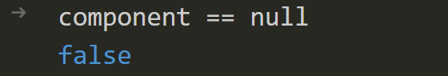
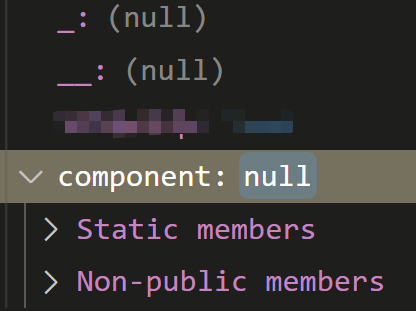

## 泛型函数

我需要实现一个函数，判断某个`GameObject`是否包含`ComponentA`，如果不包含则添加`ComponentB`，也就是：

```cs
var component = this.GetComponent<ComponentA>();
if (component == null) this.gameObject.AddComponent<ComponentB>();
```

为了把它封装成函数复用，使用了歪门邪道的泛型（以避免写复杂的反射代码）

**仅使用**参数的**类型**，而**不使用**参数的**值**：

```cs
void f<A, B>(A _, B __) {
  var component = this.GetComponent<A>();
  if (component == null) this.gameObject.AddComponent<B>();
}
```

调用的时候使用`null`加上强制类型转换：

```cs
f((ComponentA)null, (ComponentB)null);
```

## 报错

上面的代码看起来没有问题，但是实际执行的时候，`component == null`永远都是`false`，即使此 Component 并不存在

进入 Debug 模式，可以看到`GetComponent<>`确实返回了一个`null`，但是这个`null`和 CSharp 语言原生的`null`并不相等，甚至还有内部结构





## 原因

通常情况下，`GetComponent`返回的`null`是一个`UnityEngine.Object`，而不是语言原生的`null`

Unity 封装的`UnityEngine.Object`重载了运算符`==`和`!=`，所以它和语言原生的`null`进行比较的时候可以正常工作

但是因为我的函数代码使用了泛型，所以编译器在编译期无法判断返回的`null`是`UnityEngine.Object`，所以没有使用重载的运算符，导致此异常

## 解决方案

加上类型约束，实现静态类型检查：

```cs
void f<A, B>(A _, B __) where A : UnityEngine.Object {}
```

## 参考

- [GetComponent returns null however comparison to null returns false](https://answers.unity.com/questions/1243356/getcomponent-returns-null-however-comparison-to-nu.html)
- [Constraints on type parameters (C# Programming Guide)](https://docs.microsoft.com/en-us/dotnet/csharp/programming-guide/generics/constraints-on-type-parameters)
- [Unity Scripting API: Object](https://docs.unity3d.com/ScriptReference/Object.html)
