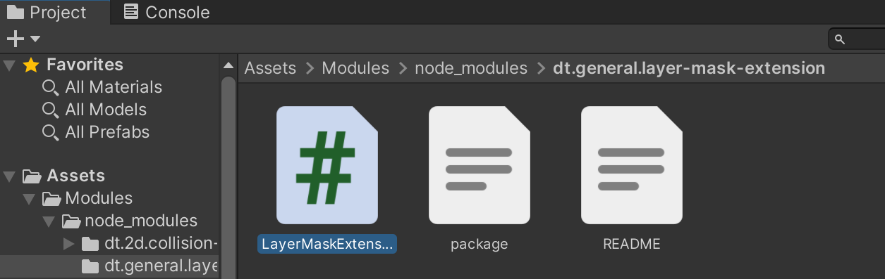

## Why?

- Unity3D 自带的 Package Manager 不好使
  - 首次加载比较慢
  - 官方 Registry 里面的内容有限（虽然也可以从本地文件 / Git Repo / Assets Store 加载）
  - GUI 哪有命令行方便（暴论）
    - 比如一次性安装/删除多个依赖包
    - 或者做版本管理，安装指定版本的包
    - 对于第三方包，先下载，再在编辑器里面通过 GUI 点来点去进行导入，哪有命令行方便
- 我想跨项目复用一些代码片段
  - 不一定每个代码片段都是一个 Repo。可能是一个 Repo 里面的几个文件或文件夹
- 更方便的第三方代码共享与复用
  - 目前没看到好的 Unity3D 代码共享方案
    - 其他编程语言需要轮子的时候，通常搜一下，然后用包管理工具安装一下就 OK 了。而 Unity3D 更多的是在社区直接粘贴代码/伪代码
    - 当然也可能是游戏的需求过分多样，难以复用轮子？

简言之，提升开发效率。

## What?

需求如下：

- 可以仅导入 GitHub Repo 里面的某个文件夹，而不一定是整个 Repo
- 拥有互联网行业主流编程语言的包管理体验，比如 `npm` / `yarn` / `pip` / `go` / `cargo` / `maven`
  - 当然，如果能直接拿来用岂不是更妙
- 依赖管理与版本控制
  - 代码片段之间可以互相设置依赖，并自动管理依赖树

## How?

### 基于 npm/yarn 的解决方案

因为目前代码主要放在 GitHub，所以理论上只要是能从 GitHub 上面安装依赖的包管理工具，都可以直接拿来使用，比如 npm/yarn

当然，是基于`package.json`文件进行包的定义与依赖管理

需要下载安装的时候，只需要

```bash
yarn add <username>/<repo>
```

或者

```bash
npm install <username>/<repo>
```

就行了

### 仅导入某个文件夹

需要使用一个叫做 [GitPkg](https://gitpkg.vercel.app/) 的工具，可以把 GitHub 上面某个文件夹视为一个 package

对应的，每个视为 package 的文件夹下面都应该有一个`package.json`文件来定义这个包

目前已经实现了一些包，放在了 [unity3d-utils](https://github.com/DiscreteTom/unity3d-utils) Repo 里面。可以看到它的文件目录就是:

```bash
─2D
│  └─CollisionManager2D
│          CollisionManager2D.cs
│          package.json
│          README.md
│          yarn.lock
│
└─General
    └─LayerMaskExtension
            LayerMaskExtension.cs
            package.json
            README.md
```

可以看到文件夹`CollisionManager2D`和文件夹`LayerMaskExtension`里面都有`package.json`文件

并且`CollisionManager2D`还依赖了`LayerMaskExtension`，我们只需要安装前者，就可以自动安装它的依赖树。

更多细节，可以看看这个 Repo 的源码：[unity3d-utils](https://github.com/DiscreteTom/unity3d-utils)

### 开始使用吧！

1. 在 Unity3D Editor 里面，创建一个文件夹用来放 npm/yarn 管理的依赖。比如`Assets/Modules/`
2. 在此文件夹中，执行`yarn init -y`创建空的`package.json`文件
3. 执行`yarn add xxx`就可以安装所需的依赖啦！
   1. 另外，建议把`node_modules/`添加到`.gitignore`，或者添加完整的 NodeJS 的[`.gitignore`](https://github.com/github/gitignore/blob/main/Node.gitignore)
   2. 当需要在其他机器下载项目的时候，也需要执行`yarn` / `yarn install`来安装所有依赖



## 瑕疵

- GitPkg 目前只能用来转换 public repo，毕竟它没权限访问 private repo
  - 不过它是开源的，有兴趣应该可以自建来解决此问题
- `package.json`要求包的名字都是小写，这导致下载下来的包的文件夹是小写命名，不是很符合 `C#` 的风格
  - 虽然强行大写也没啥问题，但是有 warning 就很不爽

## 其他方案？

当然此博客只是一个思路。使用其他包管理工具也可以实现类似的效果。

使用 npm/yarn 是因为 nodejs：

- 比较方便跨平台安装（特别是 windows）
- 依赖管理方案比较统一/直观/成熟
- 支持从 github 下载依赖
- 安装的依赖也默认安装在工作目录
