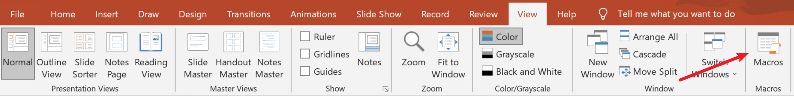
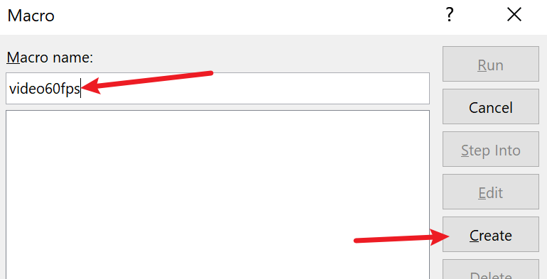

## Why

默认 PPT 就可以导出视频，但是只能导出 30 帧的视频，不够丝滑
无法体现非线性动画的美

## 操作流程

View -> Macros



输入宏的名字，比如`video60fps`



粘贴如下代码

```vb
Sub video60fps()
If ActivePresentation.CreateVideoStatus <> ppMediaTaskStatusInProgress Then
ActivePresentation.CreateVideo FileName:=Environ("USERPROFILE") & "\Desktop\Video.mp4", _
UseTimingsAndNarrations:=True, _
DefaultSlideDuration:=1, _
VertResolution:=1080, _
FramesPerSecond:=60, _
Quality:=100
Else: MsgBox "There is another conversion to video in progress"
End If
End Sub
```

然后关闭 VB 编辑窗口，回到 PPT，再次打开 Macros 窗口，选中刚才创建的宏，然后 Run

## 代码解释

- `FileName:=Environ("USERPROFILE") & "\Desktop\Video.mp4"`
  - 把文件保存在桌面 `Video.mp4` 中
- `UseTimingsAndNarrations:=True`
  - 设置计时和旁白使用指令
- `DefaultSlideDuration:=1`
  - 每张幻灯片间隔 1 秒
- `VertResolution:=1080`
  - 分片率 1080p
- `FramesPerSecond:=60`
  - 60 fps
- `Quality:=100`
  - 最高质量

## Refs

- [How to Create 60 FPS PowerPoint Videos](https://www.youtube.com/watch?v=Pd-DrfGsCjQ&t=309s)
- [如何利用 PowerPoint 导出 60 帧 PPT 演示视频](https://zhuanlan.zhihu.com/p/91519346)
