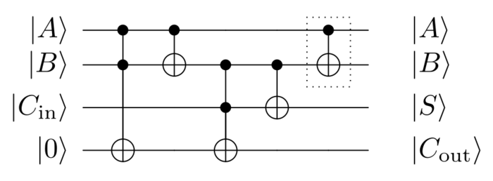
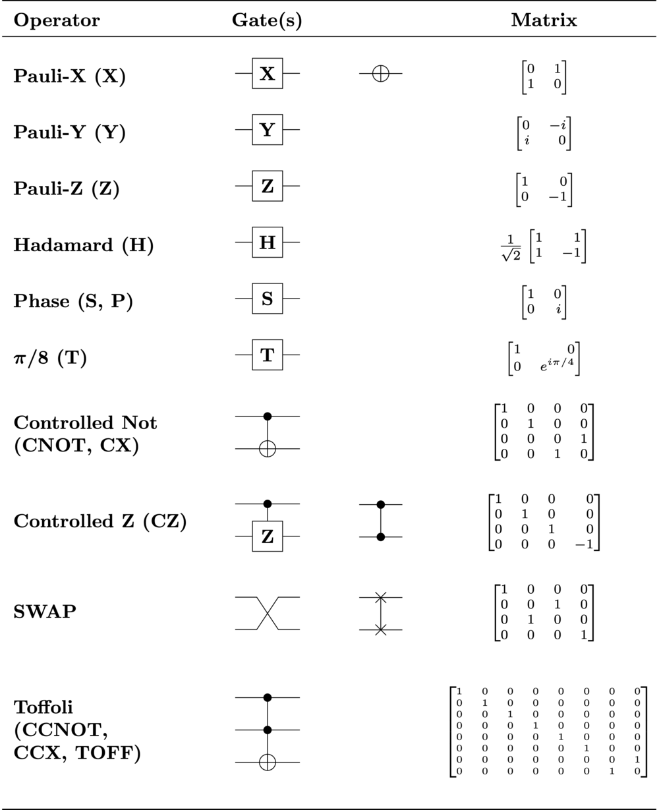
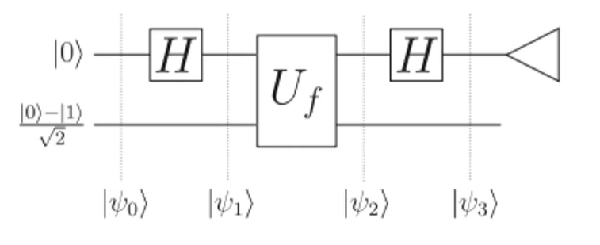

## 量子比特

- qubit
- 类似于传统计算机的比特，量子计算机也会使用一些物理量来表示【量子比特】，比如电子的自旋（向上/向下），或者光的偏振（垂直/水平）
- 使用$\ket{0}$表示量子 0，使用$\ket{1}$表示量子 1

## 量子运算

- 内积(inner product)：$\braket{a|b}$
  - 类似于条件概率，意为：如果量子初始状态是$a$，那么测量到$b$的概率是多少
    - 归一性: $\braket{0|0} = \braket{1|1} = 1$
    - 正交性: $\braket{0|1} = \braket{1|0} = 0$
  - 其中$\bra{x}$被称为 bra，$\ket{x}$被称为 ket
  - $\braket{a|b}$被称为 braket
- 叠加态(superposition of states)：$a \ket{0} + b \ket{1}$
  - 众所周知量子态是可以叠加的，所以对于一个量子态，可以同时是$\ket{0}$或$\ket{1}$
  - 是$\ket{0}$的概率为$a^2$，是$\ket{1}$的概率为$b^2$。显然$a^2 + b^2 = 1$
- 张量积(tensor product)：$\ket{a} \otimes \ket{b} = \ket{a} \ket{b} = \ket{ab}$
  - 张量积与内积的运算示例：
    - $\braket{ab|cd} = \braket{a|c} \braket{b|d}$
    - $\braket{01|01} = \braket{0|0} \braket{1|1} = 1 \times 1 = 1$
- 外积(outer product): $\ket{a} \otimes \bra{b} = \ket{a} \bra{b}$
  - 物理意义：投影
    - 比如：求$a \ket{0} + b \ket{1}$在$\ket{0}$上的投影
    - $(\ket{0} \bra{0}) (a \ket{0} + b \ket{1}) = a \ket{0} \braket{0|0} + b \ket{1} \braket{0|1} = a \ket{0}$

## 量子电路

使用电路图描述量子运算。左边是输入的 n 个量子比特，右边是输出的 n 个量子比特，中间是量子逻辑门



类似于传统计算机的门电路，量子电路里面也有各种量子逻辑门(quantum logic gates)



可以看到，所有逻辑门的输入和输出量子比特个数相等，不像传统计算机，可以输入 N 个比特，输出 1 个比特。

**量子电路是可逆的，** 因为输入和输出一一对应，知道输出可以反推输入。

量子逻辑门里面很重要的一个门是 Hadamard 门， **可以用来创建叠加态的量子比特** ，比如 50% 概率是量子 0，50% 概率是量子 1

**不可克隆原理** ：如果不读取/观测一个量子量，就无法复制这个量子量。

但是一旦读取/观测，量子态就会坍缩/被破坏。所以量子加密通信可以提供更高的安全性。

## 矩阵表示

因为单个量子位有两个分量$\ket0$和$\ket1$，所以可以使用矩阵表示量子位。上面的数字(a)表示$\ket0$的分量，下面的数字(b)表示$\ket1$的分量。其中$a^2 + b^2 = 1$，并且 a/b 可以为负数。

$$
\ket{0} = \begin{bmatrix}
  1 \\ 0
\end{bmatrix}
\text{ , }
\ket{1} = \begin{bmatrix}
  0 \\ 1
\end{bmatrix}
\text{ , }
\ket{x} = \begin{bmatrix}
  a \\ b
\end{bmatrix}
$$

如果要同时表示多个量子位的状态，需要使用张量积。

以两个量子位举例，会得到一个 4 行 1 列的矩阵，自上而下分别表示$\ket{00}$的分量，$\ket{01}$的分量，$\ket{10}$的分量，$\ket{11}$的分量。

$$
\begin{aligned}
\ket{0} \otimes \ket{0} & = \begin{bmatrix}
  1 \\ 0
\end{bmatrix} \otimes \begin{bmatrix}
  1 \\ 0
\end{bmatrix}

\\

& = \begin{bmatrix}
  1 & \begin{bmatrix}
    1 \\ 0
  \end{bmatrix} \\
  0 & \begin{bmatrix}
    1 \\ 0
  \end{bmatrix}
\end{bmatrix}

\\

&= \begin{bmatrix}
  1 \times 1 \\ 1 \times 0 \\ 0 \times 1 \\ 0 \times 0
\end{bmatrix}

\\

& = \begin{bmatrix}
  1 \\ 0 \\ 0 \\ 0
\end{bmatrix}
= \ket{00}

\end{aligned}
$$

量子逻辑门也可以使用矩阵的形式表示。进行逻辑运算的时候，量子逻辑门矩阵在乘法左侧

$$
\begin{aligned}

\text{Pauli-X / NOT gate: } &
X \ket{0} = \begin{bmatrix}
  0 & 1 \\ 1 & 0
\end{bmatrix} \begin{bmatrix}
  1 \\ 0
\end{bmatrix}
= \begin{bmatrix}
  0 \\ 1
\end{bmatrix} = \ket{1}

\\

\text{Hadamard Gate: } &
H \ket{0} = \frac{1}{\sqrt{2}} \begin{bmatrix}
  1 & 1 \\ 1 & -1
\end{bmatrix} \begin{bmatrix}
  1 \\ 0
\end{bmatrix}
= \frac{1}{\sqrt{2}} \begin{bmatrix}
  1 \\ 1
\end{bmatrix}
= \frac{\ket{0} + \ket{1}}{\sqrt{2}}

\\

&
H \ket{1} = \frac{1}{\sqrt{2}} \begin{bmatrix}
  1 & 1 \\ 1 & -1
\end{bmatrix} \begin{bmatrix}
  0 \\ 1
\end{bmatrix}
= \frac{1}{\sqrt{2}} \begin{bmatrix}
  1 \\ -1
\end{bmatrix}
= \frac{\ket{0} - \ket{1}}{\sqrt{2}}

\\

& H (H \ket{0}) = \ket{0}

\\

& H (H \ket{1}) = \ket{1}

\\

\text{Controlled NOT / CNOT / CX Gate: } &
CX \ket{00} = \ket{00}
\\
& CX \ket{01} = \ket{01}
\\
& CX \ket{10} = \ket{11}
\\
& CX \ket{11} = \ket{10}


\end{aligned}
$$

## 可逆函数

前文说过量子电路是可逆的，N 个输入与 N 个输出一一对应。因为量子逻辑门本质上是矩阵运算，而知道矩阵乘法的结果和其中一个因子，是可以算出来另一个因子的。

但是传统计算机中的逻辑门通常不是可逆的，比如 AND 门，两个输入对应一个输出。此时需要先把这种逻辑门转换为可逆的逻辑门

以 AND 门举例，传统计算机里面：

```js
AND(0, 0) == 0;
AND(0, 1) == 0;
AND(1, 0) == 0;
AND(1, 1) == 1;
```

为了使输入和输出一一对应，构造如下函数：

```js
function ReversibleAND(a, b, c) {
  return [a, b, XOR(AND(a, b), c)];
}
```

这样输入和输出就可以一一对应了，但是需要的比特数量增加了。其他函数可以类比此方案实现可逆化

## Deutsch-Jozsa 算法

最简单的用来感受量子计算优势的算法

### 问题描述

已知某个函数 f 的输入和输出都是 0 或者 1。如果`f(0)=f(1)`则称函数为 constant。如果`f(0)!=f(1)`则称函数为 balanced。现在有一个函数`f`要么是 constant 要么是 balanced，判断`f`是 balanced 还是 constant。

- 传统算法：调用两次`f`，判断是否相等
- 量子算法：只需要调用一次`f`

### 量子解法

首先，如果函数`f`是 constant，它就不是可逆的，我们知道输出并不能反推出输入，所以要先把`f`转变为可逆函数

```js
function ReversibleF(input, helper) {
  return [input, XOR(f(input), helper)];
}
```

使用 braket 来表示的话，ReversibleF 可以表示为：

$$
\ket{x} \ket{y} \rightarrow \ket{x} \ket{y \oplus f(x)}

\\

\oplus \text{ means XOR}
$$

使用矩阵表示的话（其中$x_0$表示$x$的$\ket0$分量）：

$$
\begin{bmatrix}
  x_0 y_0 \\ x_0 y_1 \\ x_1 y_0 \\ x_1 y_1
\end{bmatrix}
\rightarrow
\begin{bmatrix}
  x_0 (y_0 \oplus f(x_0)) \\ x_0 (y_1 \oplus f(x_0)) \\ x_1 (y_0 \oplus f(x_1)) \\ x_1 (y_0 \oplus f(x_1))
\end{bmatrix}
$$

然后构造量子电路，图中$U_f$就是可逆的$f$，右边的三角形意为观测/坍缩：



其中$\psi_n$表示经过某个门之后的整体状态。这个状态是所有量子位的张量积

所以我们可以计算出：

$$
\begin{aligned}
\ket{\psi_0} & = \ket{0} \otimes \frac{\ket{0} - \ket{1}}{\sqrt{2}}
\\
& = \frac{\ket{00} - \ket{11}}{\sqrt{2}}
\\
& = \frac{1}{\sqrt{2}} \begin{bmatrix}
  1 \\ 0 \\ 0 \\ -1
\end{bmatrix}
\\
\ket{\psi_1} &= \frac{\ket0 + \ket1}{\sqrt{2}} \otimes \frac{\ket0 - \ket1}{\sqrt{2}}
\\
& = \frac{\ket{00} - \ket{01} + \ket{10} - \ket{11}}{2}
\\
& = \frac{1}{2} \begin{bmatrix}
  1 \\ -1 \\ 1 \\ -1
\end{bmatrix}

\end{aligned}
$$

因为$U_f$的输入是两个量子比特，我们可以直接把$U_f$应用到$\ket{\psi_1}$上，从而计算出$\ket{\psi_2}$

$$
\begin{aligned}
\ket{\psi_2} & = U_f \ket{\psi_1}
\\
& = \frac{U_f \ket{00} - U_f \ket{01} + U_f \ket{10} - U_f \ket{11}}{2}
\\
& = \frac{\ket{0 (0 \oplus f(0))} - \ket{0 (1 \oplus f(0))} + \ket{1 (0 \oplus f(1))} - \ket{1 (1 \oplus f(1))}}{2}
\end{aligned}
$$

根据不同的情况，$\ket{\psi_2}$有不同的值：

$$
\begin{aligned}
\text{ if } f \text{ is constant and } f(0) & = f(1) = 0 \text{ then }
\\
\ket{\psi_2} & = \frac{\ket{00} - \ket{01} + \ket{10} - \ket{11}}{2}
\\
& = \frac12 \begin{bmatrix}
  1 \\ -1 \\ 1 \\ -1
\end{bmatrix}
= H \ket{0} H \ket{1}
\\
\text{ if } f \text{ is constant and } f(0) & = f(1) = 1 \text{ then }
\\
\ket{\psi_2} & = \frac{\ket{01} - \ket{00} + \ket{11} - \ket{10}}{2}
\\
& = \frac12 \begin{bmatrix}
  -1 \\ 1 \\ -1 \\ 1
\end{bmatrix}
= - H \ket{0} H \ket{1}
\\
\text{ if } f \text{ is balanced and } f(0) & = 1 , f(1) = 0 \text{ then }
\\
\ket{\psi_2} & = \frac{\ket{01} - \ket{00} + \ket{10} - \ket{11}}{2}
\\
& = \frac12 \begin{bmatrix}
  -1 \\ 1 \\ 1 \\ -1
\end{bmatrix}
= - H \ket{1} H \ket{0}
\\
\text{ if } f \text{ is balanced and } f(0) & = 0 , f(1) = 1 \text{ then }
\\
\ket{\psi_2} & = \frac{\ket{00} - \ket{01} + \ket{11} - \ket{10}}{2}
\\
& = \frac12 \begin{bmatrix}
  1 \\ -1 \\ -1 \\ 1
\end{bmatrix}
= H \ket{1} H \ket{1}
\end{aligned}
$$

接下来我们需要对第一个量子位进行$H$操作，从而得到$\ket{\psi_3}$。而$H$是$H$的反函数，所以我们可以轻易得出：

$$
\begin{aligned}
\text{ if } f \text{ is constant and } f(0) & = f(1) = 0 \text{ then } \\
\ket{\psi_3} & = \ket{0} H \ket{1} \\
\text{ if } f \text{ is constant and } f(0) & = f(1) = 1 \text{ then } \\
\ket{\psi_3} & = - \ket{0} H \ket{1} \\
\text{ if } f \text{ is balanced and } f(0) & = 1 , f(1) = 0 \text{ then } \\
\ket{\psi_3} & = - \ket{1} H \ket{1} \\
\text{ if } f \text{ is balanced and } f(0) & = 0 , f(1) = 1 \text{ then } \\
\ket{\psi_3} & = \ket{1} H \ket{1}
\end{aligned}
$$

可以看出来，如果$f$是 constant，那么第一个量子位测量出来一定是 0。如果$f$是 balanced，那么第一个量子位测量出来一定是 1

### 复盘

- 量子计算为什么比传统计算快？
  - 可以看出，虽然只调用了一次`f`函数，但是这一次调用对 4 种可能的输入都进行了处理。我们只需要对输出进行精妙的转换，就能拿到我们想要的结果
- 解题思路
  - 首先把函数`f`转变为可逆函数。
  - 因为可逆函数有 4 种输入，所以我们使用了两个量子比特，通过叠加的方式（H 量子逻辑门）构建出了 4 种输入
  - 在得到输出之后，根据我们找到的规律，设计精妙的转换电路，把叠加的结果转换为确定的结果
- 推广：如果函数`f`不仅只有两种输入，而是`n`种，使用传统计算机需要算`(n+1)/2`次，量子计算机只需要算`1`次
- 量子计算机是并行计算/并行存储吗？
  - 是，但不完全是
  - 计算/存储的过程可以类比为并行
  - 观测的时候，会坍缩。所以量子位的数量决定了量子计算机的吞吐
  - 我们并不能拿到并行计算的所有结果，所以量子计算应该适用于大量输入、少量输出的场景，比如 reduce

## Ref

- [【完结】大一新生也能懂的量子计算](https://www.bilibili.com/video/BV1oq4y1j7iZ)
- [Quantum logic gate](https://en.wikipedia.org/wiki/Quantum_logic_gate)
