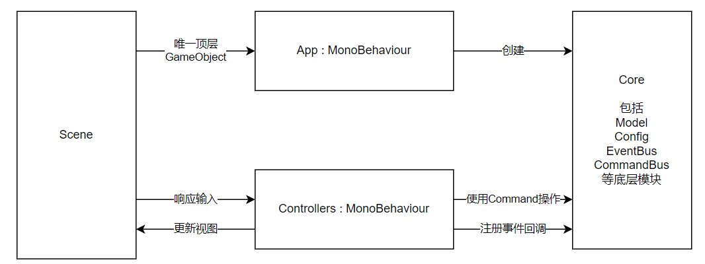

## 前言

最近学习了不少游戏客户端架构相关的东西，包括[此视频](https://www.bilibili.com/video/BV1JB4y1S7hk)，[此视频](https://www.bilibili.com/video/BV1vg411g7Fn)和[此视频](https://www.bilibili.com/video/BV1Wi4y157cE)

不同大佬的核心目标都是一样的：构建高内聚、低耦合的游戏客户端代码，使大型项目的开发更加可控，提高业务逻辑的可扩展性等。

但是不同大佬的实现方式是不一样的，使用的工具也不一样。

我想基于我自己的需求和场景，结合各位大佬的设计思路，提出自己的客户端架构设计哲学。所以就有了本文。所以核心目标都是一样的，只是代码规范/实现规范不同。

以下便是我提出的设计规范，欢迎讨论。

## 架构图



## 操作流

### 程序初始化

1. 因为 APP 是 Scene 中的唯一顶层 GameObject，所以 APP 一定会被首先创建
2. APP 创建 Core
3. APP 创建各个 Controller，并把 Core 提供给各个 Controller
4. Controller 从 Scene 中获取需要管理的 View，并注册 View 的事件回调函数。Controller 可能还需要注册 Core 里面的回调函数

### 处理用户输入或其他事件

1. View 获得用户输入或其他事件（比如碰撞）
2. 通过回调函数传给自己的 Controller

### 创建新的 View GameObject

1. 由业务逻辑，也就是 Controller，创建对应的 View GameObject
2. 创建完毕后，Controller 可以直接拿到新的 View

### 生命周期管理

比如 Start/Update 之类的，都仅在 APP 里面进行。APP 可以驱动 Controller 实现逻辑 Update

### 业务逻辑与表现的分离，团队合作

业务逻辑基本都在 Core 里面进行。Controller 通过 Command 触发业务逻辑，Core 通过 Event 通知 Controller 更新视图

这样，在团队分工合作中，可以由高级程序员编写 Command/Events，由初级程序员实现 View/Controller。只要接口（也就是 Command/Events）被定义好即可

## APP

原则：

- 整个 Scene 中只有一个根节点：APP
- APP 作为整个 Scene 的 Main 函数，一切逻辑都应该从这里出发
- APP 会创建所需的资源，并保存在 Core 里面，然后注入到 Controller 里面，以便 Controller 使用
- 只有 APP 可以使用 Unity 的生命周期函数（比如 Start/Update）
  - 不要在 View 里面处理时序和生命周期函数
  - 可以在 Controller 里面处理生命周期
    - Controller 没有继承 MonoBehaviour，所以不会被 Unity 调用，需要手动被 APP 调用

示例：

```cs
public class App : MonoBehaviour {
  Core core;

  // controllers
  UI ui;
  Player player;

  void Start() {
    // init core
    this.core = new Core();

    // init controllers, inject core
    this.ui = new UI(core);
    this.player = new Player(core);
  }

  void Update() {
    this.ui.Update();
    this.player.Update();
  }
}
```

## Core

### 禁止单例

单例的坏处：

- 单例可以被全局访问，无法规范化访问控制，导致引用关系复杂
- 单例只能创建一个。当我们需要扩展功能的时候（比如：单个玩家变为两个玩家），可能要大改

原则：

- 除非你特别确定，否则不要在任何地方使用单例、静态类
- 使用可以被实例化的类（可以被 new 出来的类），替代单例
- 使用上文的 APP，在程序入口处创建这些对象，保存在 Core 里面，然后注入到其他 Controller 中

### ScriptableObject

直接在 Scene 里面通过 MonoBehaviour 中的 public 变量，或 SerializeField 变量，实现修改变量或拖拽绑定，本身就是不稳定，并且难以查询和管理的。多人编辑同一个 Scene 也难以实现版本控制

所以，这些需要在编辑器修改的变量，建议创建 ScriptableObject，以文件的形式保存这些数据（就像保存了一个 JSON 文件，但是可以在编辑器里面修改），同时这些数据还可以被多次引用

当这些数据需要被使用时，也不要通过拖拽绑定。可以使用 Addressables 等资源管理插件，在代码里面获取资源。Code is Law，代码里面的才是最持久的

因为 ScriptableObject 自身是模块化的，不会随着 Scene 改变，可以进行细粒度的版本控制，所以可以在 ScriptableObject 里面进行拖拽绑定

初始化时需要的数据，可以在 APP 的 Start 里面进行获取

示例：

```cs
public class App : MonoBehaviour {
  Core core;

  void Start() {
    // construct core
    this.core = new Core();
    // sync fetch
    this.core.Config = Addressables.LoadAssetAsync<Config>("Assets/Config.asset").WaitForCompletion();
  }
}
```

### 响应式

有时我们可能希望观察 Model 中的数据变化，从而修改视图

可以实现一个简单的 Watch 类

```cs
public class Watch<T> {
  T value;
  UnityEvent<T, T> onChange;

  public Watch(T value) {
    this.value = value;
    this.onChange = new UnityEvent<T, T>();
  }

  public T Value {
    get => this.value;
    set {
      var old = this.value;
      this.value = value;
      this.onChange.Invoke(value, old);
    }
  }

  public void AddListener(UnityAction<T, T> f) => this.onChange.AddListener(f);
  public void RemoveListener(UnityAction<T, T> f) => this.onChange.RemoveListener(f);
}
```

这样就可以创建响应式 Model

```cs
public class Model {
  public Watch<int> Score { get; private set; }

  public Model() {
    this.Score = new Watch<int>(0);
  }
}
```

赋值和监听：

```cs
public class SomeController {
  public SomeController(Core core) {
    // assignment
    core.model.Score.Value = 1;

    // watch for changes
    core.model.Score.AddListener((value, old) => { Debug.Log(value); })
  }
}
```

如果不想自己实现 Watch，可以直接使用[这里的代码片段](https://github.com/DiscreteTom/unity3d-utils/tree/main/General/Watch)

### 事件/消息

可以在 Core 中保存一个全局使用的 EventBus。当然，也不能是单例/静态类

示例：

```cs
// sample events
public class Events {
  public UnityEvent<int> SomeEvent = new UnityEvent<int>();
  public UnityEvent<SomeView> AnotherEvent = new UnityEvent<SomeView>();
}

public class App {
  void Start() {
    this.core.Events = new Events(); // create event bus
    this.someController = new SomeController(this.core);
  }
}

public class SomeController {
  List<SomeView> views;

  public SomeController(Core core) {
    // listen to events
    core.Events.AnotherEvent.AddListener((view) => this.views.Add(view));

    // trigger events
    core.Events.SomeEvent.Invoke();
  }
}
```

## Controllers

原则：

- 不继承 MonoBehaviour
  - 所以可以被 new 出来
- Controller 负责处理业务逻辑
- Controller 可以创建自己的生命周期函数（比如 Start/Update），然后被 App 调用
  - 因为 Controller 没有继承 MonoBehaviour，所以生命周期不会被 Unity 管理，而是被 App 管理
- Controller 不会直接管理输入/输出，或视图相关的操作，而是通过 View 来修改视图，或者获得视图的事件
- Controller 可以通过 `GameObject.Find` 找到视图绑定的对象，或者直接使用 `GameObject.Instantiate` 创建视图对象
  - 如果是其他 Controller 创建的视图对象，可以通过 EventBus 捕获
- Controller 里面保存的 View 也可以是接口，这样不同的 View 可以复用一个 Controller
- Controller 之间是互相无法感知的，需要通过 Core 进行 Controller 之间的交互
- Controller 在程序一开始就会被全部创建出来。View 可以被动态创建和删除，而 Controller 不会
- Controller 中也可以使用其他的设计模式，比如配合 Command

示例：

```cs
public class SomeController {
  Core core;
  SomeView view;

  public SomeController(Core core) {
    this.core = core;

    // find view object and get view
    this.view = GameObject.Find("Some").GetComponent<SomeView>();
    // or, create object and get view
    this.view = GameObject.Instantiate(core.SomeData.SomePrefab).GetComponent<SomeView>();

    // init view
    this.view.Init();

    // watch for events from view
    this.view.OnGameStart(() => { ... });
  }

  public void Update() {
    // update view
    this.view.SetTitleText("Some");
    ...
  }
}
```

### 配合 Command 示例

使用 Command，可以把实际的业务逻辑，与 View/Controller 进行拆分，这样不同的 View/Controller 可以复用相同的业务逻辑

```cs
public interface ICommand {
  void Exec(Core core);
}
public struct SomeCommand : ICommand {
  void Exec(Core core) {
    core.model.SomeValue++;
  }
}

public class SomeController {
  public SomeController(Core core) {
    (new SomeCommand()).Exec(core);
  }
}
```

## View

原则：

- 负责处理用户输入、触发事件、显示输出，但是不实现业务逻辑
- 继承 MonoBehaviour，从而可以获取到 OnCollisionEnter 等事件
  - 仅把事件暴露给 Controller，自身不执行业务逻辑操作
- View 里面不能执行 Unity 的生命周期函数，因为要严格被 App 管理
  - 比如：不能有 Start/Awake 函数，但是可以自行创建一个 Init 函数用来做初始化。Init 函数会被 Controller 调用
- 如果 View 比较简单，可以不创建 View 脚本，直接使用 Controller 对 View GameObject 进行管理

示例：

```cs
public class SomeView : MonoBehaviour {
  UnityEvent onGameStart;

  public void Init() {
    this.onGameStart = new UnityEvent();
  }

  public void OnGameStart(UnityAction f) {
    this.onGameStart.AddListener(f);
  }

  public void SetTitleText(string text) {
    ...
  }

  void OnCollisionEnter(Collision c) {
    if (c.gameObject.tag == "Some") this.onGameStart.Invoke();
  }
}
```

## 示例项目

[复刻了一波 BBTAN](https://github.com/DiscreteTom/BBTAN)
