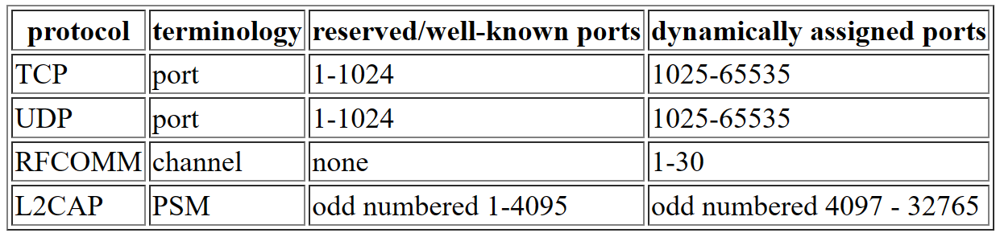

## 概念

### 设备地址和设备名

每个蓝牙设备都有一个全局唯一的设备地址，类似于 MAC 地址

蓝牙设备也可以有一个设备名。这个设备名不像 DNS 名称一样被统一管理，可以任意取名。客户端设备可以广播一个查询，搜索满足名称条件的设备，从而建立连接

### 通信协议

- RFCOMM
  - 类似 TCP
  - 每个机器只有 30 个端口（不像 TCP 有 65535 个）
  - 基于流
- L2CAP
  - 类似 UDP
  - 面向连接（也可以不面向连接，但是通常不这么用）
  - 基于报文
  - 报文最大长度固定（默认 672 字节，可以协商到 65535）
  - 可选重传机制
    - 不重传
    - 重传直到连接失效（默认）
    - 超时丢弃（超时时间可以配置为 0-1279ms）

> 修改重传机制时，所有对同一个设备的连接都会应用此机制，也就是说这个配置对于目标设备来说是全局配置。RFCOMM 底层也是使用 L2CAP，所以要确保这些连接也不会受到影响。如果只对目标设备建立一个蓝牙连接，那没问题

如何选型

- 可靠，基于流
  - RFCOMM（类似 TCP）
- 可靠，基于报文
  - RFCOMM 或 L2CAP+无限重传（类似 TCP/R-UDP）
- 最大努力，基于报文
  - L2CAP+超时丢弃（类似 UDP）

### 端口

- L2CAP
  - 端口叫做 Protocol Service Multiplexers(PSM)
  - 1-32767 的奇数
  - 1-1023 是预留的
- RFCOMM
  - 1-30



为了避免端口冲突，蓝牙使用 Service Discovery Protocol (SDP)

### SDP

SDP 是一个预留的服务（基于 L2CAP，使用预留端口），其他服务想要暴露端口或其他服务信息的时候，可以向 SDP 注册，端口会动态分配。客户端想要连接的时候，可以查询 SDP 服务器

SDP 中还支持使用 UUID 来指定服务的类型，客户端想要查询特定服务时，提供 UUID 作为关键词即可

### Profile

类似互联网领域有 RFC 对各种高层协议进行规范化（比如 HTTP），蓝牙也有，叫 Profile

## Linux+PyBluez

BlueZ 是 Linux 环境使用的蓝牙协议栈。PyBluez 可以使用 python 管理蓝牙

### 地址查询

```py
import bluetooth

target_name = "My Phone"
target_address = None

# 获得一个地址列表
nearby_devices = bluetooth.discover_devices()

for bdaddr in nearby_devices:
    # 基于地址，连接目标设备，查询它的名字
    if target_name == bluetooth.lookup_name(bdaddr):
        target_address = bdaddr
        break
```

地址格式为`xx:xx:xx:xx:xx`

有时候网络不稳定，可以多查询几次

### 建立 RFCOMM 连接

基于 Socket

> 需要注意：有些设备的蓝牙默认是`discoverable off`模式，即无法被发现，此时即使启动了服务器，也无法被客户端发现并连接。需要启用蓝牙发现才能被连接

```py
# server.py
import bluetooth

server_sock = bluetooth.BluetoothSocket(bluetooth.RFCOMM)

port = 1 # 这里使用固定端口，而不是动态分配一个端口
server_sock.bind(("",port)) # address + port, empty string means any address is acceptable
server_sock.listen(1) # 此处的1不是端口号。详见下文参考

client_sock,address = server_sock.accept()
print "Accepted connection from ",address

data = client_sock.recv(1024)
print "received [%s]" % data

client_sock.close()
server_sock.close()
```

```py
# client.py
import bluetooth

bd_addr = "01:23:45:67:89:AB"

port = 1

sock=bluetooth.BluetoothSocket( bluetooth.RFCOMM )
sock.connect((bd_addr, port))

sock.send("hello!!")

sock.close()
```

### 建立 L2CAP 连接

```py
# server.py
import bluetooth

server_sock=bluetooth.BluetoothSocket( bluetooth.L2CAP )

# 如果设置固定端口，应该是0x1001-0x8FFF的奇数
port = 0x1001
server_sock.bind(("",port))
server_sock.listen(1)

client_sock,address = server_sock.accept()
print "Accepted connection from ",address

data = client_sock.recv(1024)
print "received [%s]" % data

client_sock.close()
server_sock.close()
```

```py
# client.py
import bluetooth

sock=bluetooth.BluetoothSocket(bluetooth.L2CAP)

bd_addr = "01:23:45:67:89:AB"
port = 0x1001

sock.connect((bd_addr, port))

sock.send("hello!!")

sock.close()
```

- 可以主动协商 MTU：`bluetooth.set_l2cap_mtu( socket, 65535 )`，仅对此 socket 生效
- 设置超时语义：`bluetooth.set_packet_timeout( bdaddr, timeout_ms )`，对目标地址的所有连接生效

### 使用 SDP 动态分配端口

```py
# 查询可用端口，返回第一个可用的端口
# 只是查询端口，并没有占用端口，所以bind的时候可能会报错
bluetooth.get_available_port( protocol )

# socket被bind之后，可以被SDP广播
bluetooth.advertise_service( sock, name, uuid )
bluetooth.stop_advertising( sock )

# 如果`bdaddr`是`localhost`，则查询本机的服务
bluetooth.find_service( name = None, uuid = None, bdaddr = None )
```

调用顺序：

```py
# server.py
import bluetooth

server_sock=bluetooth.BluetoothSocket( bluetooth.RFCOMM )

port = bluetooth.get_available_port( bluetooth.RFCOMM )
server_sock.bind(("",port))
server_sock.listen(1)
print "listening on port %d" % port

uuid = "1e0ca4ea-299d-4335-93eb-27fcfe7fa848"
bluetooth.advertise_service( server_sock, "FooBar Service", uuid )

client_sock,address = server_sock.accept()
print "Accepted connection from ",address

data = client_sock.recv(1024)
print "received [%s]" % data

client_sock.close()
server_sock.close()
```

客户端示例

```py
# client.py
import sys
import bluetooth

uuid = "1e0ca4ea-299d-4335-93eb-27fcfe7fa848"
service_matches = bluetooth.find_service( uuid = uuid )

if len(service_matches) == 0:
    print "couldn't find the FooBar service"
    sys.exit(0)

first_match = service_matches[0]
port = first_match["port"]
name = first_match["name"]
host = first_match["host"]

print "connecting to \"%s\" on %s" % (name, host)

sock=bluetooth.BluetoothSocket( bluetooth.RFCOMM )
sock.connect((host, port))
sock.send("hello!!")
sock.close()
```

## DBus+BlueZ

BlueZ 还提供了 dbus 接口，有些 pybluez 没有提供的接口，可以通过调用 dbus 接口来实现。比如假设要实现 HID 设备，需要满足 HID 的 profile，而 pybluez 没有提供注册 profile 的接口，所以需要在 python 中调用 dbus 的接口来注册 profile

想要对 dbus 进行 debug，可以使用`busctl`, e.g. `busctl list`, `sudo busctl monitor org.bluez`

## HID

Human Interface Device

Windows 操作系统自带 HID Driver，所以不论是蓝牙设备还是 USB 设备，只要使用 HID 协议，就可以免驱动直接可用。如果使用 HID，就要自己写驱动或数据接收程序了

[HID 使用 0x0011 作为 HID control port, 0x0013 as HID interrupt port](https://www.bluetooth.com/specifications/assigned-numbers/)

[HID UUID: 00001124-0000-1000-8000-00805f9b34fb](https://github.com/pauloborges/bluez/blob/master/lib/uuid.h)

[16 bit UUID: 0x0011](https://btprodspecificationrefs.blob.core.windows.net/assigned-values/16-bit%20UUID%20Numbers%20Document.pdf)

## Device Class

可以在`/etc/bluetooth/main.conf`中设置 Device Class，用来被宿主机识别设备类型，从而显示对应的图标

device class generator: http://bluetooth-pentest.narod.ru/software/bluetooth_class_of_device-service_generator.html

## CLI 工具

- 蓝牙管理软件：`bluetoothctl` / `btmgmt`

## Ref

- [An Introduction to Bluetooth Programming](http://people.csail.mit.edu/albert/bluez-intro/)
- [BlueZ DBus API](https://git.kernel.org/pub/scm/bluetooth/bluez.git/tree/doc)
- [Bluetooth HID profile](https://www.bluetooth.com/specifications/specs/human-interface-device-profile-1-1-1/)
- [The meaning of 1 in socket.listen(1)](https://stackoverflow.com/questions/45370731/what-does-the-parameter-of-1-mean-in-listen1-method-of-socket-module-in-pyth)
