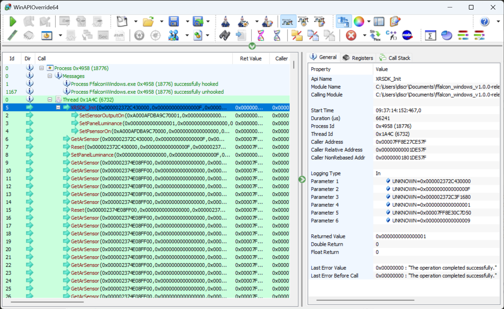

## 雷鸟自带的 Mirror Studio 分析

只是在 PC 上面开了一个 Unity3D 程序，然后把 3dof 信息传输到 PC，PC 渲染画面然后传输给 AR。所以 AR 还是只是一个显示器，3dof 画面渲染是 PC 上的 Unity3D 程序里面实现

## 我的实现思路

创建虚拟桌面，可以参考 [WebCaster 开发笔记](https://discretetom.github.io/posts/web-caster/)里面的【虚拟显示器】章节

假设创建 5 个虚拟桌面，AR 自带一个桌面，加上 PC 自带一个，所以一共是 7 个桌面。
AR 自带的桌面用来跑 Unity，做 3dof 渲染
只要把其他 5 个桌面在 Unity3D 里面显示出来即可。同时保证 Unity3D 后台运行不卡

在 Unity3D 里面捕获并渲染桌面，有现成的库：[uDesktopDuplication](https://github.com/hecomi/uDesktopDuplication)，基于 Windows Desktop Duplication API 来实现的，直接从 GPU 内存复制数据，效率很高

所以唯一的问题是如何从 AR 眼镜里面把 3dof 位置信息抓出来

## 获取旋转信息

### 方案 1：USB 抓包（弃用）

wireshark 可以抓 USB 的包，只要安装的时候加上 usbpcap 插件即可

通过 USB 抓包，可以看到 AR 眼镜就是一个 HID 显示设备，所以它可以不需要驱动就在 Windows 上面即插即用

还可以看出来它是基于 USB 中断的方式来传输数据，但是中断里面的数据是一个 64 byte 的包，我们需要自己解析这个包里面的数据格式

这个工作量就比较大了，所以在意识到可以分析 DLL 之后，果断放弃了此方案。

不过基于 USB 抓包还是可以得到一些 DLL 无法得到的信息的，就当是练手了

### 方案 2：DLL 分析

#### DLL 文件在哪里

在 MirrorStudio 文件夹里面有一个 `XRSDK.dll`的文件，这个文件最可疑，事后证明这个文件就是核心的 AR 眼镜配置库

#### 查看 DLL 文件内容

毕竟调用 DLL 文件里面函数的时候是通过函数名来调用的，所以理论上 DLL 文件必定会包含函数名作为其元数据

可以通过 Visual Studio 自带的工具 `dumpbin.exe` 对 DLL 进行分析：`dumpbin /exports XRSDK.dll`

分析得到 DLL 里面的函数有：

```
CalibGyro
GetArSensor
GetBuildDateTime
GetName
GetSDKVersion
Reset
SetDeviceChangeCallback
SetPanelLuminance
SetPanelOn
SetPanelOnOff
SetPsensorOn
SetScreenResolution
SetSensorOutputOn
SetSensorScale
XRSDK_Init
XRSDK_Shutdown
```

显然这就是 AR 眼镜的配置库。接下来有两个问题：

1. 这些函数的参数和返回值是什么？
2. 这些函数的调用顺序是什么？

#### 使用反射（失败）

如果是 C# 编译出来的 DLL 并且没有经过混淆，那么理论上是可以基于 C# 的反射来反编译的，这也是 Unity3D 游戏破解的方案之一

- 很好用的工具：https://github.com/icsharpcode/ILSpy
- 很好的文章：http://www.alanzucconi.com/2015/09/02/a-practical-tutorial-to-hack-and-protect-unity-games/

但是 XRSDK.dll 这个文件看起来不像是基于 C#写的，更像是 C++，以便基于指针访问内存，所以此方案失败

#### 分析 DLL 调用

既然 MirrorStudio 会调用这个 DLL，那我们可以分析一下它是怎么调用的，就像使用 CheatEngine 分析游戏的内存一样

调研之后发现一个很好用的应用：[WinApiOverride32](http://jacquelin.potier.free.fr/winapioverride32/)

它可以分析 Windows 自带的 DLL 是如何被调用的。我们也可以定义自己的 DLL 文件，让它去分析

问题是，我们只知道函数名，不知道参数和返回值，所以我把参数都设为 UNKNOWN，交给它去分析。需要使用如下的配置文件：

```
XRSDK.dll|CalibGyro(UNKNOWN,UNKNOWN,UNKNOWN,UNKNOWN,UNKNOWN,UNKNOWN)
XRSDK.dll|GetArSensor(UNKNOWN,UNKNOWN,UNKNOWN,UNKNOWN,UNKNOWN,UNKNOWN)
XRSDK.dll|GetBuildDateTime(UNKNOWN,UNKNOWN,UNKNOWN,UNKNOWN,UNKNOWN,UNKNOWN)
XRSDK.dll|GetName(UNKNOWN,UNKNOWN,UNKNOWN,UNKNOWN,UNKNOWN,UNKNOWN)
XRSDK.dll|GetSDKVersion(UNKNOWN,UNKNOWN,UNKNOWN,UNKNOWN,UNKNOWN,UNKNOWN)
XRSDK.dll|Reset(UNKNOWN,UNKNOWN,UNKNOWN,UNKNOWN,UNKNOWN,UNKNOWN)
XRSDK.dll|SetDeviceChangeCallback(UNKNOWN,UNKNOWN,UNKNOWN,UNKNOWN,UNKNOWN,UNKNOWN)
XRSDK.dll|SetPanelLuminance(UNKNOWN,UNKNOWN,UNKNOWN,UNKNOWN,UNKNOWN,UNKNOWN)
XRSDK.dll|SetPanelOn(UNKNOWN,UNKNOWN,UNKNOWN,UNKNOWN,UNKNOWN,UNKNOWN)
XRSDK.dll|SetPanelOnOff(UNKNOWN,UNKNOWN,UNKNOWN,UNKNOWN,UNKNOWN,UNKNOWN)
XRSDK.dll|SetPsensorOn(UNKNOWN,UNKNOWN,UNKNOWN,UNKNOWN,UNKNOWN,UNKNOWN)
XRSDK.dll|SetScreenResolution(UNKNOWN,UNKNOWN,UNKNOWN,UNKNOWN,UNKNOWN,UNKNOWN)
XRSDK.dll|SetSensorOutputOn(UNKNOWN,UNKNOWN,UNKNOWN,UNKNOWN,UNKNOWN,UNKNOWN)
XRSDK.dll|SetSensorScale(UNKNOWN,UNKNOWN,UNKNOWN,UNKNOWN,UNKNOWN,UNKNOWN)
XRSDK.dll|XRSDK_Init(UNKNOWN,UNKNOWN,UNKNOWN,UNKNOWN,UNKNOWN,UNKNOWN)
XRSDK.dll|XRSDK_Shutdown(UNKNOWN,UNKNOWN,UNKNOWN,UNKNOWN,UNKNOWN,UNKNOWN)
```

最后得到了 SDK 函数的调用顺序：



并且通过这里面函数的返回值和参数，也可以推测出来一些信息，比如 `XRSDK_Init` 返回 1，所以它的返回可能是一个 bool。 `SetPanelLuminance`的参数是 0 或 1，所以它的第一个参数可能是 int。有些函数的参数看起来很乱，可能它压根就没有参数

#### 测试 DLL 的调用

测试 DLL 最简单的方法当然是用 python

```py
from ctypes import *

dll = cdll.LoadLibrary("./XRSDK.dll")
dll.XRSDK_Init()
dll.Reset()
```

#### 内存分析

最后一个要解决的问题，就是如何获取 3dof 旋转信息

通过 DLL 的调用分析，我们可以看出，调用 `GetArSensor` 可以获得旋转信息

那么通常来说，会有 2 种传参方案：

1. 在参数里面传入一个结构体的地址，让 DLL 去写数据
2. 函数返回一个地址，里面包含数据

WinApiOverride32 内置了内存查看的功能。经过尝试，判定返回值是一个地址，并且指向的数据会随着时间改变，很可能就是 3dof 旋转信息

最后，经过一些尝试，判断它确实会返回一个基于四元数的旋转值

```py
addr = dll.GetArSensor() # 返回的是内存地址
addr + 44 # 指向x，float, [-1, 1]
addr + 48 # 指向y，float, [-1, 1]
addr + 52 # 指向z，float, [-1, 1]
addr + 56 # 指向w，float, [-1, 1]
```

到这里分析就可以结束了。我们只要在 Unity3D 的应用里面调用这个 DLL 就行了。

## 在所有虚拟桌面显示

作为一个工具应用，最好可以在所有虚拟桌面显示

可以通过 Windows 的 Extended Window Styles 实现

主要参考了以下链接：

- https://superuser.com/questions/1674972/how-to-show-a-window-on-all-virtual-desktops
- https://superuser.com/questions/1371818/how-to-make-windows-remember-the-show-this-window-on-all-desktops-option-even
- https://learn.microsoft.com/en-us/windows/win32/winmsg/extended-window-styles
- https://stackoverflow.com/questions/2285860/change-win32-window-style

## 全局快捷键

通常注册 Windows 全局热键，会使用`RegisterHotKey`/`PeekMessage`等 Windows API

但是 Unity3D 里面似乎把 Windows 原生消息给拦截了，无法成功 PeekMessage

所以使用了第三方库来解决了这个问题：[UnityRawInput](https://github.com/Elringus/UnityRawInput)
