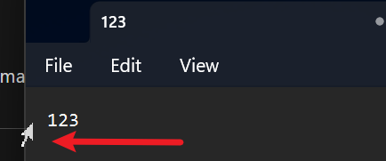

## 设计

由于 HyperStudio v1 使用的 uDesktopDuplication 无法运行在独立显卡上，所以 HyperDesktopDuplication 计划使用两个进程来实现：

- 后台进程仍然使用 Windows Desktop Duplication API 来捕获桌面数据，但是使用共享内存来保存桌面数据
- Unity 进程读取共享内存，渲染到 Unity 里面

## rusty-duplication

uDesktopDuplication 使用 C++ 进行开发，但是我已经不想再写 C++ 了。为了安全高效，决定使用 Rust 语言调用 Windows API 重写桌面复制的功能

为了可复用性，我把捕获桌面数据的库单独抽出来，放到了 [rusty-duplication](https://github.com/DiscreteTom/rusty-duplication)，并且 rusty-duplication 也提供了多层 API，以便以后可以在不同的场景下使用

rusty-duplication 主要参考了这几个项目：

- https://github.com/bryal/dxgcap-rs
- https://github.com/hecomi/uDesktopDuplication

但是使用的是 Windows 官方的 [windows](https://github.com/microsoft/windows-rs) 库。这个库之前并没有被广泛使用，但是是官方库，所以还是顶着很多问题使用了这个库，甚至还给提了个 issue（微软修 BUG 速度还挺快）

### Windows Desktop Duplication API

因为自己调用了 Windows Desktop Duplication API，所以这里也写一个总结

要调用 Windows Desktop Duplication API，首先需要创建一个`IDXGIFactory`（一个用来获取 Adapter 的工厂），然后通过`EnumAdapters`获取到`IDXGIAdapter`，然后通过`EnumOutputs`获取到`IDXGIOutput`（因为一个 Adapter 可能有多个 Output），然后通过`DuplicateOutput`获取到`IDXGIOutputDuplication`。需要注意这些流程都是在获取元数据，并没有开始捕获桌面数据，所以没有太大的开销。在 rusty-duplication 中，使用 Manager 来初始化并管理这些对象

当我们确定需要开始复制桌面的时候，首先通过`AcquireNextFrame`获取到`IDXGIResource`，然后通过`QueryInterface`获取到`ID3D11Texture2D`（在 GPU 上）。需要注意：我们需要把这个 texture2D 复制一份，然后把原本的 texture2D 释放调，以免影响操作系统正常渲染画面。所以要先调用`CreateTexture2D`创建一个可读的 texture，然后通过`CopyResource`复制这个 GPU 资源。这个 Texture2D 可以被缓存，以避免重复创建/删除。

最后，可以通过`ID3D11Texture2D`的`Map`方法获取到桌面数据，保存在我们想保存的位置（比如共享内存）

需要注意：这样捕获的画面是不包含鼠标的，所以鼠标需要额外捕获，然后渲染到画面上。在 Unity3D 里面，可以分别渲染鼠标和桌面，这样如果只有鼠标移动了，就不用刷新整个桌面了。这也是 HyperDesktopDuplication 相对于 uDesktopDuplication 的一个优化

另外，捕获鼠标需要在 `ReleaseFrame` 之前，否则会导致鼠标捕获失败

最后，虽然 Rust 提供了语法糖 `?` 来实现 `Err` 的快速 `Return`，但是很多成对出现的 API 是需要释放一些资源的，比如 `AcquireNextFrame` 和 `ReleaseFrame`。如果在 `AcquireNextFrame` 之后出现了 `Err`，是不能简单地使用 `?` 直接返回的，需要 `ReleaseFrame` 再返回

## 高 DPI 和屏幕尺寸

通过 `DXGI_OUTPUT_DESC` 可以得到显示器在系统设置里面的位置 (top/bottom/left/right)，但是这个最好只用来定位以及在渲染的时候判断屏幕大小，不要用它来确定屏幕的像素数量！

在高 DPI 下，使用 `bottom - top` 或者 `right - left` 得到的像素数量是不正确的。使用 `DXGI_OUTDUPL_DESC` 中的 `ModeDesc` 可以得到正确的像素数量

## shremdup

有了基础库 rusty-duplication 之后，我们需要一个可执行程序来捕获桌面数据，并且把桌面数据保存到共享内存中，并且使用 RPC/IPC 和外界交互。这个程序就是 shremdup (shared-memory desktop-duplication)

一开始，shremdup 使用 HTTP 实现 RPC，但是希望有更好的性能，所以后来改成了 gRPC

shremdup 主要解决的问题是：把 API 通过 gRPC 的方式暴露出去，并且保证不会有多个请求互相干扰。为了实现这个目标，shremdup 使用了一个锁，这个锁在每次请求开始的时候被锁住，请求结束的时候被释放。这样就可以保证不会有多个请求同时进行。并且，为了实现不同的线程都可以访问 rusty-duplication 的 `Manager`，使用了 rust 中的 channel 机制来实现跨进程传输。以下是一段核心示例代码：

```rs
async fn list_displays(
  &self,
  _request: Request<ListDisplaysRequest>,
) -> Result<Response<ListDisplaysReply>, Status> {
  let mut guard = self.mutex.lock().await;
  if let Err(err) = (guard.0).send(ShremdupRequest::ListDisplays).await {
    return Err(Status::internal(err.to_string()));
  }
  match (guard.1).recv().await {
    None => Err(Status::internal("failed to receive reply")),
    Some(ShremdupReply::ListDisplays(Ok(infos))) => {
      Ok(Response::new(ListDisplaysReply { infos }))
    }
    Some(ShremdupReply::ListDisplays(Err(err))) => Err(Status::internal(err.to_string())),
    Some(_) => Err(Status::internal("invalid reply")),
  }
}
```

Shremdup 和 rusty-duplication 解耦，所以如果希望使用其他 RPC 方式（比如 HTTP）调用 rusty-duplication，只需要实现一个类似 shremdup 的程序即可

Shremdup 和前端程序也是解耦的，只是通过 RPC 通信，所以如果未来想在其他游戏引擎（比如 UE）里面调用 shremdup 也是可行的

## frontend

最后，我们只需要在 Unity3D 里面实现三个功能：

1. 通过 gRPC 调用 shremdup
2. 通过共享内存访问桌面数据并渲染
3. 绘制鼠标

### gRPC in Unity

万万没想到，给 Unity3D 配置 gRPC 特别麻烦。早期 gRPC 有一个 unity 插件，但是现在已经不维护了，而且也不支持.net core。所以我们只能自己动手了

1. 安装 Unity3D 插件：https://github.com/GlitchEnzo/NuGetForUnity ，这个插件让我们可以在 Unity3D 里面使用 NuGet
   1. 当然，也可以不用这个插件，直接在命令行里面用 NuGet 下载依赖，然后把依赖放到 Unity3D 项目里面
2. 通过 NuGet，安装：`Google.Protobuf`和`Grpc`.
3. 通过 NuGet 安装的`Grpc`缺少一个`grpc_csharp_ext.dll`文件，我们需要手动从[这里](https://www.nuget.org/packages/Grpc.Core)下载 Grpc 的包，然后把里面的`runtimes`文件夹里面的`grpc_csharp_ext.x64.dll`放到 Assets/Plugins/x64 里面，并重命名为`grpc_csharp_ext.dll`。然后在 Unity3D 里面把这个文件设置为`Load on startup`，这样就可以在 Unity3D 里面使用 gRPC 了
   1. 如果你的 PC 不是 x64，请使用对应的版本
4. 访问 https://packages.grpc.io/ ，在最新的 build 里面，下载 gRPC protoc Plugins
5. 在`proto`文件所在的文件夹，执行 `protoc --csharp_out=. --grpc_out=. --plugin=protoc-gen-grpc="xxx\grpc_csharp_plugin.exe" xxx.proto`就可以生成 C# 代码了
6. 最后，把生成的 C# 代码放到 Unity3D 项目里面，就可以使用 gRPC 了

### 共享内存

如果是跨进程访问共享内存，需要共享内存的名字以`Global\`开头，并且要有管理员权限，否则只能在同一个进程里面访问

另外，如果使用`DllImport`调用 Windows API，那么`GetLastError`的返回值可能是不正确的。C# 调用 Win API 需要用`[DllImport("xxx.dll", SetLastError = true)]`启用`SetLastError`，然后使用`Marshal.GetLastWin32Error()`获取错误码。直接调用 Windows 的`GetLastError()`会返回`0`或其他不确定的值。参考[windows 官方文档](https://learn.microsoft.com/en-us/dotnet/api/system.runtime.interopservices.dllimportattribute.setlasterror?view=net-7.0)

另外，可以使用操作系统自带的 Resource Monitor 查看创建出来的共享内存的名称

在 Rust 中直接调用 Windows API 创建共享内存还需要注意: Rust 自身的`String`和`&str`是不是以`\0`结尾的，所以需要手动转换成 C 风格的 string（添加`\0`），否则会导致创建出来的共享内存名称不正确

### 绘制鼠标

HyperDesktopDuplication 把桌面的绘制和鼠标的绘制分开了，所以我们需要自己绘制鼠标。官方的示例都是使用 C++写的，并且是直接把鼠标绘制在了桌面上，所以我们需要理解一下 Windows 的 API 设计，然后按照我们自己的需求来画鼠标

鼠标形状有 3 种

> https://learn.microsoft.com/en-us/windows/win32/api/dxgi1_2/ne-dxgi1_2-dxgi_outdupl_pointer_shape_type

#### MONOCHROME

在这个模式下，鼠标像素只有两种颜色：黑/白。当然，还可以是透明。这个模式似乎只有一些特别老旧的鼠标形状在使用。在 Win11 中，记事本里面的反向鼠标（在一行的左边，用来选择一整行）就是这个模式。可以看到分辨率也不是很高



既然是黑/白/透明，三种状态，我们就需要 2 bit 来保存这个信息。微软的官方文档写的非常晦涩难懂：

> The pointer type is a monochrome mouse pointer, which is a monochrome bitmap. The bitmap's size is specified by width and height in a 1 bits per pixel (bpp) device independent bitmap (DIB) format AND mask that is followed by another 1 bpp DIB format XOR mask of the same size.

使用了两个 mask，但是其实思考一下就会发现：

- AND mask 为 1 并且 XOR mask 为 1：反转桌面像素。这个应该用不到
- AND mask 为 1 并且 XOR mask 为 0：鼠标像素和桌面像素相同，相当于是透明
- AND mask 为 0 并且 XOR mask 为 1：不管桌面像素如何，鼠标像素为白色
- AND mask 为 0 并且 XOR mask 为 0：不管桌面像素如何，鼠标像素为黑色

所以我们甚至不需要读取桌面像素，就可以完成鼠标的绘制（毕竟只有黑/白/透明三种状态，逻辑上也不应该需要读取桌面像素）

```cs
// IMPORTANT: masks only affect RGB, not A
if (andMask != 0 && xorMask != 0) {
  // if AND and XOR: (any AND 1) XOR 1 => invert any, this shouldn't happen
  Logger.Log("AND and XOR: any xor 1 == invert, this shouldn't happen");
} else if (andMask != 0 && xorMask == 0) {
  // if AND and not XOR: (any AND 1) XOR 0 => any, transparent
  textureBuffer[i * 4] = 0; // just set alpha to 0
} else if (andMask == 0 && xorMask != 0) {
  // if not AND and XOR: (any AND 0) XOR 1 => 1, all one, white
  textureBuffer[i * 4] = 255;
  textureBuffer[i * 4 + 1] = 255;
  textureBuffer[i * 4 + 2] = 255;
  textureBuffer[i * 4 + 3] = 255;
} else if (andMask == 0 && xorMask == 0) {
  // if not AND and not XOR: (any AND 0) XOR 0 == 0, all zero, black
  textureBuffer[i * 4] = 255; // A is not affected by masks
  textureBuffer[i * 4 + 1] = 0;
  textureBuffer[i * 4 + 2] = 0;
  textureBuffer[i * 4 + 3] = 0;
}
```

另外，因为有两个 mask，所以 `PointerShape` 里面的 `Height` 并不是鼠标图案是实际高度，而是两倍高度！所以我们需要把它除以 2。微软文档都没写这个！

```cs
var cursorTexture = new Texture2D((int)shape.Width, (int)shape.Height / 2, TextureFormat.ARGB32, false);
```

#### COLOR

这个模式最简单，因为系统 API 返回的就是一个 ARGB32 的数据，直接创建 texture 然后设置像素就可以了

```cs
var cursorTexture = new Texture2D((int)shape.Width, (int)shape.Height, TextureFormat.ARGB32, false);
cursorTexture.SetPixelData(shape.Data.ToByteArray(), 0);
cursorTexture.Apply();
```

#### MASKED_COLOR

这个模式下，鼠标的颜色要么是一个 ARGB32 的颜色，要么是和桌面重叠像素的异或值。所以我们需要读取桌面像素，然后和鼠标像素做异或运算

通常文本编辑器里面的鼠标就是这个模式（形状类似大写的`I`的那个）

实验了之后发现，如果鼠标像素是一个 ARGB32 的颜色，基本上和桌面的像素颜色相同，也就是说它其实是透明

需要注意：只有这个模式的鼠标需要频繁更新，因为要和桌面像素做异或运算，所以一旦桌面更新、鼠标位置更新，就需要重新绘制鼠标。其他模式的鼠标只需要在鼠标形状变化的时候更新一次就可以了

```cs
var raw = shape.Data.ToByteArray();
for (var i = 0; i < raw.Length; i += 4) {
  var cursorPixelIndex = i / 4;
  var desktopX = (cursorPixelIndex % (int)shape.Width) + this.mousePixelPosition.Item1;
  var desktopY = (cursorPixelIndex / (int)shape.Width) + this.mousePixelPosition.Item2;
  var desktopPixelOffset = desktopX + (long)desktopY * this.pixelWidth;
  var desktopPixelAddress = ((long)this.address) + desktopPixelOffset * 4;
  // desktop pixel
  byte r, g, b;
  unsafe {
    // desktop pixel format is BGRA
    b = *(byte*)(desktopPixelAddress);
    g = *(byte*)(desktopPixelAddress + 1);
    r = *(byte*)(desktopPixelAddress + 2);
  }
  if (raw[i] == 0xFF) {
    // XOR with the desktop pixel
    raw[i] = 255;
    raw[i + 1] ^= r;
    raw[i + 2] ^= g;
    raw[i + 3] ^= b;
  }
  // else: transparent, just keep the the alpha channel `raw[i]` to 0
}
cursorTexture.SetPixelData(raw, 0);
cursorTexture.Apply();
```
