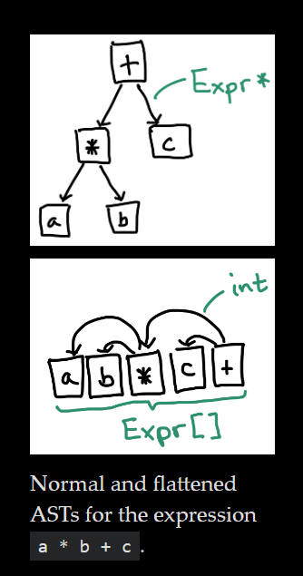

> 原文：[Flattening ASTs (and Other Compiler Data Structures)](https://www.cs.cornell.edu/~asampson/blog/flattening.html)。本文结合自己的理解，做了很多魔改

## 思路

传统情况下，解析源代码时会生成语法树。使用 rust 实现一个基础的算数语法树数据结构为例：

```rs
enum BinOp { Add, Sub, Mul, Div }
enum Expr {
    Binary(BinOp, Box<Expr>, Box<Expr>),
    Literal(i64),
}
```

但是我们可以把它扁平化，变成一个数组：



## 优势

- 优化内存分配：不需要为每个节点(`Expr/ASTNode`)分配内存，只需要分配一个数组即可。拥有连续的内存布局，减少碎片内存，甚至可以放在栈上而不是堆上
- 优化访问逻辑：不需要通过指针来访问子节点，直接通过数组下标即可
- 弱引用，容易垃圾回收：使用树状结构，会存在复杂的双向引用关系。使用数组，通过数组下标作为弱引用，可以简化垃圾回收逻辑
  - 数组也会有更清晰的生命周期管理，在 rust 中尤其重要
- 节省空间：在 64 位系统上，指针占用 8 字节，而数组下标只需要 4 字节

## 使用 rust 实现

```rs
struct ExprPool(Vec<Expr>);
struct ExprRef(u32); // 使用下标来引用表达式
enum Expr {
    Binary(BinOp, ExprRef, ExprRef),
    Literal(i64),
}
```

## 进一步优化：自底向上构建

以上的思路，虽然把 AST 扁平化为数组，仍然会自顶向下遍历，这会涉及到递归。比如，我们需要根据`ExprRef`向下寻找对应的值

进一步优化的思路是：让子节点永远出现在父节点的左边，这样我们只需要从左向右遍历即可，不需要递归

然而，因为我们解析源代码的时候，是自顶向下的，我们可以保证子节点一定出现在父节点的左边，毕竟父节点需要知道子节点的 index 才能引用，所以子节点的 index 总不可能比父节点还要大。所以，当我们自顶向下构建出来数组之后，只需要从左向右遍历，就一定可以避免递归

并且，理论上，最右边的节点一定是根节点（因为根节点没有父节点，所以它的 index 一定是最大的）。遍历完毕后，直接取它的值就行
