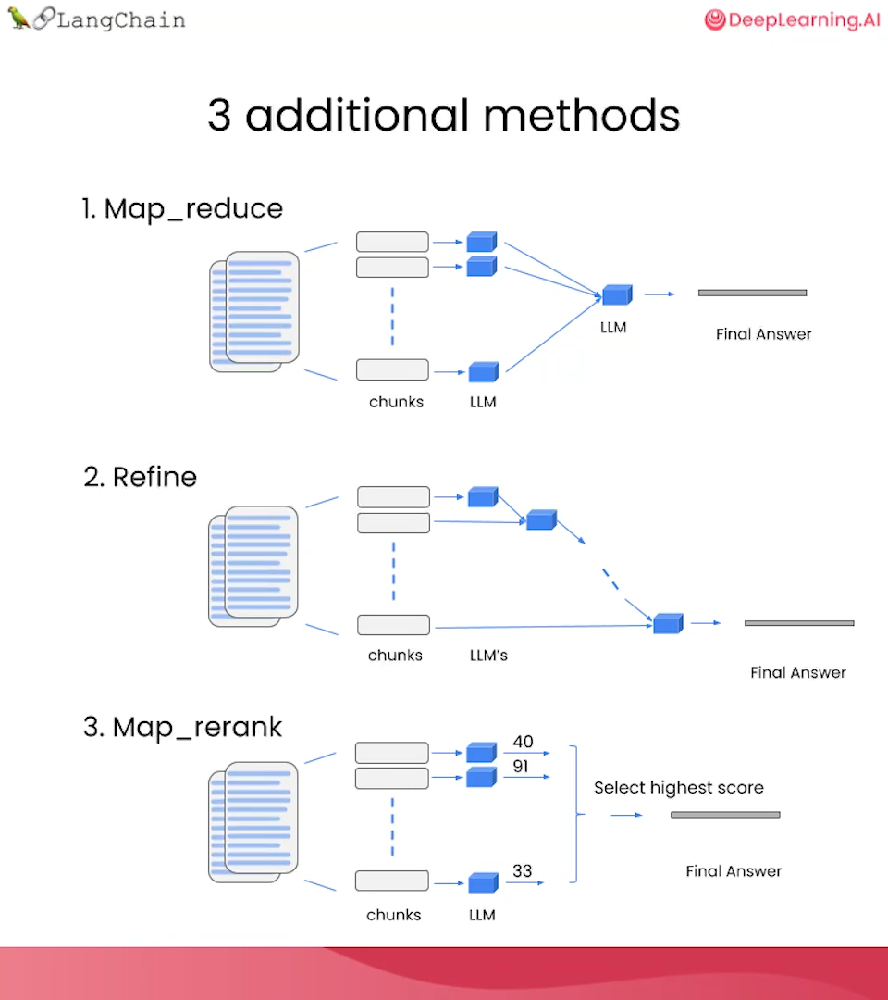

本文是观看[此视频](https://www.bilibili.com/video/BV1zu4y1Z7mc/)的笔记

## LangChain

- 一个编程框架，提供 Python/Javascript/Typescript SDK
- 用来工程化、简化基于 LLM 的应用的开发
- 把和 LLM 的交互抽象为一系列的 Chain
- 通过设置`langchain.debug = True`可以查看每个步骤发生了什么

## 模块

### LLM

略，就是各种大语言模型

### Prompt

为了实现提示词的复用，LangChain 通常不会直接使用 prompt，而是使用 prompt template，并在 template 中预留参数的 slot

````py
from langchain.prompts import ChatPromptTemplate

template_string = """Translate the text \
that is delimited by triple backticks \
into a style that is {style}. \
text: ```{text}```
"""

prompt_template = ChatPromptTemplate.from_template(template_string)
prompt_template.format_messages(style='xxx', text='xxx')
````

在以上示例中，`{style}` 和 `{text}` 就是 slot。`ChatPromptTemplate`会识别字符串中的这些 slot，并在`format_messages`的时候填充 slot

### Output Parser

如果我们希望 LLM 返回的结果是结构化的，那么我们需要定义一个`OutputParser`，用来指导 LLM 输出我们想要的格式，然后解析 LLM 的输出

```py
from langchain.output_parsers import ResponseSchema
from langchain.output_parsers import StructuredOutputParser

# define expected response fields
gift_schema = ResponseSchema(name='gift', description='Is this xxx? Answer True if yes, False if no')

# response should have multiple fields
response_schemas = [gift_schema]

# create output parser
output_parser = StructuredOutputParser.from_response_schemas(response_schemas)

# create format instruction prompt string
format_instructions = output_parser.get_format_instructions()
```

通过以上代码，我们表达了我们希望输出里面包含一个名为`gift`的字段，这个字段的值应该是一个布尔值，然后让`StructuredOutputParser`生成一个格式化指令字符串，用来告诉 LLM 我们希望输出的格式

接下来我们需要把 output parser 给出的 format instruction 放到 prompt template 里面，比如

```py
"""\
For the following text, extract the following information:

gift: Was the item purchased as a gift for someone else? \
Answer True if yes, False if not or unknown.

delivery_days: How many days did it take for the product\
to arrive? If this information is not found, output -1.

price_value: Extract any sentences about the value or price,\
and output them as a comma separated Python list.

text: {text}

{format_instructions}
"""
```

这样 LLM 就会输出可以被 output parser 解析的数据（比如 JSON），我们就可以使用 output parser 来解析输出

```py
output_dict = output_parser.parse(response.content)
```

### Memory

与 LLM 的交互是无状态的，所以为了使 LLM 能够记住之前的信息，每次向 LLM 发出请求都要包含之前的聊天记录。langchain 提供了 Memory 来简化历史信息的管理

```py
from langchain.chains import ConversationChain
from langchain.memory import ConversationBufferMemory

memory = ConversationBufferMemory()
conversation = ConversationChain(
    llm=llm,
    memory = memory,
    verbose=True
)

conversation.predict(input="Hi, my name is Andrew")
conversation.predict(input="What is 1+1?")
conversation.predict(input="What is my name?")
```

在如上的示例中，所有聊天历史记录都会保存在`memory`里面，然后在每次向 LLM 发出请求的时候，都会把历史记录放到请求里面。所以当我们问`What is my name?`的时候，LLM 会知道我们之前说过`Hi, my name is Andrew`，所以会回答`Andrew`

我们可以把 memory 里面的数据导出来放到外部数据库，也可以向 memory 导入曾经的历史数据，或者直接向里面写入新的数据

langchain 提供了很多不同功能的 memory 以便我们使用

- `ConversationBufferMemory`：把所有历史记录保存在内存里面
- `ConversationBufferWindowMemory`：把最近的历史记录保存在内存里面，超过一定数量的历史记录会被删除（基于消息的滑动窗口）
- `ConversationTokenBufferMemory`：把最近的历史记录保存在内存里面，按照 LLM 定义的 token 数量删除历史记录（基于 token 的滑动窗口）
- `ConversationSummaryMemory`：使用 LLM 获取历史记录的摘要，然后把摘要保存在内存里面

### Chain

使用 Chain 把不同步骤组合起来，这样的话一次输入就可以产生多次 LLM 的调用，用来实现不同的功能

#### SimpleSequentialChain

最简单的 Chain 是 SimpleSequentialChain，它只是把多个 LLM 调用串联起来，每个 LLM 的输入都是上一个 LLM 的输出

```py
llm = ChatOpenAI(temperature=0.9, model=llm_model)

# prompt template 1
first_prompt = ChatPromptTemplate.from_template(
    "What is the best name to describe \
    a company that makes {product}?"
)
# Chain 1
chain_one = LLMChain(llm=llm, prompt=first_prompt)

# prompt template 2
second_prompt = ChatPromptTemplate.from_template(
    "Write a 20 words description for the following \
    company:{company_name}"
)
# chain 2
chain_two = LLMChain(llm=llm, prompt=second_prompt)

# link chains together
overall_simple_chain = SimpleSequentialChain(
  chains=[chain_one, chain_two],
  verbose=True
)
overall_simple_chain.run(product)
```

#### SequentialChain

另一个简单的 Chain 是 SequentialChain，它可以把多个 LLM 调用串联起来，但是没有输出和输入的一一对应关系

```py
# prompt template 1: translate to english
first_prompt = ChatPromptTemplate.from_template(
    "Translate the following review to english:"
    "\n\n{Review}"
)
# chain 1: input= Review and output= English_Review
chain_one = LLMChain(llm=llm, prompt=first_prompt,
                     output_key="English_Review"
                    )

second_prompt = ChatPromptTemplate.from_template(
    "Can you summarize the following review in 1 sentence:"
    "\n\n{English_Review}"
)
# chain 2: input= English_Review and output= summary
chain_two = LLMChain(llm=llm, prompt=second_prompt,
                     output_key="summary"
                    )

# prompt template 3: translate to english
third_prompt = ChatPromptTemplate.from_template(
    "What language is the following review:\n\n{Review}"
)
# chain 3: input= Review and output= language
chain_three = LLMChain(llm=llm, prompt=third_prompt,
                       output_key="language"
                      )


# prompt template 4: follow up message
fourth_prompt = ChatPromptTemplate.from_template(
    "Write a follow up response to the following "
    "summary in the specified language:"
    "\n\nSummary: {summary}\n\nLanguage: {language}"
)
# chain 4: input= summary, language and output= followup_message
chain_four = LLMChain(llm=llm, prompt=fourth_prompt,
                      output_key="followup_message"
                     )

# overall_chain: input= Review
# and output= English_Review,summary, followup_message
overall_chain = SequentialChain(
    chains=[chain_one, chain_two, chain_three, chain_four],
    input_variables=["Review"],
    output_variables=["English_Review", "summary","followup_message"],
    verbose=True
)
```

可以看到，相比于 SimpleSequentialChain，SequentialChain 需要每个子链都指定输出的变量名，也就是 output_key（毕竟每个 LLM 调用只有一个输出），然后在其他子链里面直接在 prompt template 里面使用即可。SequentialChain 会自动根据 prompt 判断调用关系，形成 DAG 图，然后按顺序调用 LLM

#### Router Chain

用来实现条件判断，然后选择不同的子链进行后续操作

比如我们设计了一个问答机器人，可以回答以下四个门类的问题

```py
physics_template = """You are a very smart physics professor. \
You are great at answering questions about physics in a concise\
and easy to understand manner. \
When you don't know the answer to a question you admit\
that you don't know.

Here is a question:
{input}"""


math_template = """You are a very good mathematician. \
You are great at answering math questions. \
You are so good because you are able to break down \
hard problems into their component parts,
answer the component parts, and then put them together\
to answer the broader question.

Here is a question:
{input}"""

history_template = """You are a very good historian. \
You have an excellent knowledge of and understanding of people,\
events and contexts from a range of historical periods. \
You have the ability to think, reflect, debate, discuss and \
evaluate the past. You have a respect for historical evidence\
and the ability to make use of it to support your explanations \
and judgements.

Here is a question:
{input}"""


computerscience_template = """ You are a successful computer scientist.\
You have a passion for creativity, collaboration,\
forward-thinking, confidence, strong problem-solving capabilities,\
understanding of theories and algorithms, and excellent communication \
skills. You are great at answering coding questions. \
You are so good because you know how to solve a problem by \
describing the solution in imperative steps \
that a machine can easily interpret and you know how to \
choose a solution that has a good balance between \
time complexity and space complexity.

Here is a question:
{input}"""

prompt_infos = [
  {
    "name": "physics",
    "description": "Good for answering questions about physics",
    "prompt_template": physics_template
  },
  {
    "name": "math",
    "description": "Good for answering math questions",
    "prompt_template": math_template
  },
  {
    "name": "History",
    "description": "Good for answering history questions",
    "prompt_template": history_template
  },
  {
    "name": "computer science",
    "description": "Good for answering computer science questions",
    "prompt_template": computerscience_template
  }
]
```

为这四个门类创建四个子链，保存在 destination_chains 里面

```py
destination_chains = {}
for p_info in prompt_infos:
    name = p_info["name"]
    prompt_template = p_info["prompt_template"]
    prompt = ChatPromptTemplate.from_template(template=prompt_template)
    chain = LLMChain(llm=llm, prompt=prompt)
    destination_chains[name] = chain
```

为这四个子链提供描述，以便放到 prompt template 里面

```py
destinations = [f"{p['name']}: {p['description']}" for p in prompt_infos]
destinations_str = "\n".join(destinations)
```

以免用户的问题不属于这四个门类，再添加一条默认子链

```py
default_prompt = ChatPromptTemplate.from_template("{input}")
default_chain = LLMChain(llm=llm, prompt=default_prompt)
```

为 router 设计 prompt template

````py
MULTI_PROMPT_ROUTER_TEMPLATE = """Given a raw text input to a \
language model select the model prompt best suited for the input. \
You will be given the names of the available prompts and a \
description of what the prompt is best suited for. \
You may also revise the original input if you think that revising\
it will ultimately lead to a better response from the language model.

<< FORMATTING >>
Return a markdown code snippet with a JSON object formatted to look like:
```json
{{{{
    "destination": string \ name of the prompt to use or "DEFAULT"
    "next_inputs": string \ a potentially modified version of the original input
}}}}
```

REMEMBER: "destination" MUST be one of the candidate prompt \
names specified below OR it can be "DEFAULT" if the input is not\
well suited for any of the candidate prompts.
REMEMBER: "next_inputs" can just be the original input \
if you don't think any modifications are needed.

<< CANDIDATE PROMPTS >>
{destinations}

<< INPUT >>
{{input}}

<< OUTPUT (remember to include the ```json)>>"""
````

可以看到，判断用户的输入属于哪个门类，也是 LLM 的工作之一

然后我们创建 RouterChain

```py
router_template = MULTI_PROMPT_ROUTER_TEMPLATE.format(
  destinations=destinations_str
)
router_prompt = PromptTemplate(
  template=router_template,
  input_variables=["input"],
  output_parser=RouterOutputParser(),
)
router_chain = LLMRouterChain.from_llm(llm, router_prompt)
```

Router 只负责判断用户输入的门类，我们还需要一个 MultiPromptChain 来连接之前创建的四个子链和一个默认子链

```py
chain = MultiPromptChain(
  router_chain=router_chain,
  destination_chains=destination_chains,
  default_chain=default_chain, verbose=True
)
```

构建完毕，我们可以问它问题了，比如如下一个物理问题

```py
chain.run("What is black body radiation?")
```

### Question and Answer

#### 快速实现

实现一个从 CSV 中查询某些行的应用：

```py
from langchain.chains import RetrievalQA
from langchain.chat_models import ChatOpenAI
from langchain.document_loaders import CSVLoader
from langchain.vectorstores import DocArrayInMemorySearch
from langchain.indexes import VectorstoreIndexCreator
from IPython.display import display, Markdown

# Load a CSV file into a list of Documents.
# Each document represents one row of the CSV file.
# Every row is converted into a key/value pair and outputted to a new line in the document’s page_content.
file = 'OutdoorClothingCatalog_1000.csv'
loader = CSVLoader(file_path=file)

# create an index wrapper for easy access
index = VectorstoreIndexCreator(
  # store embedding vectors in memory
    vectorstore_cls=DocArrayInMemorySearch
).from_loaders([loader]) # Create a vectorstore index from loaders.

query ="Please list all your shirts with sun protection \
in a table in markdown and summarize each one."

# query with the default LLM (OpenAI)
response = index.query(query)

display(Markdown(response))
```

#### 底层逻辑

1. LLM 对数据进行 embedding，获得向量，并保存到数据库
2. LLM 对 query 进行 embedding，获得向量
3. 从数据库中找到与 query 向量相似的向量，然后返回对应的数据
4. 把数据和 query 交给 LLM，返回人类语言描述的结果

```py
from langchain.document_loaders import CSVLoader
from langchain.embeddings import OpenAIEmbeddings

# load CSV file into documents
loader = CSVLoader(file_path=file)
docs = loader.load()

# index documents with OpenAI embeddings
# and store them in memory
embeddings = OpenAIEmbeddings()
db = DocArrayInMemorySearch.from_documents(
  docs,
  embeddings
)

# we can embed a query
embed = embeddings.embed_query("Hi my name is Harrison")

# or directly search for similar documents
docs = db.similarity_search(query)

# we need to feed the search results to LLM
# so we create a retriever
retriever = db.as_retriever()

# create a RetrievalQA chain
qa_stuff = RetrievalQA.from_chain_type(
    llm=llm,
    chain_type="stuff",
    retriever=retriever,
    verbose=True
)

# now we can run a query
response = qa_stuff.run(query)
```

#### Chain Type

上述的示例使用了`stuff`作为 RetrievalQA 的 chain type，这个 chain type 会把所有搜索结果交给 LLM

如果搜索结果太多/太大，就不好使了。以下是其他 Chain Type



### Evaluation

如何评估 LLM 的表现？或者说 LLM 在回答问题上的正确率？

#### 手动给出 ground truth

针对一个 context（比如：数据集），手动给出 query 和 answer

```py
examples = [
    {
        "query": "Do the Cozy Comfort Pullover Set\
        have side pockets?",
        "answer": "Yes"
    },
    {
        "query": "What collection is the Ultra-Lofty \
        850 Stretch Down Hooded Jacket from?",
        "answer": "The DownTek collection"
    }
]
```

#### 使用 LLM 自动化生成 ground truth

使用 QAGenerateChain，从文档中生成 question-answer-pair

```py
from langchain.evaluation.qa import QAGenerateChain
example_gen_chain = QAGenerateChain.from_llm(ChatOpenAI(model=llm_model))

new_examples = example_gen_chain.apply_and_parse(
    [{"doc": t} for t in data[:5]]
)
```

#### 评估 LLM

有了 ground truth，就可以对 LLM 的返回结果进行评估了

```py
# get predict results
predictions = qa.apply(examples)

# compare predictions with ground truth
from langchain.evaluation.qa import QAEvalChain
eval_chain = QAEvalChain.from_llm(llm)
graded_outputs = eval_chain.evaluate(examples, predictions)
```

因为 LLM 的随机性，使用 `QAGenerateChain` 生成的答案，和 `RetrievalQA` 找到的答案，可能表达方式不一样，但是表达的意思是一样的，所以使用 `QAEvalChain` 评估二者的意思是否相同

### Agents

使用 Agents 和外部环境交互，从而实现更多的功能

> 为了消除随机性，可以把 LLM 的 temperature 设置为 0，以确保 LLM 返回的结果的准确性

#### 示例

以下为一个示例

```py
from langchain.agents.agent_toolkits import create_python_agent
from langchain.agents import load_tools, initialize_agent
from langchain.agents import AgentType
from langchain.tools.python.tool import PythonREPLTool
from langchain.python import PythonREPL
from langchain.chat_models import ChatOpenAI

llm = ChatOpenAI(temperature=0, model=llm_model)

# llm-math是一个使用LLM和计算器解决数学问题的chain
# wikipedia是一个连接维基百科API的chain，用来实现搜索
tools = load_tools(["llm-math","wikipedia"], llm=llm)

agent = initialize_agent(
    tools,
    llm,
    # 使用Chat大模型
    # 使用ReAct模型实现prompt engineering
    agent=AgentType.CHAT_ZERO_SHOT_REACT_DESCRIPTION,
    # 如果LLM的输出无法被解析，则让LLM解析这个输出并进行自动修正
    handle_parsing_errors=True,
    verbose = True)
```

现在我们用这个 agent 计算一个数学问题

```py
agent("What is the 25% of 300?")
```

Agent 会判断：应该使用 Calculator，并且输入是`300*0.25`。然后调用外部计算器的 API，返回`75.0`

同理，我们可以让 Agent 帮我们查维基百科，或者执行代码

#### 自定义 tool

非常简单，只需要给一个函数加上`@tool`装饰器即可

我们必须给函数加上 docstring，这样 Agent 才能知道这个函数的功能，以便在合适的时候调用

```py
from langchain.agents import tool
from datetime import date

@tool
def time(text: str) -> str:
    """Returns todays date, use this for any \
    questions related to knowing todays date. \
    The input should always be an empty string, \
    and this function will always return todays \
    date - any date mathmatics should occur \
    outside this function."""
    return str(date.today())
```
