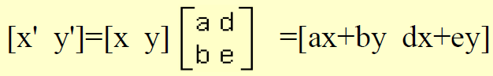
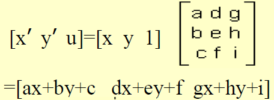

## 二维图形变换

### 齐次坐标

使用n+1维向量表示n维坐标

表示平面上的`(x, y)`可以使用齐次坐标`(hx, hy, h)`（h不为0）来表示

齐次坐标不唯一，h可以是任意不为0的比例系数

h=1时的齐次坐标称为**规格化齐次坐标**，把h变为1的变换称为**齐次坐标规格化**

使用齐次坐标的目的是把n维空间的几何问题在n+1维空间解决，找到**统一的图形变换方案**

使用齐次坐标可以完美地表示n维空间的无穷远点，即`(x1, ..., xn, 0)`

### 变换矩阵

假设二维平面一点`(x, y)`经过图形变换后变为另一点`(x', y')`，可以视为向量`(x, y)`乘上一个矩阵得到，即：

如果使用齐次坐标，则有：

称此矩阵为**二维变换矩阵**，它可以分为四个子矩阵：

其中：
- `[adbe]`矩阵实现**比例、旋转、对称、错切**等变换
- `[cf]`实现**平移**变换
- `[gh]`实现**投影**变换
- `[i]`实现**比例**变换

### 平移变换

### 比例变换

- a=e=1时为**恒等变换**，图形不变
- a=e>1时延两个坐标轴方向等比例放大
- a=e<1时延两个坐标轴方向等比例缩小
- a!=e时图形延两个坐标轴方向非均匀比例变换

等比例的含义是变换前后的点形成的直线经过原点

### 对称变换

### 旋转变换

图形绕原点**逆时针**旋转θ角

### 错切变换

### 复合变换

显然是一系列变换矩阵的乘积

例：

## 三维图形变换

### 三维变换矩阵

其中：
- `[aeibfjcgk]`实现**比例、旋转、错切、对称**变换
- `[dhl]`实现**平移**变换
- `[mno]`实现**投影**变换
- `[p]`实现**比例**变换

### 三维图形的几何变换

- 平移
- 比例
- 对称（三种平面对称+原点对称
- 旋转
- 错切
- 复合

## 三维图形的投影变换

### 投影变换分类

- 平行投影 - 投影中心与投影平面距离无穷大，投影线平行
  - 正平行投影 - 投影平面垂直于投影线
    - 正投影 - 三视图
    - 正轴侧投影
  - 斜平行投影
- 透视投影 - 投影中心与投影平面距离有限

### 正平行投影

三视图投影

例：主视图投影（YZ平面

$$
 \left[
 \begin{matrix}
   x' & y' & z' & 1
  \end{matrix}
  \right]
	=
	\left[
 \begin{matrix}
   x & y & z & 1
  \end{matrix}
  \right]
	\left[
 \begin{matrix}
   0 & 0 & 0 & 0 \\
	 0 & 1 & 0 & 0 \\
	 0 & 0 & 1 & 0 \\
	 0 & 0 & 0 & 1
  \end{matrix}
  \right]
$$

正轴侧投影变换

思路：使用复合变换

### 透视投影

任何一束**不平行**于投影平面的**平行线**的**透视投影**将汇聚成一点，称为**灭点**

灭点可以看做是无限远处的一点在投影面上的投影。灭点有无限多个。在坐标轴上的灭点称为**主灭点**

透视投影根据主灭点的个数分为一点透视、二点透视和三点透视。主灭点个数与投影平面切割坐标轴数量相对应

### 用户坐标系到观察坐标系的变换

## 窗口到视图的变换

### 用户域和窗口区

### 屏幕域和视图区

### 窗口区和视图区的坐标变换

### 从规格化坐标到设备坐标的变换

视图区 -> 规格化 -> 设备显示

## 裁剪

### 概述

- 点在区域内外的判断
- 计算图形元素与区域边界的交点

### 2D直线-编码裁剪法

Sutherland-Cohen Algorithm

把图形区域编码：

四位编码从左到右的含义：
- 点在窗口上方
- 点在窗口下方
- 点在窗口右方
- 点在窗口左方

usage:
- 如果线段两个端点的编码全0则表示线段在窗口内（如CD
- 如果线段两个端点的编码的逻辑与非0则表示线段完全在窗口外（如AB
- 其他情况需要计算线段与窗口交点，如EF

### 2D直线-中点分隔裁剪法

线段与窗口相交需要求交点时使用

### 3D直线-编码剪裁法

同2D。略