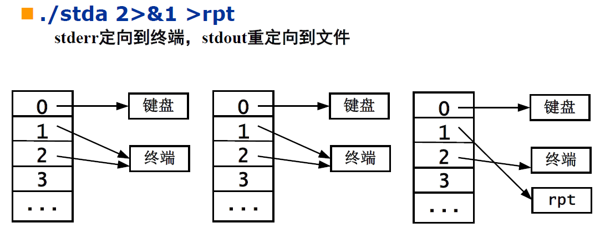

## 概述

bash比其他shell大，运行慢，功能强

与高级语言相比，批处理，效率低

shell没有关键字，只有命令（如if，如果if不在行首则可以视为变量或其他成分

真.命令式语言

策略与机制相分离，自己不实现很多功能，由shell之外的命令或程序实现。shell仅提供替换机制

shell自己连四则运算都不会。。

## 启动bash

- 注册 - 登录成功即可
  - 启动后会执行用户主目录下的`.bash_profile`进行偏好设置
  - 退出时执行`.bash_logout`文件
- 交互式 - 输入bash命令
  - 启动时执行`.bashrc`

系统级配置文件：
- 注册shell启动时执行`/etc/profile`文件中的命令
- 注册shell退出时执行`/etc/bash.bash.logout`中的命令
- 交互式shell启动时执行`/etc/bash.bashrc`

## 脚本文件概述与执行

是文本文件。会新建子进程bash，并在子进程执行脚本

使用参数：`bash [bash-options] script_file script_params`

`bash -x`参数显示运行到第几行

可以给文件设置可执行属性`chmod u+x filename`，然后使用`./filename`即可执行（在子进程的bash中

>为什么要用`./filename`来执行文件而不是直接输入`filename`？因为如果仅提供`filename`，bash会把它解释为命令（bash会把第一个单词解释为命令，其他为参数），并尝试在环境变量PATH指向的文件夹中进行搜索。PATH默认是不包含当前文件夹的，所以bash找不到此命令。而`./filename`则提供了一个路径，告诉bash要在这个路径找可执行文件，所以可以执行。下文中关于环境变量的地方也会提到安全性

`.`是一个命令，意为把后面的命令在**当前shell运行**，如`. script_name script_params`

## 历史

### 历史表

历史表 - 保存命令历史。FIFO。大小由环境变量HISTSIZE设定。如果要修改，应该放在`.bashrc`文件中

查看历史表 - `history`命令，或者查看用户目录下的`.bash_history`文件

### 历史替换

人机交互的时候可以使用上下箭头获得历史命令

可以使用`!!`引用上一命令，使用`!str`引用最近的以`str`开头的命令

## 别名

别名表 - 保存别名。执行任何命令时查询别名表

- 查看别名表 - 使用命令`alias`
- 添加别名 - `alias op_name="commands"`，如`alias dir="ls -flad"`，这样在执行dir的时候就会执行`ls -flad`
- 取消别名 - `unalias n`

## tab补全

命令的首个单词会在`$PATH`下搜索命令，其他情况搜索当前目录下的文件进行补全

## 重定向

### 输入重定向

- `cmd < filename`
  - 从数据文件filename获取stdin
- `cmd << word`
  - 如果此命令出现在脚本文件中，则从脚本直接获取数据作为stdin直到遇到定界符`word`并替换其中的变量与命令
  - 如果是在当前bash执行此命令，则从stdin中读取数据直到遇到定界符`word`并替换其中的变量与命令
  - 如果要关闭替换，使用`cmd << 'word`，bash会取消替换使用原字符串
- `cmd <<< data` - 把后面的参数视为stdin，如`base64 <<< 123456`

例：已知脚本文件：

```bash
cat << TOAST
NOW: `date`
My Home Directory is $HOME
TOAST
```

被bash进行重定向后，会先把其中的\`date\`替换为指令并执行得到当前时间，把`$HOME`替换为变量得到用户目录，然后作为stdin输入到cat。则输出应该类似于：

```
NOW: Sat Apr 27 17:16:56 CST 2019
My Home Directory is /root
```

### 输出重定向

常见输出有2个：
- stdout, fd=1
- stderr, fd=2

>stdin的文件指示符是0

gcc的错误使用的不是stdout而是stderr，所以more指令会失效

可以使用`gcc -c filename 2 > filename2`其中2表示stderr

正常信息可以通过管道，错误信息输出到屏幕

stdout相关输出重定向：
- `cmd > filename`表示stdout重定向（覆盖
- `cmd >> filename`表示stdout追加到文件尾

stderr相关输出重定向：
- `2 > filename`表示把文件句柄2重定向到filename
- `2 > &1`表示把文件句柄2重定向到文件句柄1指向的文件

允许使用除了0、1、2以外的文件进行重定向，比如命令`./myapp 5<a.txt 6>b.txt`，则在程序中可以直接使用文件5和6

例：想把stderr和stdout存放在同一个文件，正确的做法：


错误的做法（顺序错误）：



### 管道

前一命令的stdout作为后一个命令的stdin

注意：所有管道命令都是在子shell中运行，父shell负责提供stdout到stdin的数据传输。所以父shell无法共享子shell的局部变量。如`echo 123 | read a`，执行完毕后父shell是无法访问变量a的

## 变量

**无数据类型，只有字符串**

变量名的第一个字符必须是字母，其他可以是字母、数字、下划线

赋值：`var1=192.168.0.1`

也可以使用命令`read`从stdin读取用户输入给变量

注意赋值作为一条命令，**等号两侧不允许出现空格**

如果赋值的字符串包含空格，应该使用双引号包裹，如`var1="hello world"`

引用变量的两种方法：

- `$name`
- `${name}`

字符串拼接`${name}123`

引用未定义的变量，变量值为空字符串

设置shell默认行为（在bash中执行的命令
- `set -u` 使用未定义变量时报错
- `set +u` 未定义变量视为空串（默认
- `set -x` 执行命令前输出shell替换后的命令与参数。为了区别正常的shell输出，输出前面加`+`
- `set +x` 取消`set -x`

`set`指令，查看环境变量、局部变量和自定义函数

## echo & printf命令

>echo有些系统不支持，建议printf命令

`echo arg1 arg2 ... argn` - 输出`arg1 arg2 ... argn`，参数之间用空格隔开，最后打印换行符

可以使用**转义字符**输出非文字字符，使用选项`echo -e`。支持C语言的常用字符串转移和`\c`

常用转义：
- `\c` - 打印完毕，不换行
- `\b` - 退格
- `\n` - 换行
- `\r` - 回车
- `\t` - 水平制表
- `\\` - 反斜线
- `\nnn` - 三个八进制数描述的字符ASCII码

举例：
- `echo Beijing   China` - 输出Beijing和China，中间只有一个空格
- `echo "Beijing    China` - 输出Beijing和China，中间有实际传入的空格
- `echo -e '\065'` - 输出5

printf命令和C语言的printf相似，如`printf 'My Home is %s\n' $HOME`

## 环境变量与局部变量

默认创建的shell变量为局部变量

使用`export var1`把局部变量变为环境变量

shell启动的**子进程继承环境变量，不继承局部变量**

子进程对环境变量的修改**不影响**父进程的环境变量

系统环境变量：
- `HOME` - 用户主目录的路径
- `PATH` - 查找命令的路径
  - 与windows不同，**PATH不搜索当前目录**，因为搜索当前目录很危险（比如当前目录有一个叫ls的程序，程序内容是删库
  - PATH的格式 - 多个目录使用`:`隔开。从前向后依次搜索
  - 可以在PATH中添加当前目录，只需要添加`.`到PATH中就可以，但是正如上面所说，**非常危险不建议使用**
- `TERM` - 终端类型

相关命令：
- `set` - shell内部命令。列出当前所有变量及其值、自定义函数（包括环境变量和局部变量
- `env` - 外部命令，路径为`/bin/env`，列出环境变量及其值

可以在shell里面直接用`=`给变量赋值，如`abc=123`。和在脚本中一样，等号两边不允许有空格，否则就变成了执行`abc`这个命令，参数是`=` & `123`了

也可以在执行某个程序的时候给特定变量赋值，如`abc=123 ./a`

main函数第三个参数是环境变量`char ** env`

## shell替换

shell的工作内容就是替换命令然后执行命令

- 变量替换 - 使用`$`，如`$HOME`
- 文件名生成 - 使用文件通配符`*`等，按照字典序排列。如果没有可匹配文件，则保持带有`*`的原文
- 命令替换 - 使用`` `cmd` ``，如`` now=`date` ``会执行命令`date`之后用stdout替换字符串
  - 命令替换可以使用`$(cmd)`

## shell内部变量 - 位置参数

- `$0` - 脚本文件本身的名字
- `$1, $2, ...` - 脚本文件的命令行参数
- `$#` - 命令行参数的个数
- `"$*"` - `"$1 $2 ..."`
- `"$@"` - `"$1" "$2" "$3" ...`
  - 用来把变长的命令行参数传递给命令

命令`shift`所有参数左移，参数数量`$#`-1。可以加上一个数字作为左移数量，如`shift 3`

## shell元字符与转义

- 空格与制表符 - 命令行参数的分隔符
- 回车 - 执行命令
- `<>|` - 重定向与管道
- `;` - 用于一行内输入多个命令
- `&` - 后台运行
- `$` - 引用shell变量
- `` ` `` - 用于命令替换
- `*[]?` - 用于文件通配符
- `\` - 转义，取消元字符的作用
- `()` - 用于定义shell函数或者在子shell中执行一组命令
- `"` - 忽略除了`$`和`` ` ``之外的元字符。剩下的需要转义的字符：`\"` & `\$` & `` \` `` & `\\`
- `'` - 忽略所有元字符，包括转义字符。所以单引号引起的字符串里面不能出现单引号

`()<>|;&`这些字符自身起到分隔符的作用

转义字符后面跟非特殊字符，不同场合处理方式不同
- 如果在引号内（单引号或双引号），则维持字面含义，交给命令去处理转义。如`printf "\n"`就会把`\n`交给printf命令处理
- 如果没有引号，则为*未定义*的情况。通常忽略`\`，如`echo \n`会把n交给echo处理

## shell逻辑判断

### 命令返回值

判断依据 - 命令返回值是否为0。0表示命令执行成功

命令的返回值为main函数的返回值，或调用了系统调用`exit(code)`进行返回。exit函数的参数取值为0-255 

如果main函数没有return则返回随机值，不能用来作为条件判断

shell内部变量`$?`可以获取上一个命令的返回码

使用管道连接的各个命令，条件判断时以最后一个命令的返回值为准

### 复合逻辑

满足**短路计算**特性

- `cmd1 && cmd2` - 如果cmd1执行成功则执行cmd2
- `cmd1 || cmd2` - 如果cmd1执行失败则执行cmd2

命令`true` & `false`是两个程序，返回值分别为0和非0。位置在`/bin/true` & `/bin/false`。有的shell为了提高效率把这两个值设为内部命令

### 逻辑判断命令

分别是命令`[`和命令`test`

>注意`[`是一个命令而不是一个词法符号。路径为`/usr/bin/[`

命令`[`要求最后一个命令行参数必须为`]`。其他功能和命令`test`相同。有的Linux系统把`/usr/bin/[`设置为指向`test`的符号链接文件

例：`test -r /etc/motd`等价于`[ -r /etc/motd ]`

用法：
- 文件特性检测
  - `-f` - 普通文件
  - `-d` - 目录文件
  - `-r` - 可读
  - `-w` - 可写
  - `-x` - 可执行
  - `-s` - size>0
  - 例：`[ -r /etc/motd ] && echo readable`
- 字符串比较
  - `=` - 字符串相等。可以使用`==`
  - `!=` - 字符串不等
  - 例：`[ "$a" = "" ]`判断`$a`是否为空。记得加引号，因为如果`$a`为空被shell替换，不加引号就会忽略此参数
  - 注意等号和不等号两侧的空格不能省略。因为他们是作为参数传进命令的
- 整数比较
  - `-eq` - equal
  - `-ne` - not equal
  - `-gt` - greater than
  - `-ge` - greater equal
  - `-lt` - less than
  - `-le` - less equal
- 复合条件
  - `!` - not
  - `-o` - or
  - `-a` - and

## 命令组合

类似于C语言的复合语句，组合在一起的命令视为一个整体。可以集体管道、重定向，或者满足条件时执行多个命令

例：

```bash
pwd
DIR=/usr/bin
[ -d $DIR ] && {
  cd $DIR
  echo "Current Directory is `pwd`"
  echo "`ls | wc -l` files"
}
pwd
```

可以使用`{}`和`()`进行命令组合。使用`{}`表示在当前shell执行，使用`()`表示在子shell执行

**注意**：`{}`并不是shell的元字符，而是作为特殊的命令处理，也就是命令`{`和命令`}`，所以需要主动分隔大括号和普通命令。如果是在shell文件中，那么可以使用换行解决（把换行解释为`;`）。如果写在同一行，那么左大括号右面要有一个空格（因为`{`是命令），右大括号前面要有`;`作为命令的分隔，如`{ ls -l; ps;}`。而`()`是shell元字符，只需要`(ls -l;ps)`就行，不需要多余的空格和分号

## 条件分支

### if

语法：

```bash
if condition
then
  list
elif confition
then
  list
else
  list
fi
```

其中`if/then/elif/else/fi`为**内部命令**（shell没有关键字之说）。原理应该是给shell内部某个flag变量赋值

合并行：
- `then`可以和then后面的list合并为一行
- `if`不可以和`then`合并。但是可以通过分号合并，如`if condition;then`
- 与C语言不同，then与else或fi配对，不需要大括号

### case

语法：

```bash
case word in
pattern1) list1;;
pattern2) list2;;
...
esac
```

注意：
- word与pattern匹配使用的是shell的文件名匹配规则
- `;;`是一个整体，不能在两个分号间加空格，也不能用空行代替
- 可以使用竖线表示多个模式
- 如果存在word匹配多个pattern，则仅执行第一个匹配的命令表

实例：

```bash
case "$1" in
start)
  echo "start service"
  ;;
stop)
  echo "stop service"
  ;;
force-reload|restart)
  $0 stop
  $0 start
  ;;
status)
  echo "this is the status"
  ;;
*)
  echo "Usage: $0 {start|stop|restart|force-reload|status}"
  exit 1
  ;;
esac
```

## 注释

使用`#`作为注释

## 表达式计算

shell内部只有字符串这一种数据类型。不支持四则运算、正则表达式运算等。需要借助其他命令实现

有的shell（包括bash）为了提高效率，提供内部命令版本的`echo/printf/expr/test/[`命令。仅仅是性能优化措施。

`expr`支持：
- `()` - 括号
- `+-*/%` - 算术运算
- `> >= < <= = !=` - 关系运算
- `| &` - 逻辑运算
- `:` - 正则表达式运算

注意**转义**。以及，`expr`是命令，所以需要必要的空格作为分隔，如计算`x=a*(b+c)`：

```bash
x=`expr $a \* \( $b + $c \)`
x=`expr $a '*' '(' $b + $c ')'`
```

正则表达式的用法：`expr string : pattern`，输出匹配长度。如果pattern中有使用`\(`&`\)`括起来的部分，如果匹配则打印括号内能匹配的部分，否则打印空串。例：

```bash
expr 123 : "[0-9]*" # output: 3
expr A123 : "[0-9]*" # output: 0
expr "$unit" : ".*" # output: length of $unit
expr `pwd` : '.*/\([^/]*\)$' # output: 路径的最后一个分量
```

## eval

把程序的输入或者数据作为程序来执行

例：

```bash
a=100
b=200
read line
eval "$line"
echo $result
```

输入`` result=`expr $a + $b + 1000` ``

## 循环

### while

语法：

```bash
while condition
do
  list
done
```

实现计数：

```bash
if [ $# = 0 ]
then
  echo "Usage: $0 : <number>"
else
  count=$1
  while [ $count -gt 0 ]
  do
    count=`expr $count - 1`
    echo -e "\015 $count \c"
    sleep 1
  done
fi
```

### for

语法1：

```bash
for name in word1 word2 ...
do
  list
done
```

语法2：

```bash
for name
do
  list
done
# equal to:
# for name in $1 $2 ...
# do
#   list
# done
```

`seq`命令，生成数组：

```bash
for i in `seq 1 2 3 99`
do
  ping 192.168.0.$i
done
```

### break & continue & exit

break在循环中使用，终止循环。可以加上一个数字作为参数表示终止的循环层数

continue参考C语言

exit结束脚本程序的执行。参数为脚本返回码

## shell函数

语法：`name() { list;}`

函数定义完成之后可以作为一个自定义的内部命令执行。后面可以调用

调用的时候可以加参数，在函数体内部使用`$1 $2 $* $@`等方式引用

函数内使用命令return设置返回值，0表示成功，1表示失败

函数内可以创建和修改变量。函数内的变量其他程序可以访问（即使函数已返回