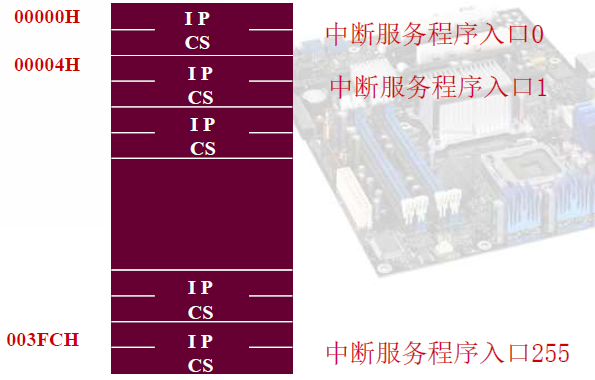

## 概述

两种中断：
- 硬中断
  - 由外部设备或接口发出事件请求，处理器通过检测中断管脚来感知
  - 处理器每执行完一条指令都会去查看中断引脚是否有外部硬中断请求产生
  - 中断的产生具有随机性（软件不可控且不可预测
  - CPU需要发中断响应信号
  - 可以被屏蔽
- 软中断
  - 执行特定指令而产生的程序转移
  - 由软中断指令或某些指令执行错误而产生，时机可预测
  - 也叫例外或异常(exception)或陷阱(traps)
  - CPU不需要发中断响应信号
  - 中断类型号由指令直接给出
  - 不可被屏蔽

## 中断识别

CPU需要识别中断源以便对其进行服务

方法：
- 查询中断法
- 向量中断法

### 查询方式

按顺序询问外设。所以外设的查询顺序存在优先级

### 中断向量方式

需要添加**中断控制器**，如图：


任何外设出现中断都会提交到中断控制器，中断控制器发出中断请求，CPU响应中断后询问中断控制器，中断控制器把**中断向量**放在**数据总线**给CPU，然后**CPU查中断向量表**找到目标程序

中断向量表，保存了中断服务程序的地址（即CS:IP）所以**每个表项占用4字节**。通常中断向量表的起始地址为0000H：



所以**使用此方式之前要把中断服务程序先放入中断向量表**，如把中断类型号为60H的服务程序intr的入口地址放入中断向量表的汇编程序：

```asm
xor ax, ax ; 相当于mov ax, 0但是比mov要快
mov es, ax ; 设置附加段的段地址为0
mov bx, 60h*4 ; 中断向量号*4，找到需要赋值的地方
mov ax, offset intr ; 获得中断服务程序偏移地址，即IP的值
mov es:[bx], ax ; 写入IP
mov ax, seg intr ; 获得中断服务程序段地址，即CS的值
mov es:[bx+2], ax ; 写入CS
```

以上为直接修改中断向量表，也可以使用DOS系统调用修改中断向量表：

```asm
mov ax, 3560h ; 35号系统调用，表示取原中断向量入口地址。60表示中断向量地址
int 21h ; 输出到es:bx
mov old_off, bx ; 保存起来
mov bx, es
mov old_seg, bx
...
mov ax, 2560h ; 25号系统调用，置中断向量入口
mov dx, seg intr
mov ds, dx
mov dx, offset intr ; 输入ds:dx
int 21h
```

### 中断优先级

CPU一次只能处理一个中断，即优先级最高的中断请求

确定优先级的方式：
- 按优先级排队
- 按轮询排队 - 所有优先级相等，FCFS

### 中断嵌套


## 8086中断系统

### 中断源

- 硬中断
  - 不可屏蔽中断NMI
  - 可屏蔽中断INT
- 软中断
  - 除法错误
  - 溢出
  - 指令中断
  - 单步中断（如调试

### 8086中断处理过程


### 不可屏蔽中断NMI

CPU收到NMI后默认中断类型号为02H

不可屏蔽中断源有三种：
- 协处理器出错
- 系统RAM奇偶校验出错
- IO通道校验出错

系统通电后可以设置是否允许NMI。如果复位后向a0h端口写00h则禁止NMI，写80h则允许NMI

### 可屏蔽中断INTR

CPU的INTR管脚输入高电平时产生硬件可屏蔽中断请求。**是否响应该请求由PSW的IF位决定**：
- IF=0表示屏蔽中断（执行CLI指令可以置IF=0
- IF=1表示允许中断（执行STI指令可以置IF=1

使用中断控制器可以管理多个硬件中断源

CPU响应INTR的条件：
- 当前指令执行完毕（一个总线周期的结束
- IF=1
- INTR信号有效

INTR的处理过程：
- 中断申请 - 外设向CPU发INTR信号
- 中断响应（如果可以响应的话）
  - 发出响应中断信号INTA
  - 获取中断类型号保存PSW和断点（即返回地址）于堆栈
  - 查表获得中断服务程序入口地址
- 执行中断服务程序
  - 保护现场
  - 对外设服务
  - 恢复现场
- 中断返回
  - 弹出断点与PSW
  - 回到之前的地址继续进行

### 软中断

- 除法中断 - 除0或结果超过机器表示范围，产生0号中断
- 溢出中断 - PSW的OF=1时执行INTO指令，产生4号中断
- 单步中断 - PSW的TF=1时，执行每条指令产生1号中断
- 指令中断 - 比如上面的DOS系统调用`int 21h`

## 可编程中断控制器8259A

### 功能

因为可编程，所以可以进行功能选择

- 优先级排队管理
  - 完全嵌套
  - 循环优先级
  - 特殊完全嵌套
- 接收和扩充外部设备的中断请求
  - 因为此芯片允许级联，最多可以拓展至8片，管理64个中断源
- 提供中断类型号（从数据总线给CPU
- 中断请求的允许与屏蔽

### 引脚


- D7-D0为返回中断类型号的数据线
- IR7-IR0为中断源（中断源可以为8259A芯片形成级联
- ~WR(in)写信号线
- ~RD(in)读信号线
- INT(out)中断请求
- ~INTA(in)中断响应接收
- A0为芯片内的端口地址指示（芯片内有两个地址，使用A0区分
- ~CS为片选信号线（使能
- ~SP/~EN从片模式编程/使能缓冲器（工作在缓冲器模式时用于控制数据总线上的收发器
- CAS2-CAS0级联信号线。主片输出从片输入

### 内部结构


- IRR - 存放外部中断源发出的中断请求信号，1表示对应引脚有中断请求。具有锁存功能
- ISR - 表示正在服务的中断。如果允许嵌套则可能很多bit同时为1
- IMR - 0表示允许中断，1表示屏蔽中断

### 工作方式

- 中断触发方式
  - 边沿触发方式 - IRi端出现上升沿视为中断请求
  - 电平触发方式 - IRi端出现高电平视为中断请求
- 屏蔽中断源方式
  - 普通屏蔽方式
  - 特殊屏蔽方式
- 中断嵌套方式
  - 完全嵌套方式（只能被优先级更高的请求打断
  - 特殊完全嵌套方式（可以被优先级相等或更高的中断请求打断
- 优先级管理方式
  - 优先级固定方式
  - 优先级轮转方式
    - 自动轮转方式（被服务后优先级降为最低
    - 指令轮转方式（使用命令将指定中断源的优先级置为最低
- 结束中断的处理方式EOI
  - 自动中断结束方式（自动EOI，中断服务程序不送EOI，第二个INTA脉冲信号的后沿把ISR对应位清零
  - 手动中断结束方式（普通EOI，中断服务程序需要向8259A送EOI以便将ISR对应位清零，标识中断结束
    - 不指定（如果采用完全嵌套方式则可以不指定EOI，中断控制器将ISR中优先级最高的为清零
    - 指定（如果中断优先级被打乱，则必须自定EOI
- 数据线连接方式（如果系统要求8259A必须通过总线缓冲器，则8259A应工作在缓冲方式
  - 非缓冲方式（把~SP/~EN设置为1是主片方式，为0是从片方式
  - 缓冲方式（~SP/~EN作为输出，用来控制总线缓冲器的传送方向。此时只能用软件设置8259A的工作在主片还是从片

以上均可使用命令字编程实现

### 8259A的编程

可分为**初始化编程**和**中断操作编程**

- 初始化编程是8259A复位后首先进行的操作。通过写入一系列**初始化命令字ICW**实现。初始化结束后除非复位，否则不会再改变。
- 中断操作编程是在初始化后任意时刻写入**操作命令字OCW**实现，可多次写入。

以上两种命令字的写入位置也不同。8259A使用一个引脚A0来标记内部的两个地址。A0=0表示偶地址端口，A0=1表示奇地址端口。不同命令字写往的端口可能不同

- 初始化命令字ICW
  - 芯片控制（工作方式设置）ICW1，完成触发方式设置和级联方式设置的功能
    - 
  - 中断类型号ICW2，完成中断类型号设置的功能，仅设置前五位，后三位自动产生
    - 
    - 例：奇地址端口(A0=1)写入00001000B时对应的中断类型号为08-0FH。写入10000000B后对应的中断类型号为80-87H
  - 级联方式ICW3，只级联方式下使用，描述主从片的连接关系
    - 主片：
    - 从片：
    - 从片是识别地址就是接在了主片的哪一个引脚上
    - 例：
  - 特定完全嵌套、缓冲器方式ICW4
    - 
- 操作命令字OCW
  - 中断屏蔽字OCW1，完成中断屏蔽的设置，即IMR。**可读可写**，可用于读取IMR
    - 
  - 中断结束方式OCW2，完成非自动中断结束方式、中断排队方式的设置功能
    - 
  - 中断查询OCW3，完成IR和ISR寄存器、状态字查询、特殊屏蔽方式的设置
    - 

例：已知8259A的端口地址为20H和21H，写出读IRR、ISR和IMR的汇编代码：

```asm
mov al, 00001011b
out 20h, al ; 下次~RD有效，读ISR
nop ; 等待操作完成
in al, 20h ; 读ISR

; 类似可以读IRR.略

; OCW1就是IM
in al, 21h
```

OCW3为00001100b时为查询状态，示例代码：

```asm
mov al, 00001100b
out 20h, al
nop ; 延时
in al, 20h
```

### 8259A初始化流程


### 级联

当系统需要管理超过8个中断源时，可以采用级联的方式来管理。使用一个主8259A和若干个从8259A构成：


**级联状态主片必须使用特殊全嵌套**

## 硬件中断服务程序的编写

主程序：
- 设置中断向量表
- CPU的IF置1，允许中断
- 设置8259A的中断屏蔽寄存器
- 可以使用忙等待来等待中断（实际情况CPU会执行其他操作，这里使用忙等待表示CPU在等待

中断服务程序：
- 要尽量短
- 参数传递、临时变量要使用存储单元
- 向中断控制器8259A发送中断结束命令EOI
- 中断返回要用iret指令

## 定时、计数技术与可编程定时、计数器8253/8254

### 概述

- 拥有3个独立的16位定时/计数器(T/C)
- 每个T/C可以：
  - 按二进制或十进制计数
  - 有6种不同的工作方式
  - 最高频率10MHz
  - 8254有读回状态功能

### 结构与管脚


- 面向CPU的信号线（用于编程
  - D7-D0三态双向数据线，用于读写控制字
  - ~RD读信号线
  - ~WR写信号线
  - ~CS片选
  - A0&A1地址线，即此芯片占用了四个IO端口
    - 00、01、10表示计数器0、1、2
    - 11表示控制寄存器
- 面向IO的信号线（三组同样的信号
  - CLK计数时钟输入
  - GATE门控信号，为0时禁止时钟工作
  - OUT输出信号

每个计数器的结构：


包含3个16位寄存器：
- 初值寄存器CR - 用于存放计数器初值，然后将初值装入CE。可以自动重载初值
- 计数单元CE - 减1计数器。CPU不能直接访问
- 当前计数值锁存器OL，跟随CE变化，收到锁存命令时锁存CE的值用于CPU的读取。读取之后恢复跟踪

### 编程

- 命令
  - 初始化
    - 设置工作方式
    - 设置计数器初值
  - 操作
    - 重写计数器初值
    - 取状态命令
- 状态
  - 当前计数值
  - 工作方式
  - 状态

上电后芯片的状态是未知的，需要初始化。**先写控制字再写初值**

读OL：
- 直接读OL，必须使GATE无效（停止计时）或用外部逻辑停止CLK（停止计时），否则读OL可能不正确
- 或者使用锁存命令锁存CE到OL，然后再读

### 6种工作方式

- 方式0 - 计数结束中断
  - 软件启动，不能自动重复（初值只有一次有效，然后就变FFFF
  - 计数结束的上升沿可以作为中断请求信号
  - 写入控制字后out为0
  - 计数为0后out输出为1
  - 设置初值后在下一个clk的下降沿置初值到CE
  - 波形：
- 方式1 - 程序可控单稳触发器
  - 硬件启动，不自动重复，负脉冲宽度可控
  - 写入控制字后out为1
  - 写入初值后计数器不开始计数
  - gate上升沿后，在下一个clk的下降沿置计数器初值到CE，out开始输出0
  - 计数为0时out输出1
  - 初值可多次有效，每次gate的上升沿会重置计数初值
  - 波形：
- 方式2 - 频率发生器（略
- 方式3 - 方波发生器（略
- 方式4 - 软件触发的选通信号（略
- 方式5 - 硬件触发的选通信号（略

### 拓展定时

当定时长度不够时，可以把**多个计数通道串联**、甚至串联多个芯片实现计数范围拓展

