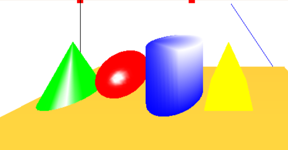

## 启动光照并设置参数

光照参数：

```cpp
GLfloat globalAmbient[] = {0.2f, 0.2f, 0.2f, 1.0f}; // 全局环境泛光的RGBA
GLfloat ambient[] = {1.0f, 1.0f, 1.0f, 1.0f}; // 环境泛光的RGBA
GLfloat diffuse[] = {1.0f, 1.0f, 1.0f, 1.0f}; // 漫反射的RGBA
GLfloat specular[] = {1.0f, 1.0f, 1.0f, 1.0f}; // 镜面反射的RGBA
GLfloat specref[] = {3.0f, 3.0f, 3.0f, 3.0f}; //
```

以上参数中通常R、G、B值相同，才能保证光线不会偏红、绿、蓝。全局环境泛光可以稍弱

```cpp
// 激活光照
glEnable(GL_LIGHTING);
// 设置全局环境泛光
glLightModelfv(GL_LIGHT_MODEL_AMBIENT, globalAmbient);
// 设置观察光线的视角为本地而不是无穷远
glLightModeli(GL_LIGHT_MODEL_LOCAL_VIEWER, GL_TRUE);
// 设置物体的两面都可以感光
glLightModeli(GL_LIGHT_MODEL_TWO_SIDE, GL_TRUE);
// 设置0号灯的参数并启动
glLightfv(GL_LIGHT0, GL_AMBIENT, ambient);
glLightfv(GL_LIGHT0, GL_DIFFUSE, diffuse);
glLightfv(GL_LIGHT0, GL_SPECULAR, specular);
glEnable(GL_LIGHT0);
// 设置阴影模式
glShadeModel(GL_SMOOTH);

// 设置物体材质颜色跟随物体表面颜色
glColorMaterial(GL_FRONT_AND_BACK, GL_AMBIENT_AND_DIFFUSE);

// 启用材质
glEnable(GL_COLOR_MATERIAL);
// 启动物体表面全反射（即反光）
glMaterialfv(GL_FRONT_AND_BACK, GL_SPECULAR, specref);
glMateriali(GL_FRONT_AND_BACK, GL_SHININESS, 50);
```

## 通过面构造反光的物体

以下代码因为偷懒而没有使用OPENGL里面的顶点数组，实际生产中效率可能偏低

### 错误示范

以下为构造一个圆柱体的代码

```cpp
// 构造一个圆柱体。原点(0, 0, 0)为几何中心，Y轴为圆柱中心轴
// radius指定半径，height指定高度，slices指定圆柱侧面被切了多少片
// line表示生成的是三维线段构成的物体还是三维面构成的物体
void buildCylinder(double radius, double height, int slices, bool line)
{
	// 计算圆柱底面的圆的各个顶点
	std::vector<double> x;
	std::vector<double> z;
	for (int i = 0; i < slices; ++i)
	{
		x.push_back(radius * cos(radians(360 / slices * i)));
		z.push_back(radius * sin(radians(360 / slices * i)));
	}
	// 把第一个点放到vector最后以便收尾连接
	x.push_back(x[0]);
	z.push_back(z[0]);

	// 生成底面
	if (line)
		glBegin(GL_LINE_LOOP);
	else
		glBegin(GL_POLYGON);
	for (int i = 0; i < slices; ++i)
	{
		glVertex3d(x[i], height / 2, z[i]);
	}
	glEnd();
	if (line)
		glBegin(GL_LINE_LOOP);
	else
		glBegin(GL_POLYGON);
	for (int i = 0; i < slices; ++i)
	{
		glVertex3d(x[i], -height / 2, z[i]);
	}
	glEnd();

	// 生成侧面
	for (int i = 0; i < slices; ++i)
	{
		if (line)
			glBegin(GL_LINE_LOOP);
		else
			glBegin(GL_POLYGON);
		glVertex3d(x[i], height / 2, z[i]);
		glVertex3d(x[i + 1], height / 2, z[i + 1]);
		glVertex3d(x[i + 1], -height / 2, z[i + 1]);
		glVertex3d(x[i], -height / 2, z[i]);
		glEnd();
	}
}
```

生成效果：


可以看到圆柱只有上底面反光，其他面虽然有材质（即能够接受光照），但是不能正确的反光

### 不反光的原因

构造平面时添加点的顺序决定了平面的**法向量**。平面的法向量决定了平面是否反光


如上图所示，假设在YZ平面按照逆时针顺序添加点，则此面的X负半轴方向能够反光，X正半轴方向不能反光

设置法向量的方案：直接通过函数设置，或者调整添加点的顺序

### 正确示范

调整了添加点的顺序以生成法向量正确的面

```diff
// build a cylinder, use (0, 0, 0) as center, Y as axis
void buildCylinder(double radius, double height, int slices, bool line)
{
	// calculate x and y
	std::vector<double> x;
	std::vector<double> z;
	for (int i = 0; i < slices; ++i)
	{
		x.push_back(radius * cos(radians(360 / slices * i)));
		z.push_back(radius * sin(radians(360 / slices * i)));
	}
	// link head and tail
	x.push_back(x[0]);
	z.push_back(z[0]);

	// build underside
	if (line)
		glBegin(GL_LINE_LOOP);
	else
		glBegin(GL_POLYGON);
	for (int i = 0; i < slices; ++i)
	{
		glVertex3d(x[i], height / 2, z[i]);
	}
	glEnd();
	if (line)
		glBegin(GL_LINE_LOOP);
	else
		glBegin(GL_POLYGON);
-	for (int i = 0; i < slices; ++i)
+	for (int i = slices - 1; i >= 0; --i)
	{
		glVertex3d(x[i], -height / 2, z[i]);
	}
	glEnd();

	//build flank
	for (int i = 0; i < slices; ++i)
	{
		if (line)
			glBegin(GL_LINE_LOOP);
		else
			glBegin(GL_POLYGON);
-		glVertex3d(x[i], height / 2, z[i]);
-		glVertex3d(x[i + 1], height / 2, z[i + 1]);
-		glVertex3d(x[i + 1], -height / 2, z[i + 1]);
-		glVertex3d(x[i], -height / 2, z[i]);
+		glVertex3d(x[i], -height / 2, z[i]);
+		glVertex3d(x[i + 1], -height / 2, z[i + 1]);
+		glVertex3d(x[i + 1], height / 2, z[i + 1]);
+		glVertex3d(x[i], height / 2, z[i]);
		glEnd();
	}
}
```

效果：非常圆润的反光效果，nice。可以对比一下旁边没有正确使用法向量生成的黄色棱锥，没有反光效果看起来就像是平面图

